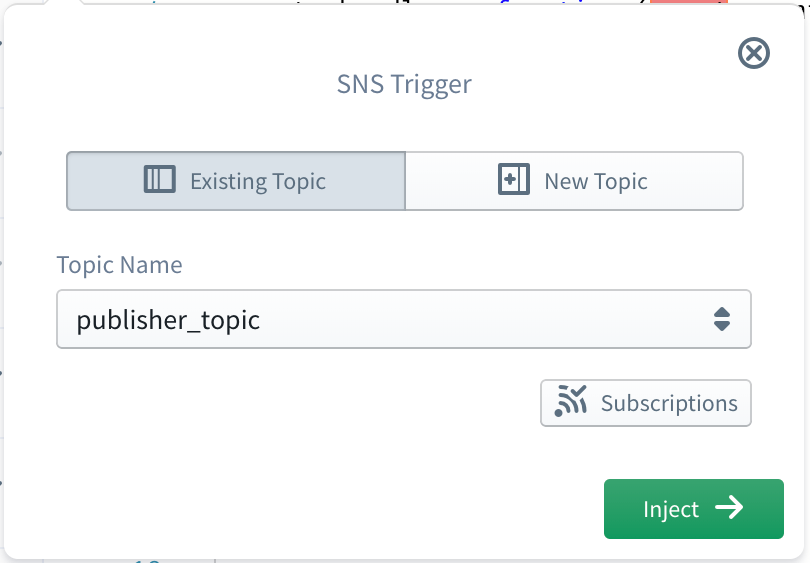
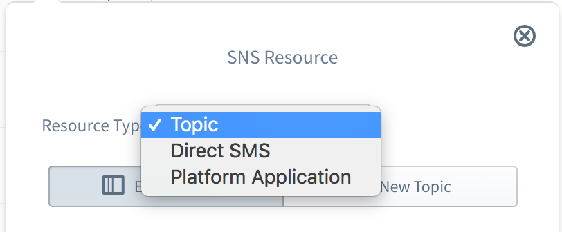

#  AWS SNS (Simple Notification Service)


Amazon Simple Notification Service (SNS) is a flexible, fully managed pub-sub messaging and mobile notifications service for coordinating the delivery of messages to subscribing endpoints and clients. With SNS you can fan-out messages to a large number of subscribers, including distributed systems and services, and mobile devices.

The Sigma IDE currently supports the following 3 types of SNS resources.
- SNS Topics (as triggers as well as for operations)
- Direct SMS via SNS (for operations)
- SNS Platform Applications  (for operations)

## SNS as a Trigger

A SNS topic can be used as a trigger for a lambda function within Sigma. For that, a SNS resource should be dragged from the resources panel and dropped on top of the `event` parameter of the lambda handler. Then the SNS topic configuration panel can be used to [set an SNS topic](#set-topic)  as the trigger.

When a SNS topic is configured as a trigger to a Lambda function, that function is invoked each time a message is published to the topic. The structure of trigger event received by Lambda function is of the following format.

````
{
   Records:[
      {
         EventSource:'aws:sns',
         EventVersion:'1.0',
         EventSubscriptionArn:'arn:aws:sns:us-east-1:111111111111:my_topic:9e72cbc4-8557-4c3e-97d5-fd805f7b9e1a',
         Sns:{
            Type:'Notification',
            MessageId:'81559821-47a5-5241-abd2-cb26179d5550',
            TopicArn:'arn:aws:sns:us-east-1:111111111111:my_topic',
            Subject:'Message Subject',
            Message:'Message Content',
            Timestamp:'2018-02-21T10:46:16.596Z',
            SignatureVersion:'1',
            Signature:'LUxjiNldCBpq1WJYHM8l+3rSRiXHIdx4HgI4+IYkkzMh46ev5j0DKTw4AvJPd0XMbySVtSVA4hWYhe6sPg==',
            SigningCertUrl:'https://sns.us-east-1.amazonaws.com/SimpleNotificationService-433026a4050d206028891664da859041.pem',
            UnsubscribeUrl:'https://sns.us-east-1.amazonaws.com/?Action=Unsubscribe&SubscriptionArn=arn:aws:sns:us-east-1:111111111111:my_topic:9e72cbc4-8557-4c3e-97d5-fd805f7b9e1a',
            MessageAttributes:{
               custom_attr_1:{
                  Type:'Number',
                  Value:'1234'
               },
               'AWS.SNS.MOBILE.MPNS.Type':{
                  Type:'String',
                  Value:'token'
               },
               'AWS.SNS.MOBILE.MPNS.NotificationClass':{
                  Type:'String',
                  Value:'realtime'
               },
               'AWS.SNS.MOBILE.WNS.Type':{
                  Type:'String',
                  Value:'wns/badge'
               }
            }
         }
      }
   ]
}
````


### <a name="set-topic">Setting the SNS topic

In SNS topic configuration panel, it is possible either to select an existing SNS topic or to define a new SNS topic.

#### Selecting an existing topic

<p align="center">
  
</p>

To select an existing topic, first go to the **Existing Topic** tab of the configuration panel. Then the **Topic Name** drop-down will be populated with all the already defined SNS topics in your AWS account for the current project region. You can simply select the required topic from that list.

#### Defining a new topic

<p align="center">
  
</p>

To define a new topic, first go to the **New Topic** tab of the configuration panel. Then a **Topic Name** should be provided, and this topic name must be non-empty and should contain only alphanumeric characters, hyphens (-), or underscores (\_). Then a **Display Name** also should be provided and it should less than 10 characters in length.

### <a name="add-topic-subscriptions">Adding subscriptions to a topic

Sigma also provides the facility to add new subscriptions to an existing or a newly defined topic. For that, first click on the **Subscriptions** button below the topic configuration fields, which will open the subscriptions panel of the topic.

<p align="center">
  
</p>

If you are using an existing topic which already has any subscriptions, they will be shown under **Existing Subscriptions**, and they cannot be changed. The new subscriptions you have defined through Sigma will be shown under **New Subscriptions** and any one of them can be removed by clicking on the remove button in-front.

To add a new subscription, first a subscription protocol should be selected from the drop-down on the left and then a suitable subscription endpoint should be specified in the right text box. Currently the following types of subscription protocols are supported.
- HTTP
- HTTPS
- Email
- Email JSON
- SQS
- Application (Platform Application)
- Lambda
- SMS

Subscription Protocol | Endpoint Type | Example
---                   | ---           | ---
HTTP                  | An HTTP URL | `http://slappforge.com`
HTTPS                 | An HTTPS URL | `https://slappforge.com`
Email                 | A valid email address | `info@slappforge.com`
Email JSON            | A valid email address | `info@slappforge.com`
SQS                   | ARN of a SQS queue | `arn:aws:sqs:us-east-1:111111111111:my-queue`
Application (Platform Application) | ARN of a SNS Platform Application | `arn:aws:sns:us-east-1:111111111111:app/GCM/my-app`
Lambda                | ARN of a Lambda function | `arn:aws:lambda:us-east-1:111111111111:function:my-function`
SMS                   | A valid phone number | `+94123123123`

Once the subscription protocol and endpoint are defined, click the + button to add the subscription.

---

## SNS for Operations

Although only the SNS topic resources can be used as triggers, all 3 types of SNS resources can be used inside Lambda code as operations. For that, a SNS resource should be dragged from the resources panel and dropped on the required line of the lambda code editor. Then the required **Resource Type** should be selected from the SNS resource configuration panel.

<p align="center">
  
</p>

---

### SNS Topic resource

When **Topic** is selected as the resource type, first an existing topic should be selected or a new topic should be defined for the operations. This procedure is exactly similar to [setting a SNS topic](#set-topic) when a SNS trigger is defined. Once the topic is configured, an operation to be injected can be selected from the **Operation** drop-down. Currently Sigma supports the following operations on SNS topics.

- Publish Message
- Get Topic Attributes
- List Topic Subscriptions
- Set Topic Attribute
- Add Topic Subscription
- Confirm Topic Subscription
- Remove Topic Subscription

#### Publish Message

**Publish Message** operation can be used to programmatically publish a message to a SNS topic. Following are the fields related to this operation.

Field              | Required            | Supports Variables  | Description
---                | :---:               | :---:                 | ---
Subject            | :x:                 | :white_check_mark:  | Subject of the message
Message            | :white_check_mark:  | :white_check_mark:  | Content of the message
Message Attributes | :x:                 | :white_check_mark:  | A set of key-value pairs that should be set as message attributes. The type of the value can be `String`, `String Array`, `Number` or `Binary`.

#### Get Topic Attributes

**Get Topic Attributes** operation can be used to programmatically retrieve the current attributes set for a SNS topic. This operation does not require any operation level parameters.

#### List Topic Subscriptions

**List Topic Subscriptions** operation can be used to programmatically retrieve the list of current subscriptions of a SNS topic. This operation does not require any operation level parameters.

#### Set Topic Attribute

**Set Topic Attribute** operation can be used to programmatically set the value of a SNS topic attribute. Following are the fields related to this operation.

Field              | Required            | Supports Variables  | Description
---                | :---:               | :---:               | ---
Attribute Type     | :white_check_mark:  | :x:  | Attribute to set the value for. This can be `Policy`, `Display Name` or `Delivery Policy`
Attribute Value     | :white_check_mark:  | :white_check_mark:  | Value to be set for the attribute

#### Add Topic Subscription

**Add Topic Subscription** operation can be used to programmatically add a new subscription to a SNS topic. Following are the fields related to this operation.

Field                 | Required            | Supports Variables  | Description
---                   | :---:               | :---:               | ---
Subscription Protocol | :white_check_mark:  | :x:                 | Protocol of the subscription to be added. This can be `HTTP`, `HTTPS`, `Email`, `Email JSON`, `SQS`, `Application`, `Lambda` or `SMS`.
Endpoint              | :white_check_mark:  | :white_check_mark:  | Subscription endpoint to be added

*Please refer [Adding subscriptions to a topic](#add-topic-subscriptions) section for more details on subscription protocols and related endpoints.*

#### Confirm Topic Subscription

**Confirm Topic Subscription** operation can be used to programmatically confirm a subscription for a SNS topic. Following are the fields related to this operation.

Field              | Required            | Supports Variables   | Description
---                | :---:               | :---:                | ---
Confirmation Token | :white_check_mark:  | :white_check_mark:   | Confirmation token received by the subscription endpoint

#### Remove Topic Subscription

**Remove Topic Subscription** operation can be used to programmatically remove an existing subscription from a SNS topic. Following are the fields related to this operation.

Field           | Required            | Supports Variables   | Description
---             | :---:               | :---:                | ---
Subscription ID | :white_check_mark:  | :white_check_mark:   | The ID of the subscription endpoint to be removed

---

### SNS Direct SMS

SNS Direct SMS feature can be used to send text messages directly to a phone number via SNS, without having to subscribe to a topic.  Following are the fields related to this operation.

Field           | Required            | Supports Variables   | Description
---             | :---:               | :---:                | ---
Mobile Number | :white_check_mark:  | :x:   | The mobile number to send the text message
Message | :white_check_mark:  | :white_check_mark:   | The message to be sent. If the message is longer than 160 characters, it will be treated as multiple text messages.
Message Type | :white_check_mark:  | :x:   | The type of the message, which can be either `Promotional` or `Transactional`. `Promotional` type can be used for non-critical messages, such as marketing messages, where SNS optimizes the message delivery to incur the lowest cost. `Transactional` type can be used for critical messages that support customer transactions, such as one-time passcodes for multi-factor authentication, where SNS optimizes the message delivery to achieve the highest reliability.
Sender ID | :x:  | :white_check_mark:   | The sender ID to be displayed as the message sender on the receiving device. This can contain up to 11 alphanumeric characters, including at least one letter and no spaces.
