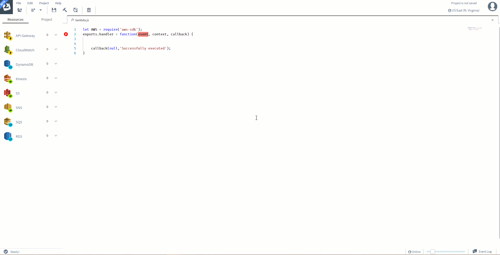

# Deploying a sample project in Sigma

In sigma, you don't necessarily have to start a project from scratch. You may start by openning an existing project from your own Github account, or by openning a public project from someone else's github account.

Inorder to make things more convinient for you, SLAppforge has provided you some sample projects covering almost all the [resources](concepts/resources.md) supported by Sigma.

You can select and open a sample project from the Project View of the IDE. There are two ways to open the Project View of Sigma.

1. At startup, after successfully loging in.

2. From the editor toolbar.

## Activating Github Integration

Inorder to activate github integration, you have connect your github account to Sigma by loging in with your github account.

Once you successfully login with Github, you will see all the features available for Github integration.

* Your Projects\
This section lists all Sigma projects which are available in your Github account
* Samples\
This section lists all Sigma projects which are avaiable in SlappForge Github account
* Public Repositories\
This section provides you the ability to directly open any Sigma repository by URL or to search all Sigma projects in a Github account by giving Github username

## Opening a sample Project

To open a sample project, just click on any of the avialble sample projects and Sigma will do the rest; creating javascript files and resources. You can simply test the application by clicking on Deploy button.