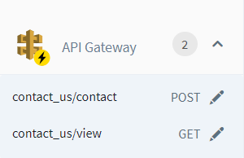

# Basic Functionalities of Sigma

The Sigma IDE mainly contains of 4 major view panes.
1. Menu Bar
2. Toolbar
3. Resources Pane
4. Editor Pane
5. Status Bar

## Menu Bar

**Menu Bar** consists of 4 menu categories -- File, Edit, Project, Help. Under
_File_ you can change your current working project and view/edit project related
settings. _Edit_ category is equipped with most common editor related operations
(keyboard shortcuts available). With menu items under _Project_ category, you
can perform current project related operations.

## Toolbar

**Toolbar** consists of shortcut buttons for a handful of quick launch operations.
_Project Select_ allows you to quickly change your project into an existing Sigma
project from your currently integrated GitHub account, pre-created Sigma samples,
a public GitHub repository for a given URL, or a new project, from the scratch.
_Add Dependency_ button facilitates adding a third-party npm dependency from npmjs.
Drop-down next to it will show dependencies already added to the current Sigma
project. _Save Project_, _Build Project_, _Deploy Project_ buttons give you a
smooth **Continuous Integration** or **Continuous Deployment** experience
depending on the operation of your choice. You can simply click on _Deploy Project_
button to automatically save your project to the integrated repository, then
build the source, and deploy it on top of your AWS account. With _Clean Unused
Resources_ button, you can easily remove all the stale resources reside in your
current project source.

## Resources Pane

The **Resources Pane** allows you to save your time solely on the application
logic. You can simply drag and drop resources and related operations from this
to the desired location (depending on the requirement of triggers or resources)
editor pane to auto-generate code snippets. As depicted in the image below,
available resource types/ trigger types are listed with related attributes.

  

All the components in the resources pane indicate whether they can be used as only
a resource, a trigger, or both. The number in front of the component name indicates
the number of resources of that components used in the current project. An expanded
view of a particular component looks like this.

  

You can simply click on the _pen_ icon to quickly edit the respective resource.

## Editor Pane

To develop the application logic of your project, apart from the drag and drop
model of components to ease the pain, Sigma allows you to exploit the power of
raw coding. **Editor Pane** is where you will code and you'll also be able to
see the auto-generated code snippets.

For example, we can add a `console.log(event)` method within the lambda function.
This would log the event trigger, on AWS CloudWatch logs.

The function would appear as follows.

  

## Status Bar

**Status Bar** contains the status information of your current project like
notifications, event logs, network status, current cursor position in editor pane,
and editor font size changer. An active status bar should look like this.

  

The _Event Log_ button of the status bar shows the event logs of your current
work session. You may also filter event logs by their log levels.

  

While executing time consuming operations in your project, you'll be able to see
the progress in the notification area of the status bar. The image below depicts
the build progress of your current project.

  

