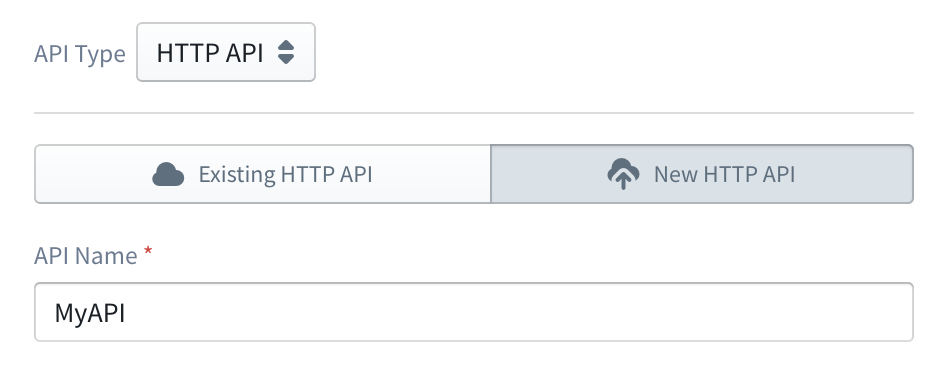
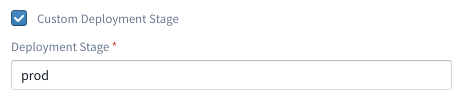
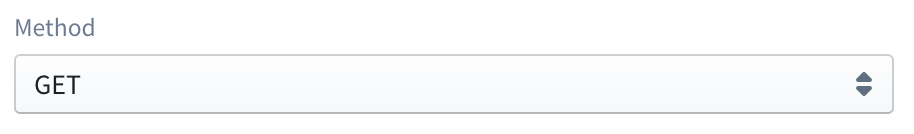
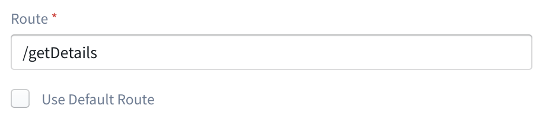

#  AWS API Gateway (HTTP)

AWS **HTTP** API Gateway (APIG) is an easy and convenient framework for building and managing HTTP API endpoints.
It offers support for multiple back-end integrations including lambda, and direct HTTP.
With HTTP APIG you can quickly set up HTTP API endpoints for your web or mobile application,
or expose your lambda as a microservice over HTTP.

A HTTP endpoint in APIG involves at least 4 definitions:

* the owning API entity itself ([`Api`](https://docs.aws.amazon.com/apigatewayv2/latest/api-reference/apis-apiid.html)),
which contributes to the base hostname (subdomain) of the API
* the [`Route`](https://docs.aws.amazon.com/apigatewayv2/latest/api-reference/apis-apiid-routes-routeid.html)
that represents the HTTP path (including path parameters)
* the [`Integration`](https://docs.aws.amazon.com/apigatewayv2/latest/api-reference/apis-apiid-integrations-integrationid.html) between 
a Route and a backend resource such as a Lambda function over an HTTP method
* the [`Stage`](https://docs.aws.amazon.com/apigatewayv2/latest/api-reference/apis-apiid-stages-stagename.html)
over which the current "version" of the API is deployed

For example, an endpoint accepting POST requests at
`https://blablablaa.execute-api.us-east-1.amazonaws.com/Prod/smartpath` involves:

* a `Api` with ID `blablablaa`
* a `Route` with path `smartpath` for the above API; the API may have several similar resources
* an `Integration` for the above route on HTTP `POST` method to a Lambda function or another HTTP endpoint
* a `Prod` stage that combines all the above (and current versions of the other entities of the `blablablaa` API)
into one live deployment "stage"

Since an HTTP endpoint is strictly an event source from a lambda's point of view,
Sigma supports APIG only as a trigger (i.e. you cannot "invoke" an APIG entity directly,
although there is no restriction on accessing one as a regular HTTP endpoint (e.g. via the `requests` module)
without direct assistance from Sigma APIs).

In order to use a HTTP APIG endpoint as a trigger for a lambda function within Sigma,
an APIG resource should be dragged from the resources panel and dropped on top of the `event` parameter of the lambda handler.
Then select the **API Type** as **HTTP API** from the APIG endpoint configuration panel, and configure the HTTP endpoint as the trigger.

When configured in this manner, an API endpoint will invoke the function every time it receives an HTTP request.
The structure of trigger event received by Lambda function contains the metadata about the request such as HTTP 
headers, query parameters along with the stringyfied version of the request payload 
(as in [proxy integration](apig_rest.md#lambda-proxy-integration)). In case of a binary payload, its Base64 encoded value will be 
included in the event.

## Configuring a HTTP APIG endpoint

As mentioned before, an endpoint consists of a root API, a route, an integration over an HTTP method and a deployment 
stage that can be configured through the APIG configuration panel.

HTTP APIG configuration panel currently allows you only to define new entities
(useful if you are starting from scratch, or are intending your project to be portable across AWS accounts)
for each of the endpoint components.

> The capability to select existing entities (convenient when you already have the APIG infrastructure set-up under 
>your account) will be added in the near future.

### Defining a new API

  

To define a new API, go to the **New API** tab of the configuration panel, and provide an **API Name**.

### Defining a deployment stage

By default, the API will be deployed under the `$default` stage. In such a case, the endpoint URL will not have a part
corresponding to the stage name.
e.g.: `https://blablablaa.execute-api.us-east-1.amazonaws.com/smartpath`

If you need to define a custom stage, that can be done by first checking the **Custom Deployment Stage** checkbox and 
then providing a custom stage name in the **Deployment Stage** field.

  

### Selecting the Integration Method

  

Then an HTTP method should be selected from the **Method** drop down. This method provides the bridge between the APIG 
HTTP endpoint, and your lambda function., i.e. when the HTTP endpoint received a request over this HTTP method, it will 
trigger the Lambda function.

If you need the Lambda function to be triggered for all the requests to a particular route, you can select **ANY** as 
the method. 

### Defining a Route

  

The route is the sub path of the API endpoint to which you need to accept the requests. It can be specified as the 
value of the **Route** field.

#### Default route

It is also possible to configure the **Default Route** of an HTTP API to trigger the Lambda function. For that, you can
check the **Use Default Route** check box on the configuration panel. In such a case, all the requests that don't match
any defined routes of the API, will be directed to this Lambda function.
