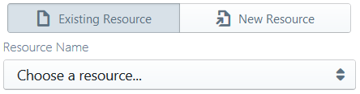
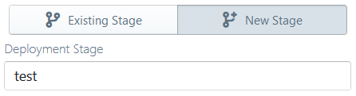

#  AWS API Gateway (REST)


AWS **REST** API Gateway (APIG) is an easy and convenient framework for building and managing HTTP REST APIs.
It offers specific support for REST, such as first-class support for JSON, and header and payload mappings,
in addition to multiple back-end integrations including lambda, AWS services, direct HTTP and mock-ups.
With REST APIG you can quickly set up REST API endpoints for your web or mobile application,
or expose your lambda as a microservice over HTTP.

A REST endpoint in APIG involves at least 4 definitions:

* the owning API entity itself ([`RestApi`](https://docs.aws.amazon.com/apigateway/api-reference/resource/rest-api/)),
which contributes to the base hostname (subdomain) of the API
* the [`Resource`](https://docs.aws.amazon.com/apigateway/api-reference/resource/resource/)
that represents the HTTP path or the REST resource (including path parameters)
* the [`Method`](https://docs.aws.amazon.com/apigateway/api-reference/resource/method/)
(`GET`, `POST` etc.) corresponding to the particular endpoint
* the [`Deployment`](https://docs.aws.amazon.com/apigateway/api-reference/resource/deployment/)
and [`Stage`](https://docs.aws.amazon.com/apigateway/api-reference/resource/stage/)
over which the current "version" of the API is deployed

For example, an endpoint accepting POST requests at
`https://blablablaa.execute-api.us-east-1.amazonaws.com/Prod/smartpath` involves:

* a `RestApi` with ID `blablablaa`
* a `Resource` with path `smartpath` for the above API; the API may have several similar resources
* a `POST` `RestMethod` for the above resource; other HTTP methods could be configured against the resource as well
* a `Prod` stage that combines all of the above (and current versions of the other entities of the `blablablaa` API)
into one live deployment "stage"

Since an HTTP endpoint is strictly an event source from a lambda's point of view,
Sigma supports APIG only as a trigger (i.e. you cannot "invoke" an APIG entity directly,
although there is no restriction on accessing one as a regular HTTP endpoint (e.g. via the `requests` module)
without direct assistance from Sigma APIs).

In order to use a REST APIG endpoint as a trigger for a lambda function within Sigma,
an APIG resource should be dragged from the resources panel and dropped on top of the `event` parameter of the lambda handler.
Then select the **API Type** as **REST API** from the APIG endpoint configuration panel, and configure the REST endpoint as the trigger.

When configured in this manner, an API endpoint will invoke the function every time it receives an HTTP request.
The structure of trigger event received by Lambda function usually contains the JSON payload of the inbound request
(or an empty object in case of empty or missing payload),
unless [proxy integration](#lambda-proxy-integration) is enabled (as described later).

> Since APIG only accepts JSON payloads by default,
in order to handle non-JSON payloads you would need to explicitly enable [proxy integration](#lambda-proxy-integration).


## Configuring a REST APIG endpoint

As mentioned before, an endpoint consists of a root API, resource path, REST method and deployment stage.
All of these can be configured through the APIG configuration panel,
in addition to some additional features such as one-click enabling of
[CORS](#cors) and [lambda proxy integration](#lambda-proxy-integration).

APIG configuration panel allows you to either select existing entities
(convenient when you already have the APIG infrastructure set-up under your account) or define new ones
(useful if you are starting from scratch, or are intending your project to be portable across AWS accounts)
for each of the endpoint components.

### Selecting an API

#### Selecting an existing API

<p align="center">
  
</p>

To select an existing API, first go to the **Existing API** tab of the configuration panel.
Then the **API Name** drop-down will be populated with all the already defined APIs in your AWS account for the current project region.
You can simply select the required API from that list.

With an existing API, you have the option of
[selecting an existing resource path](#existing-resource) or
[defining a new resource path](#new-resource);
however, since only a single integration should exist for a REST method, you always have to
[define a new REST method](#selecting-method) for the configured resource path.

#### Defining a new API

<p align="center">
  
</p>

To define a new API, go to the **New API** tab of the configuration panel, and provide an **API Name**.

When configuring a new API, you are required to
[define a new resource path](#new-resource) as well,
since the newly created API will not have any predefined paths (unlike in the case of an existing API).

### Selecting a resource path

#### <a name="existing-resource"> Selecting an existing resource path

<p align="center">
  
</p>

This only applies if you are reusing an existing API as the trigger.

Below the API selection pane, open the **Existing Resource** tab.
The **Resource Name** drop-down will list names and path texts all resource paths available under the selected API,
from which you can select the desired one.

#### <a name="new-resource"> Defining a new resource path

<p align="center">
  
</p>

Below the API selection pane, open the **New Resource** tab, and specify the HTTP path that should be used.
Sigma will automatically derive a name for the resource entity based on the entered path.

### <a name="selecting-method"> Selecting a REST method

<p align="center">
  
</p>

The REST method provides the bridge
([integration](https://docs.aws.amazon.com/apigateway/api-reference/resource/integration/))
between the APIG HTTP endpoint and your lambda function.
Hence a new REST method declaration is required for every trigger
(since it does not make sense for an already defined REST method to integrate with multiple destinations).

If an existing resource path was selected during the earlier steps,
the drop-down under the **Method** section would display the methods that are currently unused
(and hence available for use in your new trigger).
If your resource path is a newly defined one, all HTTP methods would be available for integration on the current trigger.

In any case, simply select one of them in order to route HTTP requests corresponding to the desired base API,
path and method to be routed into your lambda function.

### Additional configurations

#### <a name="lambda-proxy-integration"> Lambda proxy integration

Usually, an APIG event would only contain the JSON payload of the inbound request.
In some cases, however, you would need access to additional information regarding the request, such as HTTP headers,
or you may need to accept non-JSON payloads via your endpoint.
In such cases you can enable
[lambda proxy integration](http://docs.aws.amazon.com/apigateway/latest/developerguide/api-gateway-create-api-as-simple-proxy-for-lambda.html)
in order to receive a richer payload that contains additional metadata related to the inbound request,
in the following format:

```
{
    "resource": "/smartpath",
    "path": "/smartpath",
    "httpMethod": "POST",
    "headers": {
        "Content-Type": "text/xml; charset=windows-1252",
        "Host": "blablablaa.execute-api.us-east-1.amazonaws.com",
        "User-Agent": "Mobile Safari",
        ...
    },
    "queryStringParameters": null,
    "pathParameters": null,
    "stageVariables": null,
    "requestContext": {
        "requestTime": "26/Feb/2018:11:04:43 +0000",
        "path": "/Prod/smartpath",
        "accountId": "359675929438",
        "protocol": "HTTP/1.1",
        "resourceId": "abcdefg",
        "stage": "Prod",
        "requestTimeEpoch": 1519643083299,
        "requestId": "d928b7ed-1ae4-11e8-9b2a-6b3288489b61",
        "identity": {
            "cognitoIdentityPoolId": null,
            "accountId": null,
            ...
        },
        "resourcePath": "/smartpath",
        "httpMethod": "POST",
        "apiId": "blablablaa"
    },
    "body": "<a><b>foo</b></a>",
    "isBase64Encoded": false
}
```

Proxy integration can be enabled for your trigger by simply flipping the
**Enable lambda proxy integration** switch that appears under the method selection pane.

Please note that, with proxy integration enabled, your lambda should also return its response in a specific format,
in order for APIG to interpret it correctly (whereas otherwise you could simply return the response payload):

```
{
    "isBase64Encoded": true,
    "statusCode": 200,
    "headers": {
      "headerName": "headerValue"
    },
    "body": "..."
}
```

If this convention is not adhered to, APIG will generate a
[502 malformed lambda proxy response](https://aws.amazon.com/premiumsupport/knowledge-center/malformed-502-api-gateway/)
HTTP error as the response for the original request,
which may or may not be readable to the invoker
(e.g. if invoked via a JS-based browser client, the error response will generally be unreadable for your application
as it will not contain the necesary access control (CORS) headers).

#### <a name="cors"> CORS (cross-origin resource sharing)

If you are invoking the API via JavaScript on a browser (e.g. in case of a webapp frontend),
access control policies of the browser may not allow your application to read the responses delivered by APIG.
For bypassing this, you would need to
[enable CORS on your APIs](https://docs.aws.amazon.com/apigateway/latest/developerguide/how-to-cors.html).

Sigma will automatically enable CORS for your API,
if you have ticked the **Enable CORS** switch under the method selection pane.
This will add basic CORS enablement headers to your API endpoint so that they could be accessed from environments
where strict origin policies are enforced, such as web browsers.

> Currently Sigma's CORS headers would allow your APIs to be invoked from any domain
(with a `'*'` for `Access-Control-Allow-Origin`).
If you need more fine-grained control over the CORS headers, until we begin supporting the feature natively,
you can always enable lambda proxy integration on your API and adjust the response of your lambda
to include the appropriate CORS headers in the `headers` field of the response.

> Please note that, due to inherent limitations, any error responses from APIG
(e.g. in case of a lambda invocation failure or request/response mapping issue)
will not contain CORS headers, regardless of whether you have enabled CORS on the endpoint.
If your application relies on CORS, it may be advisable to have necessary CORS error handling logic in place
in order to mitigate such scenarios.

### Selecting a stage

As mentioned before, a stage acts as a deployment "stage" for your API,
triggering a "go-alive" of the current versions of all resources (paths, method integrations etc.) of your API.
During each deployment, Sigma will create a new
[deployment](https://docs.aws.amazon.com/apigateway/api-reference/resource/deployment/)
of your API under the selected stage, to ensure that the latest changes are immediately visible once the deployment is complete.

#### Selecting an existing stage

<p align="center">
  
</p>

Under the **Deployment Stage** section of the APIG pop-up,
switch to the **Existing Stage** tab and select one of the stage names that would be listed in the **Stage Name** list.

#### Defining a new stage

<p align="center">
  
</p>

Under the **Deployment Stage** section of the APIG pop-up,
switch to the **New Stage** tab and enter a name for the **Stage Name** field.

## Reusing an already defined APIG trigger

Since an API method entity can effectively integrate with only one backend (lambda or otherwise),
a given APIG definition can be used only against a single lambda function.
Hence if you assign the same APIG trigger definition to multiple lambda functions, your deployment will fail.

However, if you define a trigger and later decide to reassign it to a different lambda function,
you can simply [remove it](../../concepts/triggers.md#delete-trigger) from the original function, switch to the new function,
and drag the already existing definition from the resources pane on to the `event` parameter of the new function.
