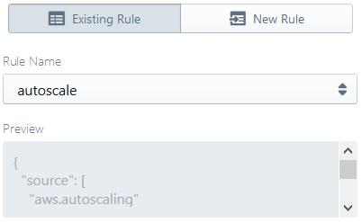
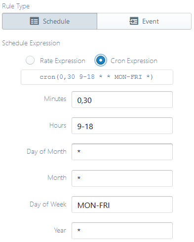
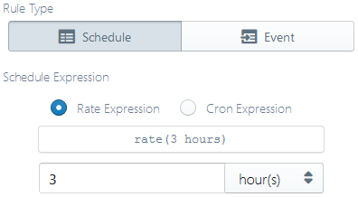
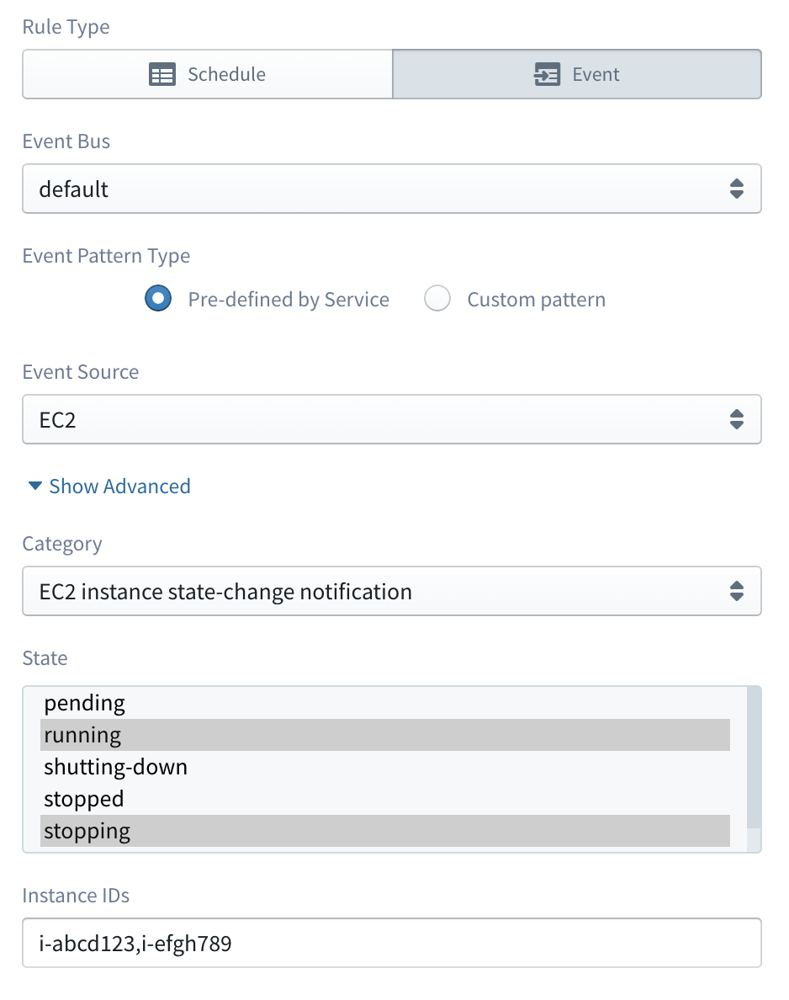
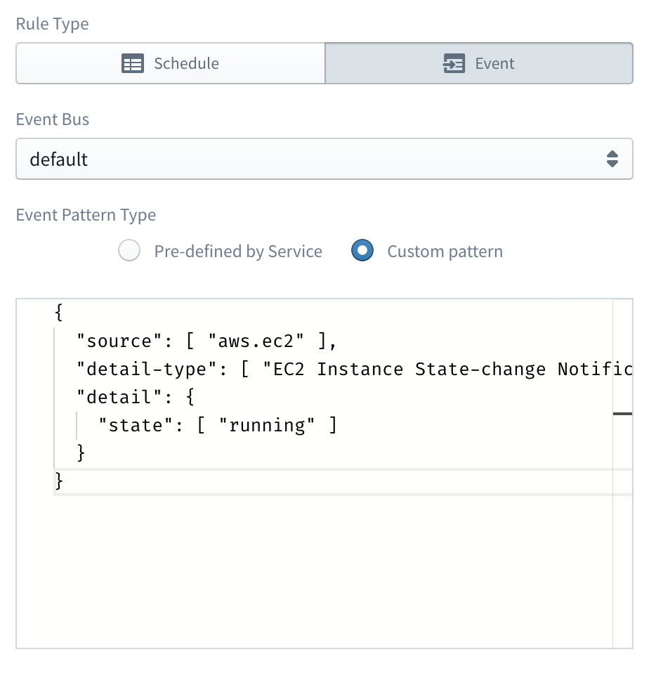

#  AWS CloudWatch Events


[AWS CloudWatch Events](https://docs.aws.amazon.com/AmazonCloudWatch/latest/events/WhatIsCloudWatchEvents.html)
(referred to as CWE here onwards) is a convenient way to incorporate time- and event-based triggers for your workflows.


## Supported Rule Types

A CWE configuration is usually called a "rule". CWE currently supports the following types of rules:

### [Schedule-based rules](https://docs.aws.amazon.com/AmazonCloudWatch/latest/events/ScheduledEvents.html)

#### [Rate syntax](https://docs.aws.amazon.com/AmazonCloudWatch/latest/events/ScheduledEvents.html#RateExpressions)

This takes the form `rate(value unit)` where:
- `value` is a positive number, and
- `unit` is a unit of time, one of: `minute`, `minutes`, `hour`, `hours`, `day`, `days`

#### [Cron syntax](https://docs.aws.amazon.com/AmazonCloudWatch/latest/events/ScheduledEvents.html#CronExpressions)

This takes the form `cron(expression)` where `expression` consists of 6 fields:
- minutes (`0-59`, with wildcards `, - * /`)
- hours (`0-23`, with wildcards `, - * /`)
- day-of-month (`1-31`, with wildcards `, - * ? / L W`)
- month (`1-12` or `JAN-DEC`, with wildcards `, - * /`)
- day-of-week (`1-7` or `SUN-SAT`, with wildcards `, - * ? L #`)
- year (`1970-2199`, with wildcards `, - * /`)

### [Event pattern-based rules](https://docs.aws.amazon.com/AmazonCloudWatch/latest/events/CloudWatchEventsandEventPatterns.html)

#### Pre-defined by Service

The following service based pre-defined event pattern rule types are currently supported:

- [AWS Auto Scaling](https://docs.aws.amazon.com/AmazonCloudWatch/latest/events/EventTypes.html#auto_scaling_event_types):
 - instance launch/termination events
 - related API calls captured via CloudTrail
- [AWS EC2](https://docs.aws.amazon.com/AmazonCloudWatch/latest/events/EventTypes.html#ec2_event_type)
 - instance state change notifications
 - EBS volume-related notifications
 - EBS snapshot-related notifications
 - related API calls captured via CloudTrail
- [AWS Health Events](https://docs.aws.amazon.com/AmazonCloudWatch/latest/events/EventTypes.html#health-event-types)
 - subsets of available Health event types
- [AWS RDS](https://docs.aws.amazon.com/AmazonRDS/latest/UserGuide/USER_Auditing.html)
 - related API calls captured via CloudTrail
- [AWS S3](https://docs.aws.amazon.com/AmazonCloudWatch/latest/events/EventTypes.html#api_event_type)
 - related API calls captured via CloudTrail

In addition, each type supports an "All events" mode where all events of the specific type are captured by the CWE rule.

An event captured via a pattern rule such as above,
would [resemble the following](https://docs.aws.amazon.com/AmazonCloudWatch/latest/events/CloudWatchEventsandEventPatterns.html):

```
{
    "version": "0",
    "id": "6a7e8feb-b491-4cf7-a9f1-bf3703467718",
    "detail-type": "EC2 Instance State-change Notification",
    "source": "aws.ec2",
    "account": "111122223333",
    "time": "2015-12-22T18:43:48Z",
    "region": "us-east-1",
    "resources": [
        "arn:aws:ec2:us-east-1:123456789012:instance/i-12345678"
    ],
    "detail": {
      "instance-id": "i-12345678",
      "state": "terminated"
    }
}
```

#### Custom

It is also possible to define a custom event pattern in the following format.

```
{
  "source": [ "aws.ec2" ],
  "detail-type": [ "EC2 Instance State-change Notification" ],
  "detail": {
    "state": [ "running" ]
  }
} 
```

## Configuring a CWE rule

CWE configuration panel allows you to either select existing rules (convenient when you already have preconfigured rules)
or define new ones (useful if you are starting from scratch, or are intending your project to be portable across AWS accounts).

### Selecting an existing rule

<p align="center">
  
</p>

To select an existing rule, open the **Existing Rule** tab of the configuration panel.
The **Rule Name** drop-down will be populated with all the already defined event rules in your AWS account
for the current project region.
You can simply select the required rule from the list and click **Inject**.
For confirmation, the **Preview** pane will display a preview of the currently selected rule.

### Defining a new rule

<p align="center">
  
</p>

To define a new rule, go to the **New Rule** tab of the configuration panel, and provide a **Rule Name**.
Next, configure a schedule- or event pattern-based rule as appropriate, and click **Inject**.

#### Defining a schedule-based rule

You can choose between a schedule-based rule (useful for periodic triggers) or an event pattern-based one
(useful for event-triggered flows, especially for monitoring actions in your AWS account)
using the tab pane below the **Rule Name** input box.

If the **Schedule** tab is selected, you will be able to define a cron- or rate-based rule
by selecting one of the **Rate Expression** and **Cron Expression** options.
In each case, Sigma will assist you by displaying a preview of the composed rule under the expression type option pane.

##### Defining a cron-based rule

<p align="center">
  
</p>

Under the **Cron Expression** option, enter appropriate values for each of the 6 fields
(leave a field with value `*` if you do not want the field to take part in the cron configuration).
You may find some useful descriptive examples in the
[official documentation](https://docs.aws.amazon.com/AmazonCloudWatch/latest/events/ScheduledEvents.html#CronExpressions).

E.g. if you want a scheduled event that fires once every 30 minutes from 9 AM to 6 PM throughout the week,
set **Minutes** to `0,30`, **Hours** to `9-18` and **Day of Week** to `MON-FRI`.

> While some parts of CloudWatch Events' cron syntax may differ from standard cron,
[online tools](https://crontab.guru/) may also be useful for composing and interpreting cron expressions.

##### Defining a rate-based rule

<p align="center">
  
</p>

Under the **Rate Expression** option, select a time unit on the right-side drop-down
and enter the unit value on the text box on the left.

E.g. if you want a scheduled event that fires once in every 3 minutes, select `minute(s)` on the drop-down
and enter `3` in the text box.

#### Defining an event pattern-based rule

First select the desired **Event Bus** from which you need to receive events from. By default, the **default** event bus will 
be used. Then select the **Event Pattern Type** based on the requirement.

##### Event pattern pre-defined by Service

<p align="center">
  
</p>

Select the **Event Pattern Type** as **Pre-defined by Service** and then select the  appropriate event source type 
from the **Event Source** drop-down.

By default, with only the event source selected, your function would be triggered for all events of the specified type.
In order to access more fine-grained filtering parameters,
you can open the advanced pane using the **Show Advanced** toggle link.

Advanced event pattern configurations are usually specific to the selected event type.
However, all configurations belong to one of two types:

- **multi-select**: you can select multiple items out of a list of available options.
An example is the **State** field on the above image
(available under **Event Source** "EC2" and **Category** "EC2 instance state-change notifications").
- **multi-value input**: you can provide multiple values (usually identifiers, e.g. EC2 instance IDs),
as a comma-separated list.
An example is the **Instance IDs** field on the above image.

##### Custom Event pattern

<p align="center">
  
</p>

Select the **Event Pattern Type** as **Custom pattern** and then provide a JSON formatted event pattern on the editor
below.

:information_source: [See here](https://docs.aws.amazon.com/AmazonCloudWatch/latest/events/EventTypes.html) for some of the example events 
from supported AWS services.

## Reusing an already defined CWE trigger

If you define a CWE trigger and later decide to reassign it to another lambda function,
you can simply drag the trigger definition (appearing under the **CloudWatch** entry on the **Resources** pane on the left)
on to the `event` parameter of the new function.
