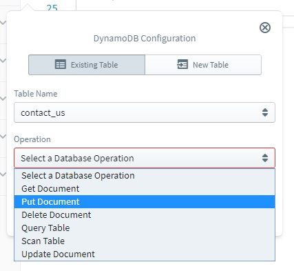

#  AWS Dynamo DB

## DynamoDB for Operations

Siga IDE provides ability generate code to perform following operations on a DynamoDB resource(table).

* Get Document
* Put Docuement
* Delete Docuement
* Update Document
* Scan Table
* Query Table

When injecting a new operation, user has the ability to either create a new DynamoDB table
or to use an existing DynamoDB table which is accessible by the current user credentials.

Inorder to start with DynamoDB, user has to drag DynamoDB tile to the code editor from the resources panel.
Then user may choose either **New Table** or **Existing Table** option based on the requirement.

### Existing Table option

If it's required to execute an operation on a table which is already exists, first user should select the **Existing Table** mode tab. Then existing table names will be listed in the Table Name drop down list. User can easily select required queue from that drop down list.

In the existing table list, a union of following table sets will be visible to the user.

* Tables already exist in AWS account of user.
* Tables which have been previously created in the same project.

### New Table Option

If it's required to execute an operation on a newly created table, first user should select the **New Table** mode tab.\
Then required parameters should be configured for the queue which is going to be created and invoke the required operation.

#### Configuring a New DynamoDB Resource

Field|Required|Description
---|:---:|---
Table Name| :white_check_mark: |A unique name to refer the table
Partition Key| :white_check_mark: |Name of the field to consider as the partition key
Sort Key| :x: |Name of the field to consider as the Sort Key

### Configuring Operation

Once you create or select a valid DynamoDB table, then an option will be visible to select the intended DynamoDB operation.

#### Get Document Operation

This operation can be used to retrieve a set of attributes for an item with the given Primary Key. (Primary Key is the combination of Partition Key and Sort Key)

Field|Required|Description|
---|:---:|---|
Partition Key| :white_check_mark: |Field name of the partition key
Sort Key|Required if, table specified has a sort key|Field name of the sort key

#### Put Docuement Operation

This operation can be used to either create a new item, or to update an existing item.

Field|Required|Description|
---|:---:|---|
Values| :white_check_mark: |A list of attribute:value pairs where, attribute is the name of the field and value is the intended value for that field.

#### Delete Document Operation

This operation deletes a single item from the table, when Primary Key of the item is given.

Field|Required|Description|
---|:---:|---|
Partition Key| :white_check_mark: |Field name of the partition key
Sort Key|Required if, specified table has a sort key|Field name of the sort key

#### Update Document Operation

This operation edits an existing item in the table, or create a new item if specified item is not existing.

Field|Required|Description|
---|:---:|---|
Partition Key| :white_check_mark: |Field name of the partition key
Sort Key|Required if, specified table has a sort key|Field name of the sort key
Expression Attribute Values| :x: |A list of [Variable Name]:[Value] pairs, which can be used in the update expression
Expression Attribute Names| :x: |A list of [Identifier]:[Attribute Name] pairs, which can be used in the update expression
Condition Expression| :x: |Can be used to update only if specified condition is met. This is a list of [Identifier]:[Variable Name] pairs, where [Identifier] is from Expression Attribute Names and [Variable Name] is from Expression Attribute Values
Update Expression| :x: |Can be used to specify the new values for the target fields. This is a list of [Identifier]:[Variable Name] pairs, where [Identifier] is from Expression Attribute Names and [Variable Name] is from Expression Attribute Values

#### Scan Table Operation

THis operation can be used to retrieve a list of Items which meets a specified condition. This will iterate over all the elements in the table to compose the results, since it is not required to short list Item set by primary key in Scan operation.

Field|Required|Description|
---|:---:|---|
Expression Attribute Values| :x: |A list of [Variable Name]:[Value] pairs, which can be used in the update expression
Filter Expression| :x: |Condition to do more filtering on the selected Items using Key Condition Expression

#### Query Table Operation

This operation can be used to retrieve a list of Items by specifying Partition Key and a condition for Sort Key or secondary index.

Field|Required|Description|
---|:---:|---|
Expression Attribute Values| :x: |A list of [Variable Name]:[Value] pairs, which can be used in the update expression
Key Condition Expression| :white_check_mark: |Condition to narrow down result set by applying conditions on Primary Key
Filter Expression| :x: |Condition to do more filtering on the selected Items using Key Condition Expression
