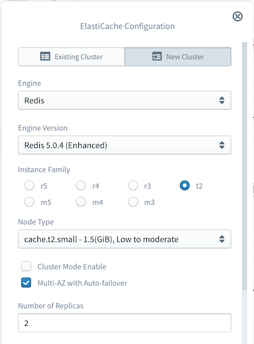
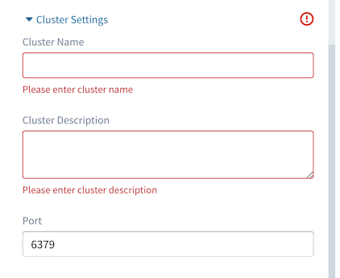
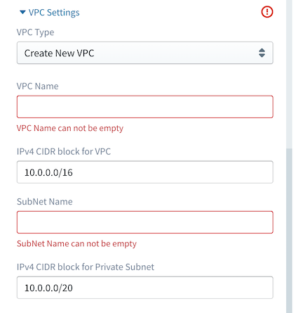
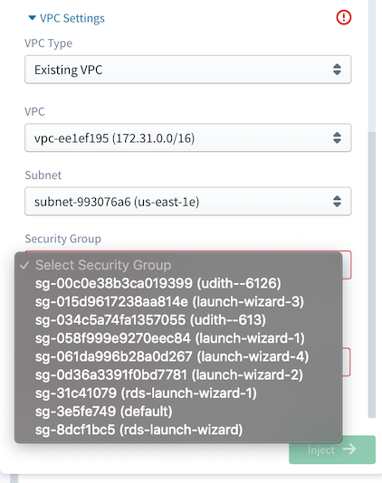
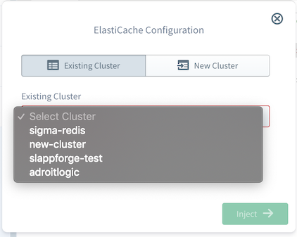
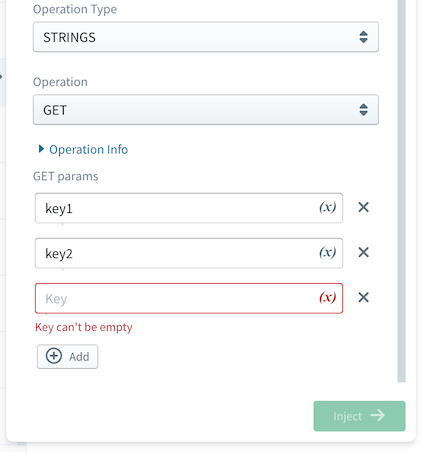
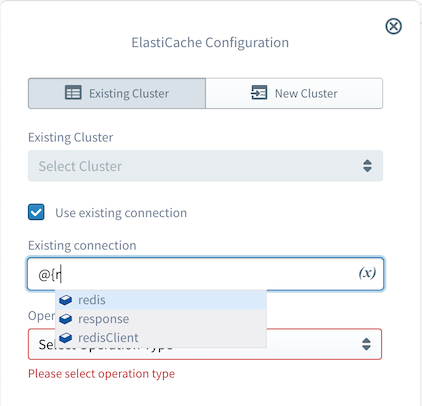

#  AWS ElastiCache

ElastiCache is a fully managed, in-memory data store for enterprise-level, data-intensive applications. ElastiCache 
can improve the performance of consumer applications, by retrieving data from its in-memory data stores with high throughput and low latency. 
ElastiCache supports two open-source cache engines, Amazon ElastiCache for Redis and Amazon ElastiCache for Memcached.

The Sigma IDE currently supports only for Amazon ElastiCache for Redis.

## Amazon ElastiCache for Redis

**Re**mote **Di**ctionary **S**erver is an open-source, in-memory key-value data storage that can offer multi-purpose 
functionalities such as a database, cache, message broker, and queue. Sigma IDE provides the ability to create a new Redis cluster as well as 
choose an existing cluster to execute operations.

### New Redis Cluster

To create a new cluster, first, go to the **New Cluster** tab of the configuration panel. Inorder to create new Redis cluster following configurations 
required.

#### Cluster Engine Configuration

<p align="center">
  
</p>

Field                       | Required           | Description
---                         | :---:              | ---
Engine                      | :white_check_mark: | The cache engine type to be used for the cluster   
Engine Version              | :white_check_mark: | The version number of the cache engine to be used for the cluster 
Node Type                   | :white_check_mark: | The compute and memory capacity of the node
Cluster mode                | :white_check_mark: | Standalone or Clustered 
Multi-AZ with Auto-failover | :white_check_mark: | Auto failover with multi availability zones
Number of Shards            | :white_check_mark: | Number of shards in the cluster 
Number of Replicas          | :white_check_mark: | Number of replicas within a single shard
&nbsp;

Field                       | Constraints
---                         | ---
Multi-AZ with Auto-failover | Only available in standalone mode(cluster mode disabled). In cluster mode enabled by default
Number of Shards            | Only available in cluster mode, minimum:2 maximum:15. Otherwise, default to be 1  
Number of Replicas          | Maximum: 6, If Multi-AZ with Auto-failover enabled minimum should be 2, 1 otherwise
&nbsp;

#### Cluster Settings

<p align="center">
  
</p>
  

Field               | Required           | Description
---                 | :---:              | ---
Cluster Name        | :white_check_mark: | Name for the cluster to be used as an identifier 
Cluster Description | :white_check_mark: | Description for the cluster
Port                | :white_check_mark: | The port number on which cluster accepts connections
&nbsp;

Field        | Constraints
---          | ---
Cluster Name | Name must contain from 1 to 20 alphanumeric characters or hyphens, the first character must be a letter, the name cannot end with a hyphen or contain two consecutive hyphens.
&nbsp;

#### VPC Configuration

When creating a new ElastiCache cluster, you need to configure a VPC as well. Sigma enables
functionality to create new VPC as well as use an existing one.

##### Create New VPC

To create new VPC, expand VPC settings and select **Create New VPC** option from VPC type dropdown.

<p align="center">
  
</p>

Field                 | Required           | Description
---                   | :---:              | ---
VPC Name              | :white_check_mark: | Name of the VPC 
CIDR block            | :white_check_mark: | IPv4 CIDR block for the VPC
Subnet Name           | :white_check_mark: | Name of the private subnet 
CIDR block for subnet | :white_check_mark: | IPv4 CIDR block for the private subnet

**Important:**  
> **When creating a new VPC, make sure your lambda is also deploying in the same VPC. Select No VPC option
from lambda Advanced configuration. Then Sigma IDE will be automatically deployed your lambda in the new VPC you created.**

##### Using Existing VPC

To use already existing VPC, select **Existing VPC** option from VPC type under VPC settings.

<p align="center">
  
</p>

Field          | Required           | Description
---            | :---:              | ---
VPC            | :white_check_mark: | Select a VPC from available VPC dropdown 
Subnet         | :white_check_mark: | Select a subnet from available subnets for selected VPC 
Security Group | :white_check_mark: | Select a security group from available security groups for selected VPC 

**Important:**  
> **When using an existing VPC, make sure your lambda function is also deployed in the same VPC. Either select the same VPC 
(with the same Subnet and Security Group) that you selected for ElastiCache cluster in lambda advanced configuration or 
leave 'No Vpc' option so that Sigma IDE will be able to deployed your lambda function in the same VPC as ElastiCache cluster**

### Existing Redis Cluster

To choose an existing redis cluster, go to the **Existing Cluster** tab of the configuration panel. Existing cluster 
instances can be selected from Existing cluster dropdown.

<p align="center">
  
</p>

### Basic Code Template

After ElastiCache configuration completed, Sigma IDE will generate following basic code template for you. 

```
// You must always quit the redis client after it's used
redis.[operation-name]({
    clusterIdentifier: 'sigma-redis',
    params: [
        //Operation parameters
    ]
}, function (error, response, redisClient) {
    if (error) {
        callback(error);
    } else {
        //redisClient.quit();
    }
});
```

### Perform operations on multiple keys using single Sigma operation

Most of the Redis operations are restricted to interact with only one key inside a single operation. 
With Sigma IDE, now you can perform same redis operation on multiple of keys using single Sigma operation. 

For an example redis `get` operation returns value of corresponding key while Sigma allows
you to fetch values of multiple keys using single Sigma get operation.

<p align="center">
  
</p>

```
redis.get({
    clusterIdentifier: 'sigma-redis',
    params: [
        'key1', 'key2', 
    ]
}, function (error, response, redisClient) {
    if (error) {
        callback(error);
    } else {
        //redisClient.quit();
    }
});
```

### Return Values 

For every executed operation Sigma will return following attributes in its callback function.

 - `error`: This object will contain error if any. Otherwise it will be `null`
 - `response`: Response object of the operation. 
 - `redis client`: Redis client connection object that created communicate with the Redis server.

### Response Format

Field   | Type   | Description  
:---:   | :---:  | :---
Success | Number | Number of succeeded operations
Failed  | Number | Number of failed operations
results | Object | Object containing result objects of each individual key
&nbsp;

```
{
    success: "Number of succeeded operations",
    failed: "Number of failed operations",
    results: {
        key1: {
            result: "Result for key1",
            error: "error for key1 if any"
        },
        key2: {
            result: "Result for key2",
            error: "error for key2 if any"
        }, 
        ...
        keyN: {
            result: "Result for keyN",
            error: "error for keyN if any"
        }
    }
}
```

### Redis Connection Object

Sigma will return redis client connection object in callback. Connection object can be
reused for further operations without creating new connection.

**Important**
> **Make sure to close connection after it is used. Otherwise your lambda may face connection time out**

#### How to reuse Connection

You can reuse connection object within the callback function for further operations. 
First drag and drop new ElastiCache resource from resource panel into callback function
code area. Then go to the **Existing Cluster** tab of the configuration panel and 
select **Use existing connection** option. 

<p align="center">
  
</p>

```
// You must always quit the redis client after it's used
redis.set({
    clusterIdentifier: 'sigma-redis',
    params: [{
        key: 'my_key',
        value: 'test_value'
    }]
}, function (error, response, redisClient) {
    if (error) {
        callback(error);
    } else {
        redis.rename({
            redisClient: redisClient,
            params: [{
                key: 'my_key',
                name: 'new_key'
            }]
        }, function (error, response, redisClient) {
            if (error) {
                callback(error);
            } else {
                //redisClient.quit();
            }
        });
    }
});
```
### Testing your cluster

**Important:** 
>**At the moment you cannot test ElasitiCache operations using Sigma IDE test lambda. We will enable this feature
in near future for you.**


### ElastiCache for Redis Operations

Sigma IDE currently supports following categories of Redis operations.

* Key
* Strings
* Set 

#### Key Operations

##### 1. DELETE 

- Description

Removes the specified key/keys. A key is ignored if it does not exist.

- Parameters

Parameter | Type   | Required
:---:     | :---:  | :---:
Key       | String | :white_check_mark:
 
- Response

Return type | Success | Failure 
:---:       | :---:   | :---:
Integer     | `1`     | `0` if key does not exists
&nbsp;

##### 2. EXPIRE

- Description

Set a timeout in seconds on key. The key will be automatically deleted after the timeout has been expired.
A key which associated with a timeout is said to be volatile in Redis terminology.

- Parameters

Parameter | Type    | Required
:---:     | :---:   | :---:
Key       | String  | :white_check_mark:
Seconds   | Integer | :white_check_mark:
 
- Response

Return type | Success | Failure 
:---:       | :---:   | :---:
Integer     | `1`     | `0` if key does not exists
&nbsp;

##### 3. PERSIST

- Description

Remove the existing timeout on key, making the key from volatile 
to persistent (a key with no timeout is association).

- Parameters

Parameter | Type   | Required
:---:     | :---:  | :---:
Key       | String | :white_check_mark:
 
- Response

Return type | Success | Failure 
:---:       | :---:   | :---:
Integer     | `1`     | `0` if key does not have associated time out or key does not exists
&nbsp;

##### 4. TYPE

- Description

Remove the existing timeout on key, making the key from volatile 
to persistent (a key that no timeout is associated).

- Parameters

Parameter | Type   | Required
:---:     | :---:  | :---:
Key       | String | :white_check_mark:

- Response

Return type | Success         | Failure 
:---:       | :---:           | :---:
String      | Type of the key | `none` if key does not exists
&nbsp;

##### 5. RENAME

- Description

Rename a key into a new key. If new key already exists then its value will be overwritten.

- Parameters

Parameter | Type   | Required
:---:     | :---:  | :---:
Key       | String | :white_check_mark:
Name      | String | :white_check_mark:

- Response

Return type | Success | Failure 
:---:       | :---:   | :---:
String      | `OK`    | An `error` if key does not exists
&nbsp;

#### Strings Operations

##### 1. APPEND

- Description

Append value at the end of string key if key does exists. If key does not exists,
Redis will create an empty string and append value.

- Parameters

Parameter  | Type   | Required
:---:      | :---:  | :---:
Key        | String | :white_check_mark:
Value      | String | :white_check_mark:

- Response

Return type | Success         
:---:       | :---:           
Integer     | The length of the string after the operation. 
&nbsp;

##### 2. DECRBY

- Description

Decrement the value of the key by decrement. Limited to 64 but signed integers.
If the key does not exist, Redis will set value to 0 before performing operation.  

- Parameters

Parameter  | Type    | Required
:---:      | :---:   | :---:
Key        | String  | :white_check_mark:
Decrement  | Integer | :white_check_mark:

- Response

Return type | Success                               | Failure      
:---:       | :---:                                 | :---:
Integer     | Value of the key after the operation. | An `error` if the key contains a value of the wrong type or contains a string that can not be represented as integer
&nbsp;

##### 3. GET

- Description

Get the value stored in the key

- Parameters

Parameter  | Type   | Required
:---:      | :---:  | :---:
Key        | String | :white_check_mark:

- Response

Return type | Success           | Failure        
:---:       | :---:             | :---:     
Bulk String | Value of the key. | `Null` if the key does not exists, An `error` if the stored value is not a string
&nbsp;

##### 4. INCRBY

- Description

Increment the value of the key by increment. Limited to 64 but signed integers.
If the key does not exist, Redis will set value to 0 before performing operation.  

- Parameters

Parameter  | Type    | Required
:---:      | :---:   | :---:
Key        | String  | :white_check_mark:
Increment  | Integer | :white_check_mark:

- Response

Return type | Success                               | Failure      
:---:       | :---:                                 | :---:
Integer     | Value of the key after the operation. | An `error` if the key contains a value of the wrong type or contains a string that can not be represented as integer
&nbsp;

##### 5. SETEX

- Description

Create new key with string value and set key to timeout after the given timeout in seconds.
This command is equivalent to executing SET and EXPIRE commands.

- Parameters

Parameter  | Type    | Required
:---:      | :---:   | :---:
Key        | String  | :white_check_mark:
Value      | String  | :white_check_mark:
Seconds    | Integer | :white_check_mark:

- Response

Return type | Success | Failure        
:---:       | :---:   | :---:     
String      | `OK`    | An `error` if the seconds are invalid
&nbsp;

##### 6. SET

- Description

Create new key with string value. If key holds a value, it will overwritten regardless 
of value type. Any timeout previously associated will be discarded on successful SET operation.

- Parameters

Parameter  | Type    | Required
:---:      | :---:   | :---:
Key        | String  | :white_check_mark:
Value      | String  | :white_check_mark:

- Response

Return type | Success        
:---:       | :---:        
String      | `OK`    
&nbsp;

##### 7. STRLEN

- Description

Get the length of the value stored in the given key.

- Parameters

Parameter  | Type    | Required
:---:      | :---:   | :---:
Key        | String  | :white_check_mark:

- Response

Return type | Success                                   | Failure        
:---:       | :---:                                     | :---:     
Integer     | The length of the value stored in the key | `0` if key does not exists, An `error` if the key holds non string value  
&nbsp;

#### Set Operations

##### 1. SADD

- Description

Add the specified members to the set stored at key. Specified members that already contains in the set are ignored. 
If set does not exists, a new set will be created before adding the specified members.

- Parameters

Parameter  | Type    | Required
:---:      | :---:   | :---:
Set        | String  | :white_check_mark:
Value      | Any     | At least one 

- Response

Return type | Success                                          
:---:       | :---:                                         
Integer     | Number of members that were added to the set, not including all the members that already present in the set   
&nbsp;

##### 2. SCARD

- Description

Returns the cardinality (number of members) of the set stored at key.

- Parameters

Parameter  | Type    | Required
:---:      | :---:   | :---:
Set        | String  | :white_check_mark:

- Response

Return type | Success                                   | Failure        
:---:       | :---:                                     | :---:     
Integer     | Number of elements of the specified set   | `0` if set does not exists 
&nbsp;

##### 3. SDIFF

- Description

Returns the members of the set resulting from the difference between the first set 
and all the successive sets.

For example:
```
set1 = {a,b,c,d,e,f}  
set2 = {c,d}  
set3 = {b,c,e,g}

Result = {a,f}
```
- Parameters

Parameter  | Type    | Required
:---:      | :---:   | :---:
Set        | String  | :white_check_mark:
Set        | String  | At least one 

- Response

Return type | Success                                           
:---:       | :---:                                          
Array       | Array with elements of the resulting set. 
&nbsp;

##### 3. SDIFFSTORE

- Description

Equivalent command to SDIFF, but instead of returning the resulting set,
this command will stored resulting set in specified destination.
If destination already exists, it is overwritten.

- Parameters

Parameter             | Type    | Required
:---:                 | :---:   | :---:
New set (destination) | String  | :white_check_mark:
Set                   | String  | At least one  

- Response

Return type | Success                                           
:---:       | :---:                                          
Integer     | The number of elements in the resulting set  
&nbsp;

##### 4. SINTER

- Description

Returns the members of the set resulting from the intersection of all the given sets.

For example:
```
set1 = {a,b,c,d,e,f}  
set2 = {c,d}  
set3 = {b,c,d,g}

Result = {c,d}
```
- Parameters

Parameter  | Type    | Required
:---:      | :---:   | :---:
Set        | String  | :white_check_mark:
Set        | String  | at least one 

- Response

Return type | Success                                           
:---:       | :---:                                          
Array       | Array with elements of the resulting set. 
&nbsp;

##### 5. SINTERSTORE

- Description

Equivalent command to SINTER, but instead of returning the resulting set,
this command will stored resulting set in specified destination.
If destination already exists, it is overwritten.

- Parameters

Parameter             | Type    | Required
:---:                 | :---:   | :---:
New set (destination) | String  | :white_check_mark:
Set                   | String  | At least one  

- Response

Return type | Success                                           
:---:       | :---:                                          
Integer     | The number of elements in the resulting set
&nbsp;

##### 6. SISMEMBER

- Description

Returns if a element(s) is a member of the specified set.

- Parameters

Parameter  | Type    | Required
:---:      | :---:   | :---:
Set        | String  | :white_check_mark:
Value      | Any     | At least one  

- Response

Return type | Success                                    | Failure                                  
:---:       | :---:                                      | :---:           
Integer     | `1` if the element is a member of the set. | `0` if the element is not a member of the set, or if key does not exist.
&nbsp;

##### 7. SMEMBERS

- Description

Returns all the members of the specified set.
This operation has the same effect as running SINTER with only one set.

- Parameters

Parameter  | Type    | Required
:---:      | :---:   | :---:
Set        | String  | :white_check_mark:

- Response

Return type | Success                                           
:---:       | :---:                                          
Array       | All elements of the specified set.
&nbsp;
  
##### 8. SMOVE

- Description

Move member from the source set to the destination set. If the source set does not exist or does not contain the specified element, 
no operation is performed and 0 is returned.  
Otherwise, the element is removed from the source set and added to the destination set. 
When the specified element already exists in the destination set, it is only removed from the source set.

- Parameters

Parameter   | Type    | Required
:---:       | :---:   | :---:
Set         | String  | :white_check_mark:
Value       | Any     | :white_check_mark:  
Destination | String  | :white_check_mark:

- Response

Return type | Success                                                                                                    | Failure                                  
:---:       | :---:                                                                                                      | :---:           
Integer     | `1` if the element is moved, `0` if the element is not a member of source and no operation was performed | An `error` is returned if source or destination does not hold a set value.
&nbsp;

##### 9. SREM

- Description

Remove the specified member from the set stored at key. If specified member is not a member of the set, it will be ignored. 
When key does not exist, it is treated as an empty set and returns 0.

- Parameters

Parameter   | Type    | Required
:---:       | :---:   | :---:
Set         | String  | :white_check_mark:
Value       | Any     | :white_check_mark: 

- Response

Return type | Success                       | Failure                                                                                | Failure                                  
:---:       | :---:                         | :---:                                                                             | :---:           
Integer     | `1` if the element is removed | An `error` is returned when the value stored at key is not a set

##### 10. SUNION

- Description

Returns the members of the set resulting from the addition(union) of all the given sets.

For example:
```
set1 = {a,b,c,d,e,f}  
set2 = {c,d}  
set3 = {b,c,d,g}

Result = {a,b,c,d,e,f,g}
```
- Parameters

Parameter  | Type    | Required
:---:      | :---:   | :---:
Set        | String  | :white_check_mark:
Set        | String  | at least one 

- Response

Return type | Success                                           
:---:       | :---:                                          
Array       | Array with elements of the resulting set. 
&nbsp;

##### 11. SUNIONSTORE

- Description

Equivalent command to SUNION, but instead of returning the resulting set,
this command will be stored resulting set in specified destination.
If destination already exists, it is overwritten.

- Parameters

Parameter             | Type    | Required
:---:                 | :---:   | :---:
New set (destination) | String  | :white_check_mark:
Set                   | String  | At least one  

- Response

Return type | Success                                           
:---:       | :---:                                          
Integer     | the number of elements in the resulting set
&nbsp;
 

