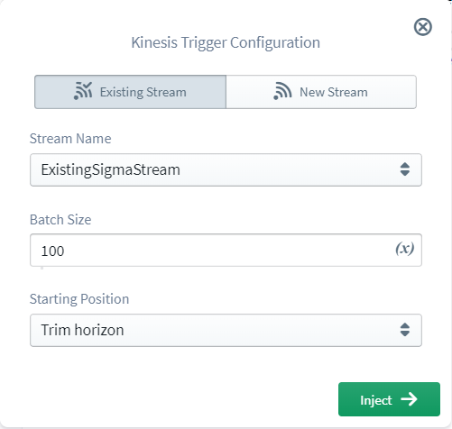
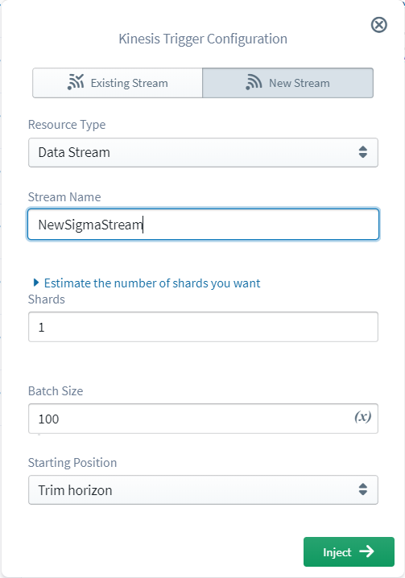

#   AWS Kinesis


Amazon Kinesis is a real-time streaming data service which makes it easy to
collect, process, and analyze. Kinesis offers capabilities of cost-effectively
process streaming data at any scale to get timely insights and react quickly to
newly generated information. With Kinesis, now you can ingest real-time video,
audio, logs, website clickstreams, IoT telemetry data for machine learning, and
many more.

The Sigma IDE currently supports only the following type of Kinesis resources.
- Kinesis Data Stream type (for triggers and for operations)

## Kinesis as a Trigger

A Kinesis stream can be used to trigger a lambda function within a Sigma project.
To insert a Kinesis stream as a trigger, a Kinesis resource should be dragged from
the resources panel and dropped on top of the `event` parameter of the lambda handler. Next, the Kinesis topic configuration panel should be used to
[set a Kinesis stream](#select-stream) as the trigger.

When a Kinesis stream is configured as a trigger to a Lambda function, that function is invoked each time a record is published to the defined stream. The structure
of trigger event received by Lambda function is of the following format.

````
{
  "Records": [
    {
      "eventID": "shardId-000000000000:49545115243490985018280067714973144582180062593244200961",
      "eventVersion": "1.0",
      "kinesis": {
        "approximateArrivalTimestamp": 1428537600,
        "partitionKey": "partitionKey-3",
        "data": "SGVsbG8sIHRoaXMgaXMgYSB0ZXN0IDEyMy4=",
        "kinesisSchemaVersion": "1.0",
        "sequenceNumber": "49545115243490985018280067714973144582180062593244200961"
      },
      "invokeIdentityArn": "arn:aws:iam::EXAMPLE",
      "eventName": "aws:kinesis:record",
      "eventSourceARN": "arn:aws:kinesis:EXAMPLE",
      "eventSource": "aws:kinesis",
      "awsRegion": "us-east-1"
    }
  ]
}
````

### Trigger Parameters

*Kinesis triggers have the following trigger specific parameters.*

- Batch size:
The largest number of records that will be read from your stream at once.

- Starting position:
The position in the stream to start reading from. For more information, see `ShardIteratorType` in the Amazon Kinesis API Reference.
Latest

### <a name="select-stream">Setting the Kinesis stream</a>

In Kinesis stream configuration panel, it is possible either to select an existing Kinesis stream or to define a new stream.

#### Selecting an existing stream

<!-- TODO: change image -->
<p align="center">
  
</p>

To select an existing stream, first go to the **Existing Stream** tab of the configuration panel. Then, under the **Stream Name** you will be able to select the required stream from the list of streams you already own in your AWS account under your current project region.

#### Defining a new stream

<!-- TODO: change image -->
<p align="center">
  
</p>

To define a new stream, first go to the **New Stream** tab of the configuration panel. Then a **Stream Name** should be
provided, and this stream name must be non-empty and should contain only alphanumeric characters, hyphens (-), periods (.), or underscores (\_). Then,
provide a positive integer within the shard limit for your account under `Shards`.
To request an increase in the shard limit of your account, use
<a href="https://console.aws.amazon.com/support/home#/case/create?issueType=service-limit-increase&limitType=service-code-kinesis">Kinesis Data Stream Limits form</a>.

---

## Kinesis Stream Operations

Kinesis Data Stream type resources can be used inside Lambda to perform operations
on streams. To auto-generate relevant code snippet for the operation you desire,
simply drag a Kinesis resource from the resources panel and drop on the required
line in editor.

---

### Kinesis Stream resource

When a new Kinesis stream is dragged and dropped into the editor, first the [resource mode should be selected](#select-stream) depending on it's an existing
one or a new one and configured. Once the stream configuration is done, an
operation should be selected to inject the code snippet into the editor.
Currently Sigma supports the following operations on Kinesis streams.

- Describe Stream
- Put Record

#### Describe Stream

**Describe Stream** operation can be used to programmatically retrieve the information
about the specified Kinesis data stream. The information returned includes the stream
name, ARN, creation time, enhanced metric configuration, and shard map. This operation
has a limit of 10 transactions per second per account. The fields related to
this operation are as follows.

Field | Type | Required | Supports Variables | Description
--- | :---: | :---: | :---: | ---
Max Shard Limit | `Integer` | :x: | :white_check_mark: | Maximum number of shards to return in a single call Default is 100
Exclusive Start Shard ID | `String` | :x: | :white_check_mark:  | The shard ID of the shard to start with

#### Put Record

**Put Record** operation can be used to programmatically write a single data record
into a Kinesis data stream. This operation sends data into the stream allowing real-time
ingestion and subsequent processing, one record at a time. The fields related to
this operation are as follows.

Field | Type | Required            | Supports Variables  | Description
--- | :---: | :---: | :---: | ---
Data | `String` | :white_check_mark:  | :white_check_mark:  | The data string to put into the record, the total size must not exceed the maximum record size (1 MB)
Partition Key | `String` | :white_check_mark:  | :white_check_mark: | Determines which shard in the stream the data record is assigned to
Explicit Hash Key | `String` | :x:  | :white_check_mark: | The hash value used to explicitly determine the shard the data record is assigned to by overriding the partition key hash
Sequence Number  | `String` | :x:  | :white_check_mark: | Guarantees strictly increasing sequence numbers, for puts from the same client and to the same partition key
