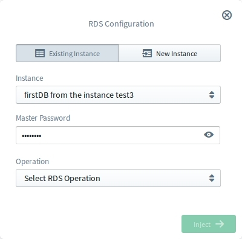
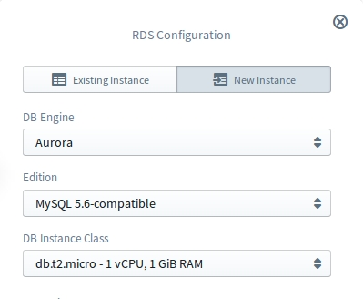
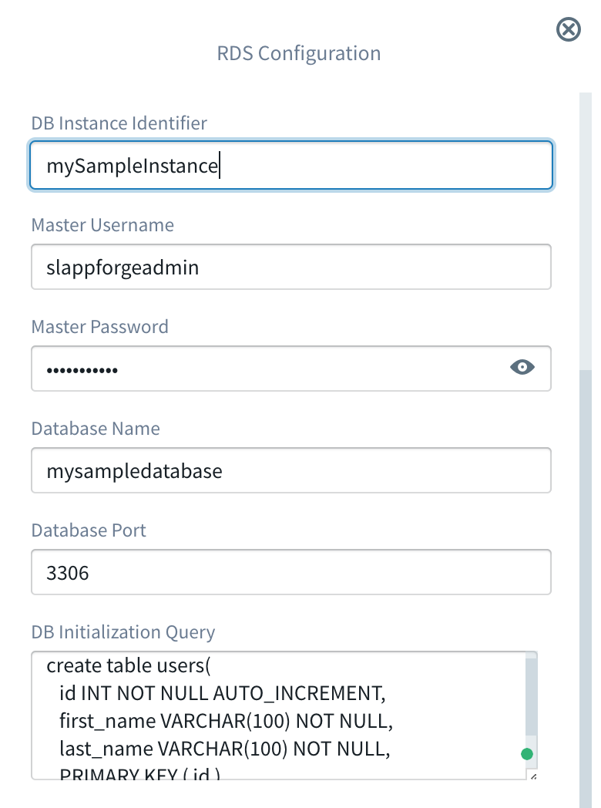

#   AWS RDS (Relational Database System)

Amazon RDS is a managed relational database service that provides six familiar database engines to choose from, including
Amazon Aurora, MySQL, MariaDB, Oracle, Microsoft SQL Server, and PostgreSQL. Amazon RDS handles routine database tasks
such as provisioning, patching, backup, recovery, failure detection, and repair. Amazon RDS makes it easy to use replication
to enhance availability and reliability for production workloads.

The Sigma IDE currently supports the following database engines.
- Amazon Aurora MySQL
- MySQL

## RDS for Operations
Sigma IDE provides the ability to execute any database query on RDS resources. Users have the ability to either select an
existing RDS instance or startup a new instance with an initialization DDL. Sigma provides ability to configure both
operation and instance resource under a single window without any overhead to the user.

To use RDS resource for operations, it should be dragged from the resources panel and dropped on the required line of the
lambda code editor. Then user should select either **Existing Instance** tab or **New Instance** tab based on the
requirement.

### Using Already Existing RDS Instance

If it's required to execute a query on an instance which already exists, first user should select the **Existing Instance**
mode tab. Then existing instances will be listed in the Instance drop down list. The naming convention used there is
<Database_Name> from the <Instance_Identifier>. User can easily select required instance from that drop down list.

Once user selects the instance, if this is the first time the selected instance is used in the project, Master Password
parameter will be requested from the user.

  

### Using New RDS Instance

If it's required to startup a new instance and execute a query on the newly created instance, first user should select the
**New Instance** mode tab. Then required parameters should be configured for the instance which is going to be created and
queried.

#### Configuring New RDS Resource

Configuration for an RDS instance mainly divides into two categories. Parameters in the first category, are highly coupled
with the Engine Type. The other category is the general configurations which are common to all Engine Types.

##### Engine Type Related Parameters - Aurora

  

Field               | Required          | Description
---                 | :---:             | ---   
DB Engine           | :white_check_mark:| A list of supported Engine Types. In the case of Aurora the value Aurora should be selected.
Edition             | :white_check_mark:| A list of available editions for the Engine Type selected above. As of now Sigma only supports MySQL edition. The other option PostgreSQL will be supported in the near future.
DB Instance Class   | :white_check_mark:| A list of DB instance classes. Choose the DB instance class that allocates the computational, network, and memory capacity required by planned workload of this DB instance.

##### Engine Type Related Parameters - MySQL

  

Field               | Required          | Description
---                 | :---:             | ---   
DB Engine           | :white_check_mark:| A list of supported Engine Types. In the case of MySQL the value MySQL should be selected.
License Model       | :white_check_mark:| License type associated with the database engine.
DB Engine Version   | :white_check_mark:| Version number of the database engine to be used for this instance.
DB Instance Class   | :white_check_mark:| A list of DB instance classes. Choose the DB instance class that allocates the computational, network, and memory capacity required by planned workload of this DB instance.

##### Common Configurations

Here all the configuration are common to any instance type.

Field                   | Required          | Description
---                     | :---:             | ---   
DB Instance Identifier  | :white_check_mark:| A name that is unique for all DB instances owned by your AWS account in the current region. DB instance identifier is case insensitive, but stored as all lower-case, as in "mydbinstance".
Master Username         | :white_check_mark:| An alphanumeric string that defines the login ID for the master user. You use the master user login to start defining all users, objects, and permissions in the databases of your DB instance. Master Username must start with a letter, as in "awsuser".
Master Password         | :white_check_mark:| A string that defines the password for the master user. Master Password must be at least eight characters long, as in "mypassword".
Database Name           | :white_check_mark:| The name of the database.
Database Port           | :white_check_mark:| TCP/IP port the DB instance will use for applications connections.
DB Initialization Query | :x:               | DDL which needs to be run at the Initialization, e.g. for creating the necessary tables, indexes etc. This **should not** include the database creation (`CREATE DATABASE`) query.

### Configure RDS Operations

Once user configure or select the instance resource for the operation, user can configure the required operation to be invoked
on that database. Sigma IDE supports two operations Begin Transaction and Query. As the first step, user should select the required operation from the operation drop down list of the configuration window.

#### Query Operation

This operation can be used to execute any query based on your selected instance engine type.

For this operation following parameters should be provided.

Field         | Required          | Description
---           | :---:             | ---   
Query     | :white_check_mark:| Query to be executed on the database
Inserts  | :x:         | Values which will be passed into the prepared statement during the execution time. Values should be passed as an array.

#### Begin Transaction Operation

This operation can be used to enable transactional support.
