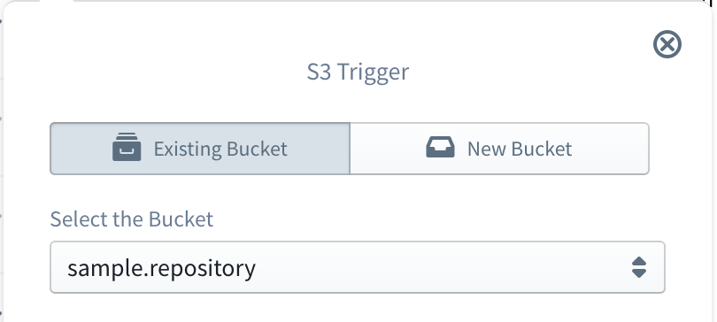

#   AWS S3 (Simple Storage Service)

Amazon Simple Storage Service (S3) is an object storage built to store and retrieve any amount of data from anywhere with 99.999999999% durability. Although S3 provides comprehensive security and compliance capabilities that meet even the most stringent regulatory requirements, it also gives customers flexibility in the way they manage data for cost optimization, access control, and compliance.

## S3 as a Trigger

A S3 bucket can be used as a trigger for a lambda function within Sigma. For that, a S3 resource should be dragged from the resources panel and dropped on top of the `event` parameter of the lambda handler. Then the S3 bucket configuration panel can be used to [set a S3 bucket](#set-bucket) as the trigger.

### Trigger Parameters

After a bucket is configured for the trigger, the following trigger parameters should also be defined.

Parameter         | Required            | Description
---               | :---:               | ---
Event Type        | :white_check_mark:  | Type of S3 event on which the lambda should be triggered
Object Key Prefix | :x:                 | Prefix to filter objects that should trigger lambda (e.g.: `log-`)
Object Key Suffix | :x:                 | Suffix to filter objects that should trigger lambda (e.g.: `.png`)

The following S3 event types can be configured as triggers currently.

- Object created
- Object created via PUT
- Object created via POST
- Object created via copy
- Object created via multipart upload
- Object removed
- Object removed via deletion
- Object delete marker created
- RRS object lost

When a S3 bucket is configured as a trigger to a Lambda function, that function is invoked each time an event of the configured type is triggered on that bucket. The structure of trigger event received by Lambda function is of the following format.

```
{
   Records:[
      {
         eventVersion:'2.0',
         eventSource:'aws:s3',
         awsRegion:'us-east-1',
         eventTime:'2018-02-23T07:31:20.118Z',
         eventName:'ObjectCreated:Put',
         userIdentity:{
            principalId:'A123ARPQROX9BC'
         },
         requestParameters:{
            sourceIPAddress:'110.102.65.111'
         },
         responseElements:{
            'x-amz-request-id':'2E3G7UYN61F67GB9',
            'x-amz-id-2':'dedeffewfwffefeeWJU='
         },
         s3:{
            s3SchemaVersion:'1.0',
            configurationId:'678999077-7bcb-418d-8c8d-a4e71fab2212',
            bucket:{
               name:'my-bucket',
               ownerIdentity:{
                  principalId:'A123ARPQROX9BC'
               },
               arn:'arn:aws:s3:::my-bucket'
            },
            object:{
               key:'log.txt',
               size:58066,
               eTag:'32ba46654873b329fc5ef3001ea14890',
               sequencer:'005A8FC3B96544EBF8'
            }
         }
      }
   ]
}
```

### <a name="set-bucket">Setting the S3 bucket

In S3 bucket configuration panel, it is possible either to select an existing S3 bucket or to define a new S3 bucket.

#### Selecting an existing bucket

<p align="center">
  
</p>

To select an existing bucket, first go to the **Existing Bucket** tab of the configuration panel. Then **Select the Bucket** drop-down will be populated with all the already defined S3 buckets in your AWS account for the current project region.
You can simply select the required bucket from that list.

#### Defining a new bucket

<p align="center">
  
</p>

To define a new bucket, first go to the **New Bucket** tab of the configuration panel. Then a **New Bucket Name** should be provided, and this bucket name must be non-empty and should contain 3-63 characters.

---

## S3 for Operations

To use S3 for operation within lambda, first an existing bucket should be selected or a new bucket should be defined. This procedure is exactly similar to [setting a S3 bucket](#set-bucket) when a S3 trigger is defined. Once the bucket is configured, an operation to be injected can be selected from the **Operation** drop-down.

Currently Sigma supports the following operations on S3 buckets.

- List Objects
- Put Object
- Get Object
- Copy Object
- Delete Object
- Get Bucket Location

#### List Objects

**List Objects** operation can be used to programmatically retrieve a list of files currently exist in a bucket. Following are the fields related to this operation.

Field              | Required            | Supports Variables  | Description
---                | :---:               | :---:               | ---
Maximum number of results to be shown | :x: | :x:  | The maximum number of keys to be returned in the response. The response might contain fewer keys but will never contain more.
Limit the results begins with prefix | :x: | :white_check_mark:  | A prefix to limit the response only to keys which begin with that prefix

#### Put Object

**Put Object** operation can be used to programmatically upload a file to a S3 bucket. Following are the fields related to this operation.

Field              | Required            | Supports Variables  | Description
---                | :---:               | :---:               | ---
The content of object | :white_check_mark: | :white_check_mark:| The content of the file to be uploaded
Name for the object | :white_check_mark: | :white_check_mark:| A name for the file
Tags for the object | :x: | :x: | A set of key-value pairs to be set as tags for the file
Metadata for the object | :x: | :x: | A set of key-value pairs to be set as metadata for the file
Server side Encryption | :x: | :x: | The Server-side encryption algorithm to be used when storing this file
ACL to apply to the object | :x: | :x: | The canned Access Control List to be applied to the file

#### Get Object

**Get Object** operation can be used to programmatically retrieve a file from a S3 bucket. Following are the fields related to this operation.

Field              | Required            | Supports Variables  | Description
---                | :---:               | :---:               | ---
Name of the object | :white_check_mark: | :white_check_mark:| A name of the file to be retrieved

#### Copy Object

**Copy Object** operation can be used to programmatically copy a file from one S3 bucket to another. Following are the fields related to this operation.

Field              | Required            | Supports Variables  | Description
---                | :---:               | :---:               | ---
Name of the object to copy | :white_check_mark: | :white_check_mark:| A name of the file to be copied
Select the Target Bucket | :white_check_mark: | :x:| The destination bucket

#### Delete Object

**Delete Object** operation can be used to programmatically delete a file from a S3 bucket. Following are the fields related to this operation.

Field              | Required            | Supports Variables  | Description
---                | :---:               | :---:               | ---
Name of the object to delete | :white_check_mark: | :white_check_mark:| A name of the file to be deleted

#### Get Bucket Location

**Get Bucket Location** operation can be used to programmatically retrieve the the region that a bucket resides in. This operation does not require any operation level parameters.
