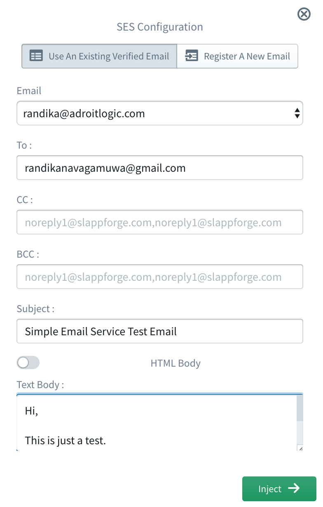
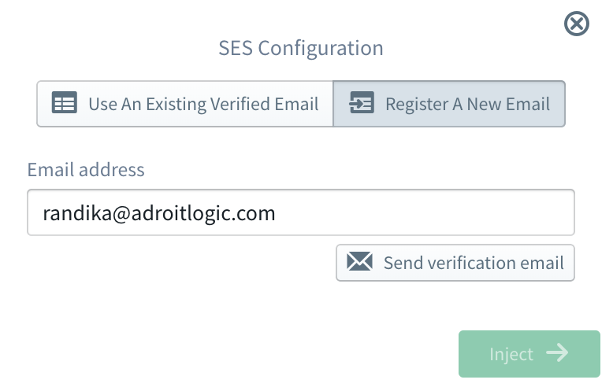

#   AWS SES (Simple Email Service)

Amazon Simple Email Service (Amazon SES) is a cloud-based email sending service designed to help digital marketers and application developers send marketing, notification, and transactional emails. It is a reliable, cost-effective service for businesses of all sizes that use email to keep in contact with their customers.

The Sigma IDE can be used to integrate Amazon SES directly into your serverless application.

## SES for Operations
Sigma IDE provides the ability to send emails using Amazon SES. Users have the ability to select and existing verified email or a new email.

To use SES resource for operations, it should be dragged from the resources panel and dropped on the required line of the
lambda code editor. Then user should select either **Use An Existing Verified Email** tab or **Register A New Email** tab based on the
requirement.

### Using An Already Verified Email
If it's required to send emails from an already verified email address, first user should select the **Use An Existing Verified Email** mode tab. Then the verified email addresses will be listed in the Email drop down list. User can easily select the required email from that drop down list.

Once user selects the email address, all the other required information should be provided.

##### Parameters When Using An Already Verified Email

  

Field               | Required          | Description
---                 | :---:             | ---   
Email               | :white_check_mark:| The **From:** field of the message.
To                  | :white_check_mark:| The **To:** field(s) of the message.
CC                  | :x:               |The **CC:** field(s) of the message.
BCC                 | :x:               |The **BCC:** field(s) of the message.
Subject             | :white_check_mark:|The subject of the message: A short summary of the content, which will appear in the recipient's inbox.
Body                | :x:               |The content of the message, in text\\html format. Format can be chosen according to the user's preference.

### Register A New email
If user prefers to register a new email address instead of using an already verified email address, first user should select **Register A New Email** mode tab.

#### Parameters When Registering A New Email

  

Field               | Required          | Description
---                 | :---:             | ---   
Email  address      | :white_check_mark:| The email address which user wants to verify

After clicking on the **Send verification email** button, a verification email will be sent to the provided email address. As soon it's verified, it will be available for user to select.

> ### Important
When it comes to Amazon SES, by default users are only allowed to send emails to verified email addresses. So user has 
to use a verified email address(s) for the **To:** email(s), **CC:** email(s) and **BCC:** email(s) as well.

> This limitation can be removed by opening an [SES Sending Limits Increase case](https://aws.amazon
.com/ses/extendedaccessrequest/) in Amazon Support Center.

> More information regarding this limit can be found from [here](https://docs.aws.amazon
.com/ses/latest/DeveloperGuide/increase-sending-limits.html).
