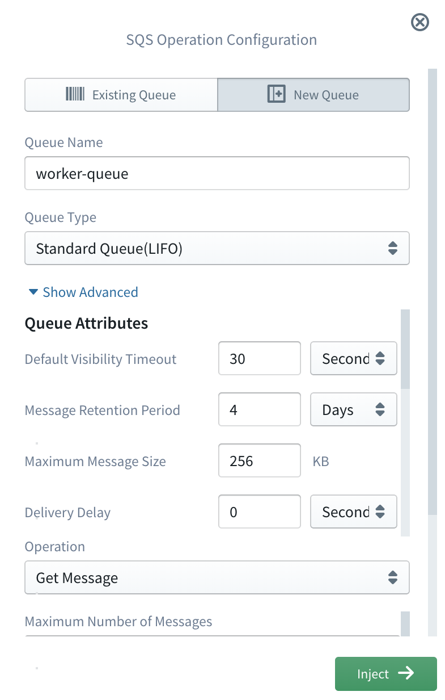

#  AWS SQS (Simple Queue Service)

Amazon Simple Queue Service (SQS) is fully managed, reliable and highly scalable cloud message queuing service to store
and consume messages to keep modularity between application components in micro services and distributed systems.
SQS supports both standard and FIFO queue types, to facilitate at-least-once and exactly-once guarantees respectively,
while providing highly concurrent access to messages and high availability for producing and consuming messages.

The Sigma IDE currently supports most of the available features of SQS service including,
- Standard and FIFO queue types
- Queue level and per message configurations and validations for all provided features like visibility time, delivery delay etc.
- Put, Get and Get and Remove operations are provided.
- Operation wise parameter configuration and validation.

## SQS for Operations
Sigma IDE provides the ability to execute Get, Put and Get and Remove operations on SQS resources. Users have the ability 
to either select an existing queue or configure new queue to execute the required operation. Sigma provides ability to 
configure both operation and queue resource under a single window without any overhead to the user.

To use SQS resource for operations, it should be dragged from the resources panel and dropped on the required line of the 
lambda code editor. Then user should select either **Existing Queue** tab or **New Queue** tab based on the requirement.

### Using Already Existing SQS Queue

If it's required to execute an operation on a queue which is already exists, first user should select the **Existing Queue** 
mode tab. Then existing queue names will be listed in the Queue Name drop down list. User can easily select required queue 
from that drop down list. If  in the  queue type should be selected.

### Using New SQS Queue

If it's required to execute an operation on a newly created queue, first user should select the **New Queue** mode tab. 
Then required parameters should be configured for the queue which is going to be created and invoke the required operation.

#### Configuring New SQS Resource

SQS queue resource can be easily configured by providing queue name and queue type for the basic use case.

  

If the queue type is, FIFO, queue name should be suffixed with *.fifo* extension. If not, user can provide any name as 
the queue name without special characters.

User can configure advance properties such as message retention period, delivery delay for the queue, etc. by expanding 
advance properties section by clicking the **Show Advance** option.

  

### Using Already Configured Queue for Subsequent Operations

Once user configured new queue from the Sigma IDE, it will be considered as an existing queue for subsequent operations. 
If user want to execute some operation, on already configured queue from the IDE, user can dragged the SQS resource from 
the resource panel and then select the **Existing Queue** tab and then select the required queue from the queue name drop 
down list. For the clarity, IDE will show already configured queues with the *(New)*  suffix for the queue name. 
As an example, let's assume that user first creates a queue with name *worker-queue* and then it's required to use that 
queue for some other operation. In that case, user can select the queue under queue name list in the existing queue mode 
like below,

  

### Configure SQS Operation

Once user configure or select the queue resource for the operation, user can configure the required operation to be invoked 
on that queue. Currently Sigma IDE supports frequently used three main commands, Put, Get and Get and Remove. As the first 
step, user should select the required operation from the operation drop down list of the configuration window.

#### Put Operation

Put operation insert a message to the specified queue with the configured payload and attributes. Based on the configured 
queue type, put operation parameters will be changed.

For standard queue type, parameters list is like this,

Field         | Required          | Description
---           | :---:             | :---:   
Message Payload     | :white_check_mark:| Payload of the message to be sent
Message Attributes  | :x:         | Key value list of message attributes to be sent with the message

For FIFO queue type, parameters list is like this,

Field                     | Required          | Description
---                       | :---:             | :---:   
Message Payload           | :white_check_mark:| Payload of the message to be sent.
Message Deduplication Id  | :x:               | This parameter applies only to FIFO (first-in-first-out) queues. The token used for deduplication of sent messages to the queue. If the queue has configured to use *Content-Based Deduplication*, this is optional, but if not this is a mandatory parameter.
Message Group Id          | :white_check_mark:| This specifies that a message belongs to a specific message group. Messages that belong to the same message group are processed in a FIFO manner.
Message Attributes  | :x:         | Key value list of message attributes to be sent with the message.

#### Get Operation

Get operation fetched messages from the configured queue. User can configure get operation parameters like below for both queue types.

Field                     | Required            | Description
---                       | :---:               | :---:   
Maximum Number of Messages| :white_check_mark:  | The maximum number of messages to return for the get operation. Amazon SQS never returns more messages than this value (however, fewer messages might be returned). Valid values are 1 to 10. Default is 1.
Visibility Timeout For a Message| :white_check_mark: | The duration (in seconds) that the received messages are hidden from subsequent retrieve requests after being retrieved by a ReceiveMessage request.
Wait Time                 | :white_check_mark:  | The duration (in seconds) for which the call waits for a message to arrive in the queue before returning. If a message is available, the call returns sooner than this value.
Message Attribute Names   | :x:                 | The comma separate list of message attribute names to fetch together with each message.
Attribute Names           | :white_check_mark:  | A list of attributes with meta information, that need to be fetched together with each message.

#### Get and Remove Operation

Once you read messages from SQS, it doesn't delete those message automatically. It's consumers responsibility to remove 
messages once it reads the message completely. To make this process more intuitive and user friendly Sigma IDE facilitate 
custom operation to handle this in a single operation. All the parameters for this operation is completely equivalent to 
the list of parameters in the above Get operation. Generated code fragment will be differed for two operations to handle 
the difference between the behaviors of two operations. 
