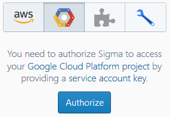
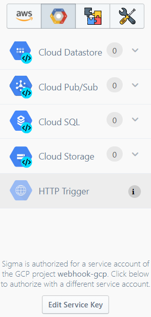
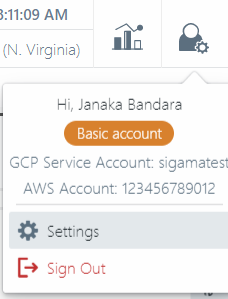
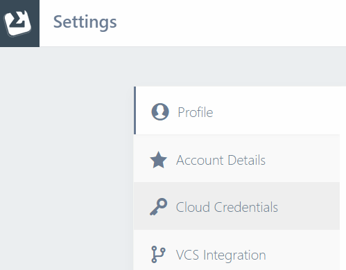
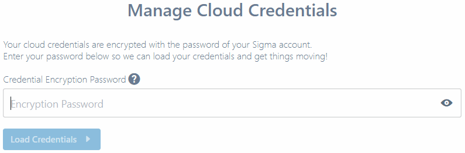
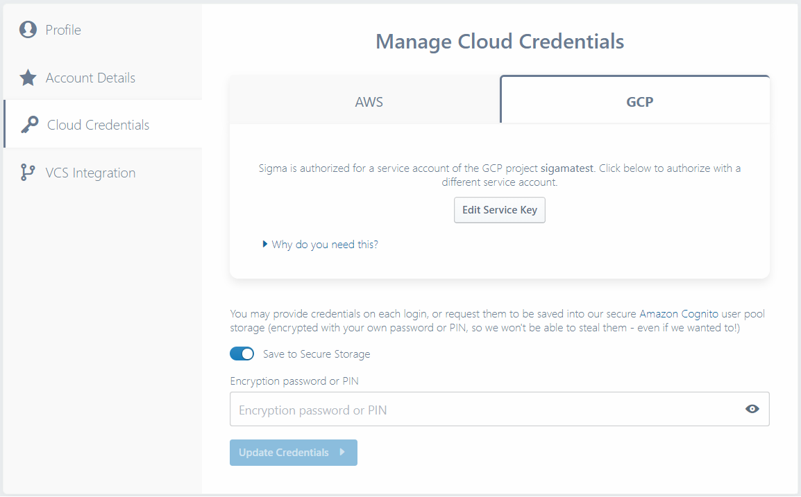
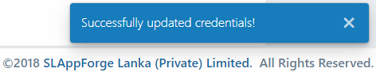

# Google Cloud Platform: Authorization

[Service accounts](https://cloud.google.com/iam/docs/understanding-service-accounts)
are the standard authorization mechanism in Google Cloud Platform. While they are mainly for server-to-server interaction,
Sigma uses them for authorizing itself to access your cloud resources during development time as well.

## Authorizing Sigma for your GCP project

This can be under one of two scenarios:

### You are new to Sigma (or have just created an account)

Please refer [**Grant GCP access to Sigma**](getting-started.md#grant-gcp-access-to-sigma) section under our
[**GCP getting-started guide**](getting-started.md).

### You have already authorized Sigma with an AWS key pair

In this case you would not be seeing the Cloud Credentials page upon log-in, as described above.

#### Authorizing via the GCP Resources pane

This is a temporary authorization; the service account key will be stored in your browser's
[session storage](https://www.w3schools.com/jsref/prop_win_sessionstorage.asp)
and will be automatically cleared when you log out or close the browser tab.

1. Switch to the [editor mode](https://sigma.slappforge.com/#/editor).

2. Switch to the **GCP Resources** child tab on the **Resources** tab of the left pane.

   

3. Click **Authorize**.

4. Paste the service account key file content into the input field of the **GCP Service Account Key** dialog,
and click **Save**.

   

5. If the service account key is accepted, the GCP Resources tab will start displaying available GCP services,
along with the authorized GCP project name at the bottom.

   

#### Authorizing via the Settings page

**Note:** This is only available in Sigma version 1.2.7 and higher, which may not have been publicly released yet.

This approach provides an option to persist your credentials into Sigma's Amazon Cognito secure storage;
so you can make a permanent authorization.

1. Open the user menu on the top right corner, and choose **Settings**.

   

2. On the Settings page, select **Cloud Credentials** tab on the left.

   

3. If you have already saved credentials for other platforms, Sigma will prompt you for an encryption password/PIN
so that it can load and decrypt them.
Provide the password/PIN, based on how you logged in - using a username or via social media.

   

3. Now follow the instructions as described under
[**Grant GCP access to Sigma** section of the getting-started guide](getting-started.md#grant-gcp-access-to-sigma)
to provide GCP (and optionally AWS) credentials, and choose to persist (or not persist) them.

   

4. When done, click **Update Credentials** on the bottom.

   Sigma will validate the provided credentials, persist them if required, and display a confirmation if all goes well.

   

If there are any issues, an appropriate error message will be displayed against the **Update Credentials** button,
including the name of the cloud platform where the failure occurred;
in this case, revise the corresponding credentials and try again.

## After authorization

Once authorization is done via any of the above means,
the GCP resources pane will start displaying a list of natively supported GCP services.
You can drag them into your code as [operations](../../concepts/operations.md) (and [triggers](../../concepts/triggers.md),
depending on whether you are in a GCP-based project) similar to other platforms like AWS.

Since the service account usually has full permission to all resources in your GCP project,
you can use any Google Cloud API in your project - even if they are not present in Sigma's supported GCP resource list.
Simply write your custom API invocation logic based on the [`googleapis` client](https://www.npmjs.com/package/googleapis),
and they should work fine at runtime.

You can commit, build and deploy your solution, configure cloud function settings or set
[environment variables](../../features/environment-variables/environment-variables.md) similar to how they are done on an AWS-based project.

## How Sigma uses your service account key

### Within the IDE

Sigma uses the key to obtain an [OAuth2 access token](https://developers.google.com/identity/protocols/OAuth2)
in order to access Google Cloud APIs on your behalf (within the scope `https://www.googleapis.com/auth/cloud-platform`).
This is used to obtain details of existing cloud resources in your GCP project during drag-n-drop operations,
and to invoke [Cloud Storage](https://cloud.google.com/storage/), [Cloud Build](https://cloud.google.com/cloud-build/)
and [Deployment Manager](https://cloud.google.com/deployment-manager/) API operations on your behalf.

### For GCP deployments

Google Cloud Functions use implicit authorization via
[Application Default Credentials](https://cloud.google.com/docs/authentication/production#providing_credentials_to_your_application).
Hence your service account key is not included into the deployment configurations.

### For other platform (e.g. AWS) deployments

Sigma includes your service account key as an [environment variable](../../features/environment-variables/environment-variables.md),
and uses it to create an authorizer and feed it to the
[`googleapis` client library](https://www.npmjs.com/package/googleapis) at runtime.
Hence it is advisable to use a customized service account with only the necessary permissions,
when integrating with GCP on a non-GCP runtime.