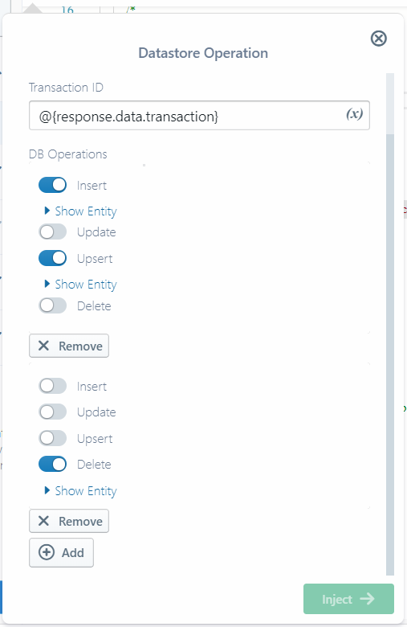
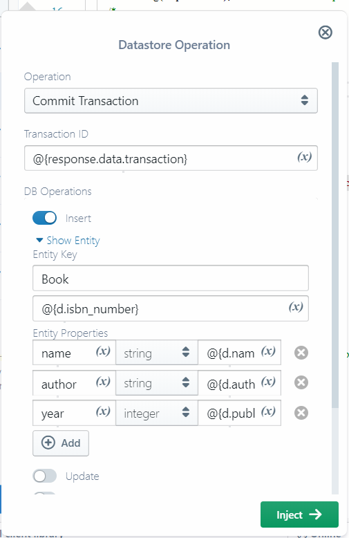

#  Google Cloud Datastore

[Google Cloud Datastore](https://cloud.google.com/datastore/) is a managed non-relational (NoSQL) entity storage.
Though usually used in combination with [Google App Engine](https://cloud.google.com/appengine/),
thanks to the [REST API](https://cloud.google.com/datastore/docs/reference/data/rest/)
and [SDK support](https://cloud.google.com/datastore/docs/reference/libraries),
it is well-suited for the storage component of any applicaion, serverless, cloud or on-premise.

Datastore categorizes its content
([**Entities**](https://cloud.google.com/datastore/docs/concepts/entities#working_with_entities))
under [**Kinds**](https://cloud.google.com/datastore/docs/concepts/entities#kinds_and_identifiers),
similar to tables in the relational space.
While it is possible to map predefined data structures to kinds (esp. in case of typed languages),
Datastore usually autogenerates its kind specifications based on the structure of entities that are stored under them.

Datastore supports indexing, backup/restore, [transactions](https://cloud.google.com/datastore/docs/concepts/transactions)
and other features that make it useful in writing scalable and robust applications.


## Basic Concepts

### Entity keys

In Datastore, an entity is identified by a [**key**](https://cloud.google.com/datastore/docs/concepts/entities#assigning_identifiers).
Sigma currently supports keys composed of entity **kind** and **name**.


### Properties and data types

Each entity could additionally contain one or more
[**properties**](https://cloud.google.com/datastore/docs/concepts/entities#properties_and_value_types);
key-value pairs where the key is a string and the value type can be either *simple* or *composite*.

Supported simple types include:

* [**String**](https://cloud.google.com/datastore/docs/concepts/entities#text_string)
* **Boolean**: `true` or `false`
* **Double**
* **Integer**
* [**Blob**](https://cloud.google.com/datastore/docs/concepts/entities#blob): a base64-encoded binary payload
* [**Null**](https://cloud.google.com/datastore/docs/concepts/entities#null): a `null` value
* [**Timestamp**](https://cloud.google.com/datastore/docs/concepts/entities#date_and_time):
  an [RFC 3339](https://www.ietf.org/rfc/rfc3339.txt) date-time with milliseconds, of the format `yyyy-MM-ddTHH:mm:ss.xxxZ`

Composite types:

* [**Geopoint**](https://cloud.google.com/datastore/docs/concepts/entities#geographical_point)
* [**Entity**](https://cloud.google.com/datastore/docs/concepts/entities#embedded_entity): a complete Datastore entity
* [**Key**](https://cloud.google.com/datastore/docs/concepts/entities#key): a Datastore key


#### Array types

Additionally a property could be of [**array**](https://cloud.google.com/datastore/docs/concepts/entities#array) type;
in this case the value would contain a `values` array, which can in turn contain property entries of any type.

```
{
    values: [
        {
            stringValue: "str"
        },
        {
            geoPointValue: {
                latitude: 7.4639,
                longitude: 80.2985
            }
        },
        {
            arrayValue: {
                values: [
                    ...
                ]
            }
        },
        ...
    ]
}
```

**NOTE:** Sigma currently does not fully support visually composing array-type Datastore entity parameters;
however you can enter the corresponding JSON array structure (value portion of the `values` entry)
into the operation configuration pop-up to configure the parameter:

**Name** = `array_field_name`
\
**Type** = `array` (selected from drop-down)
\
**Value** = `[{stringValue: "str"}, {geoPointValue: {latitude: 7.4639, longitude: 80.2985}]`


### Transactions

Datastore updates can be carried out in [transactions](https://cloud.google.com/datastore/docs/concepts/transactions).
[The API](https://cloud.google.com/datastore/docs/reference/data/rest/) expects you to
[*begin* a transaction](https://cloud.google.com/datastore/docs/reference/data/rest/v1/projects/beginTransaction)
and then [*commit* it](https://cloud.google.com/datastore/docs/reference/data/rest/v1/projects/commit)
along with the necessary data manipulations,
rather than invoking the manipulation operations as separate API calls between the begin and the commit.


#### Mutations

A commit can contain multiple
[**mutations**](https://cloud.google.com/datastore/docs/reference/data/rest/v1beta3/projects/commit#Mutation) (stages),
each of which can contain up to four data manipulation calls; one from each of
[the four types](https://cloud.google.com/datastore/docs/reference/data/rest/v1beta3/projects/commit#body.request_body.FIELDS-table):
**insert**, **update**, **upsert** (update if exists, insert if not), and **delete**.
For example, a transaction could first insert `A` and update `B`, then delete `C` and update `B` again, and so forth.
Datastore does [impose some rules](https://cloud.google.com/datastore/docs/concepts/transactions#transactions_and_entity_groups)
on the operations that can be included in a single transaction.


#### Sigma Commit Transaction pop-up

In the **Commit Transaction** pop-up, you can add new mutations to your commit operation
by clicking the **(+) Add** button near the bottom;
and remove unwanted ones by clicking the **(X) Remove** button under each mutation.



Each stage provides four toggle buttons for the four supported operations;
you can enable any desired combination, and configure them using the detail pane that appears below each.
Deletion needs only an entity key, while other operations need the key as well as the full set of properties of the element.



**NOTE:** Any properties that are present in the remote entity but not included in the update/upsert call,
would be removed from the entity.


## Available Datastore operations

You can invoke Datastore operations (API calls) from any platform.


### Native operations

#### Run Query: `projects.runQuery`

Executes a [Google Query Language (GQL)](https://cloud.google.com/datastore/docs/reference/gql_reference)
query upon the Datastore. Because GQL only supports selections, this is inherently a read-only operation.

GQL queries can be parameterized, using either or both of these parameter types:

* **named** (e.g. `SELECT * FROM Foo WHERE bar = @barvalue`)
* **positional** (e.g. `SELECT * FROM Foo WHERE baz = @1`)

If your query uses such parameters you can specify them below the query
via the **Named Parameters** and **Positional Parameters** fields.


Field | Required | Supports Variables | Description
--- | :---: | :---: | ---
GQL Query | :white_check_mark: | :white_check_mark: | The GQL query to execute; any parameters must be prefixed with `@`
Named Parameters | :x: | :white_check_mark: | A set of key-type-value entries of named parameters in the GQL query. The key must be the parameter name without the `@` prefix.
Positional Parameters | :x: | :white_check_mark: | An ordered set of type-value pairs of positional parameters in the GQL query. The type must have a `Value` suffix: e.g. `stringValue`, `integerValue`, `geoPointValue`, etc.

On success, `response.data` will contain a result of the following format,
where `batch.entityResults` will contain an array of matching entities:

```
{
    "batch": {
        "entityResultType": "FULL",
        "endCursor": "<base64-encoded>",
        "entityResults": [
            {
                "entity": {
                    "key": {
                        "partitionId": {
                            "projectId": "<project>"
                        },
                        "path": [
                            {
                                "kind": "<kind>",
                                "name": "<name>"
                            }
                        ]
                    },
                    "properties": {
                        "<key-1>": {
                            "<type-1>": "<value-1>"
                        },
                        ...
                    }
                },
                "cursor": "<cursor>",
                "version": "<version-timestamp>"
            },
            ...
        ]
    },
    "query": {
        "kind": <kind-spec>,
        "filter": {
            "propertyFilter": <property-spec; property, op and value>
        }
    }
}
```

#### Begin Transaction: `projects.beginTransaction`

Starts a new transaction for Datastore modification operations. This call does not have any parameters.

On success, `response.data` will contain a `transaction` field holding the ID of the started transaction.
This ID should be used when committing or rolling back the transaction later on.


#### Commit transaction: `projects.commit`

Commits a [previously started](#begin-transaction-projectsbegintransaction) transaction,
executing a list of data manipulation [mutations](#mutations)

Field | Required | Supports Variables | Description
--- | :---: | :---: | ---
Transaction ID | :white_check_mark: | :white_check_mark: | ID of the transaction (usually from a previous [`beginTransaction`](#begin-transaction-projectsbegintransaction) call)
DB Operations | :x: | :white_check_mark: | A list of mutations to apply along with the commit, each including up to four [modification operations](#sigma-commit-transaction-pop-up)

On success, `response.data` will contain metadata of the transaction (mutation versions, number of index updates, etc.).

```
{
    "mutationResults": [
        {
            "version": "<version-timestamp-or-id>"
        }
    ],
    "indexUpdates": 8,
    "commitVersion": "<commit-timestamp>"
}
```


#### Rollback transaction: `projects.rollback`

Rolls back (cancels) a previously initiated transaction

Field | Required | Supports Variables | Description
--- | :---: | :---: | ---
Transaction ID | :white_check_mark: | :white_check_mark: | ID of the transaction to rollback

On success, `response.data` will be empty.


### Canned operations

In addition to these native operations, Sigma's Datastore component supports the following
"canned" (convenience) operations for performing a single action (insert, update, etc.) transactionally.
When injected, these are inserted as *two* service calls;
a [`beginTransaction`](#begin-transaction-projectsbegintransaction) followed by a
[`commit`](#commit-transaction-projectscommit) that contains a single operation.

#### Insert entity

Runs a full transaction with a single entity insert operation

#### Update entity

Runs a full transaction with a single entity update operation

#### Upsert entity

Runs a full transaction with a single entity upsert operation

#### Delete entity

Runs a full transaction with a single entity delete operation