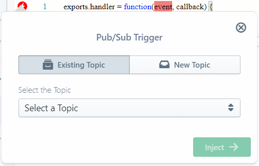

#  Google Cloud Pub/Sub

[Google Cloud Pub/Sub](https://cloud.google.com/pubsub/) is a managed publisher-subscriber solution
that allows you to asynchronously accept/send messages from/to interested parties and systems.
It is driven by a [topic-subscription model](https://cloud.google.com/pubsub/architecture#the_basics_of_a_publishsubscribe_service),
supporting both push (webhook post) and pull (polling) for new messages.

Apart from [guaranteed at-least-once delivery](https://cloud.google.com/pubsub/#websites), Pub/Sub also offers
[limited-time persistence](https://cloud.google.com/pubsub/docs/faq#persistent) of unacknowledged messages, and a
[generous monthly free tier](https://cloud.google.com/pubsub/pricing) followed by a "cheaper-as-you-go" pricing model.

Sigma supports Cloud Pub/Sub as an [operational](../../concepts/operations.md) resource on all platforms,
and as a [trigger](../../concepts/triggers.md) on GCP-based projects.

You can add Cloud Pub/Sub to your project via the **GCP Resources** tab on the
[Resources pane](../../basic_functionalities.md#resources-pane),
once you have [authorized Sigma to access your GCP project](index.md#authorization).

**NOTE:** Ensure that your GCP project has **Cloud Pub/Sub API** (service name `pubsub.googleapis.com`)
[enabled](https://console.cloud.google.com/apis/dashboard), before you start using the API in your Sigma project.

## Pub/Sub Concepts

In Pub/Sub, a [**topic**](https://cloud.google.com/pubsub/docs/admin#managing_topics) receives messages from a source (producer),
and delivers them to zero or more [**subscriptions**](https://cloud.google.com/pubsub/docs/subscriber).
Subscriptions retain these messages and deliver (or make available) them for interested parties (consumers).

### Subscriptions

There are two types of subscriptions:

* [push](https://cloud.google.com/pubsub/docs/push) type, where the subscription automatically *publishes*
the messages to a configured HTTPS endpoint
* [pull](https://cloud.google.com/pubsub/docs/pull) type, where the subscription simply retains the messages,
and consumers can *pull* them when required

Subscriptions are real-time; a subscription would only receive messages delivered to the topic after it was created,
meaning that it would not see any of the "older" messages (messages that are older than itself).

### Message Acknowledgement

Consumers must *acknowledge* the messages they read from a subscription;
if Pub/Sub does not receive an acknowledgement, it considers the delivery as a failure,
and re-processes the message (ether re-publishes or re-queues it, depending on the subscription type)
until a successful acknowledgement is received; these retries may last up to 7 days.

**NOTE:**: Due to this auto-retry mechanism, be careful when consuming messages - especially with push-based scenarios,
where the assigned webhook or [cloud function trigger](#cloud-pubsub-as-a-trigger) will continue to get invoked repeatedly
if your application logic does not acknowledge the message properly (or continues to fail, in case of a cloud function).

* For *push-based* subscriptions, simply
[returning a `200`, `201`, `202`, `204`, or `102` HTTP status response](https://cloud.google.com/pubsub/docs/push#receive_push)
will acknowledge the push message.
* For *pull-based* cases the consumer should specifically call the
[acknowledgement API](#acknowledge-messages-pubsubprojectssubscriptionsacknowledge) with the message ID
in order to acknowledge the message.

### General Usage Pattern

Based on the above, usage of Cloud Pub/Sub usually follows this pattern:

* Create a topic.
* Create one or more subscriptions to the topic.
* Publish messages to the topic.
* Individually consume copies of messages via subscriptions.
* Individually acknowledge messages via subscriptions, marking them as "completed".

## Cloud Pub/Sub as a Trigger

On GCP-based Sigma projects, Cloud Pub/Sub can be used as an event source
to trigger a cloud function of [*background/event* type](https://cloud.google.com/functions/docs/writing/#background_functions).
For this, simply drag the **Cloud Pub/Sub** entry from the **GCP Resources** pane,
on to the `event` parameter of the function header.

Now simply select a topic as the event source under **Select the Topic**
(or add a new bucket via the **New Topic** tab), and click **Inject**.
Pub/Sub triggers do not require any other configuration parameters.

## Cloud Pub/Sub as an Operation

This is available under all cloud platforms, for invoking various API operations against the topics in your GCP project.
Simply:

* drag a **Cloud Pub/Sub** entry from the **GCP Resources** pane on to the desired line in the editor
where you would like to invoke the operation,
* select (or define a new) topic,
* pick the API operation,
* fill in the parameters as appropriate, and
* click **Inject** (or **Update**) when done.

Sigma offers Pub/Sub API operations at *topic level* (acting on *subscriptions*)
as well as *subscription level* (managing individual subscriptions, in addition to acting upon *messages* held by them).

### Available Cloud Pub/Sub Operations at Topic Level

- List Subscriptions
- Publish Message

#### List Subscriptions: `pubsub.projects.topics.subscriptions.list`

Returns the list of subscriptions belonging to a topic

Field | Required | Supports Variables | Description
--- | :---: | :---: | ---
Number of results (page size) | :x: | :x: | The maximum number of subscriptions to be returned in the response

On success, `data` field of the response will contain a `subscriptions` array containing subscription identifier strings.

#### Publish Message: `pubsub.projects.topics.publish`

Publishes a new message to a topic

Field | Required | Supports Variables | Description
--- | :---: | :---: | ---
Message (must be base-64 encoded) | :x: | :white_check_mark:| The body of the message. This can be any arbitrary data chunk, but it **must** be base-64 encoded; e.g. using `Buffer.from(data).toString("base64")`
Attributes | :x: | :white_check_mark:| Key-value pairs to be included as attributes of the message

**NOTE:** You **must** provide either a **message** or **at least one attribute**.

On success, `data` field of the response will contain a `messageIds` array containing the ID of the published Pub/Sub message.

### Available Cloud Pub/Sub Operations at Subscription Level

- Create Subscription
- Pull Messages
- Acknowledge Messages
- Delete Subscription

#### Create Subscription: `pubsub.projects.subscriptions.create`

Creates a new subscription under the selected topic

Field | Required | Supports Variables | Description
--- | :---: | :---: | ---
Subscription Name | :white_check_mark: | :white_check_mark: | A name for the subscription; note that this should be just a simple name and **not** the GCP-dicated `projects/{project name}/topics/{topic name}` full identifier
Push Endpoint (if applicable) | :x: | :white_check_mark: | A HTTPS endpoint URL for publishing the messages captured by this *push-type* subscription; if this is not specified, a *pull-type* subscription will be created instead. It is usually a good practice to include a validation token as a query parameter in this URL, so that any bogus requests from other applications can be filtered out.
Retain acked messages? | :x: | :x: | Whether to retain messages that have already been acknowledged by a consumer
Message Retention Duration (seconds) | :x: | :white_check_mark: | If **Retain acked messages?** is enabled, how long to retain unacknowledged messages in the subscription's backlog, from the moment a message is published
Acknowledgement deadline (seconds) | :x: | :white_check_mark: | How long Pub/Sub should wait for an acknowledgement for a message that was received by a subscriber, before it can re-enable or retry delivering the same message

On success, `data` field of the response will be a
[Pub/Sub Subscription object](https://cloud.google.com/pubsub/docs/reference/rest/v1/projects.subscriptions#Subscription).

#### Pull Messages: `pubsub.projects.subscriptions.pull`

Pulls one or more available messages from a (pull-type) subscription

Field | Required | Supports Variables | Description
--- | :---: | :---: | ---
Subscription Name | :white_check_mark: | :white_check_mark: | The "simple" (non-qualified) name for the subscription
Max. number of messages | :white_check_mark: | :x: | The maximum number of messages to return in the response
Return immediately if there are no messages? | :x: | :x: | If disabled, Pub/Sub will wait for at least one message to become available (bounded by a timeout) rather than returning immediately with zero messages

On success, `data` field of the response will have a `receivedMessages` array containing zero or more
[Pub/Sub Message instances](https://cloud.google.com/pubsub/docs/reference/rest/v1/PubsubMessage).

**NOTE:** Pub/Sub considers each pulled message as "incomplete" until you acknowledge it,
and may redeliver the same message if you fail to acknowledge within the **Acknowledgement deadline** of the subscription.

#### Acknowledge Messages: `pubsub.projects.subscriptions.acknowledge`

Acknowledges one or more messages pulled from a subscription

Field | Required | Supports Variables | Description
--- | :---: | :---: | ---
Subscription Name | :white_check_mark: | :white_check_mark: | The "simple" (non-qualified) name for the subscription
Array of Message Acknowledgement IDs | :white_check_mark: | :white_check_mark: | Array of message IDs to be acknowledged; a comma-separated list may also be accepted

On success, `data` field of the response will be empty.

#### Delete Subscription: `pubsub.projects.subscriptions.delete`

Deletes a named subscription under the selected topic

Field | Required | Supports Variables | Description
--- | :---: | :---: | ---
Subscription Name | :white_check_mark: | :white_check_mark: | The "simple" (non-qualified) name for the subscription to be deleted

On success, `data` field of the response will be empty.