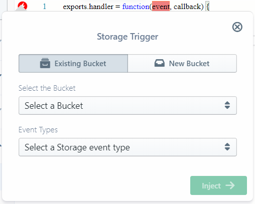

#  Google Cloud Storage

[Google Cloud Storage (GCS)](https://cloud.google.com/storage/)
provides key-value style storage capabilities for cloud applications.
It is composed of [**buckets**](https://cloud.google.com/storage/docs/json_api/v1/buckets) that act as storage roots,
under which [**objects**](https://cloud.google.com/storage/docs/json_api/v1/objects) are arranged in a hierarchical,
filesystem-like pattern.
Hence it is also well suited for file storage, and provides HTTP serving -
and hence static website and public file archive capabilities - as well.

Sigma supports Cloud Storage as an [operational](../../concepts/operations.md) resource on all platforms,
and as a [trigger](../../concepts/triggers.md) on GCP-based projects.

You can add Cloud Storage to your project via the **GCP Resources** tab on the
[Resources pane](../../basic_functionalities.md#resources-pane),
once you have [authorized Sigma to access your GCP project](index.md#authorization).

**NOTE:** Ensure that your GCP project has **Cloud Storage API** (service name `storage-api.googleapis.com`)
[enabled](https://console.cloud.google.com/apis/dashboard), before you start using the API in your Sigma project.

## Cloud Storage as a Trigger

On GCP-based Sigma projects, Cloud Storage can be used as an event source to trigger a cloud function of
[*background/event* type](https://cloud.google.com/functions/docs/writing/#background_functions).
For this, simply drag the **Cloud Storage** entry from the **GCP Resources** pane,
on to the `event` parameter of the function header.

Now select a bucket as the event source under **Select the Bucket** (or add a new bucket via the **New Bucket** tab),
use **Event Types** to pick the type of event (change, metadata update, deletion etc.) that would trigger the function,
and click **Inject**.

## Cloud Storage as an Operation

This is available under all cloud platforms, for invoking various API operations against the buckets in your GCP project.
Simply:

* drag a **Cloud Storage** entry from the **GCP Resources** pane on to the desired line in the editor
where you would like to invoke the operation,
* select (or define a new) bucket,
* pick the API operation,
* fill in the parameters as appropriate, and
* click **Inject** (or **Update**) when done.

### Available Cloud Storage Operations

Currently Sigma supports the following operations on Cloud Storage buckets.

- List Objects
- Put Object
- Get Object
- Copy Object
- Delete Object

#### List Objects: `storage.objects.list`

Retrieves a list of objects available in a bucket, under a given path (prefix)

Field | Required | Supports Variables | Description
--- | :---: | :---: | ---
Maximum number of results to be shown | :x: | :x: | The maximum number of keys to be returned in the response. The response might contain fewer keys but never more.
Limit the results begins with prefix | :x: | :white_check_mark: | A prefix to limit (filter) the results only to keys which begin with that prefix

On success, `data` field of the response will be an array of matching
[Cloud Storage Object](https://cloud.google.com/storage/docs/json_api/v1/objects)s.

#### Put Object: `storage.objects.insert`

Uploads an object to a bucket

Field | Required | Supports Variables | Description
--- | :---: | :---: | ---
The content of object | :white_check_mark: | :white_check_mark:| The content to be uploaded
Name for the object (Object Key) | :white_check_mark: | :white_check_mark:| Name (key) for the object, including any path prefixes
MIME type/Content-Type | :x: | :white_check_mark: | [Content-Type](https://developer.mozilla.org/en-US/docs/Web/HTTP/Headers/Content-Type) or [Mime-Type](https://developer.mozilla.org/en-US/docs/Web/HTTP/Basics_of_HTTP/MIME_types) of the object (payload)
Metadata for the object | :x: | :white_check_mark: | A set of key-value pairs to be set as metadata for the object
ACL to apply to the object | :x: | :x: | The canned Access Control List (private, publicly readable, etc.) to be applied to the object

On success, `data` field of the response will be a
[Cloud Storage Object](https://cloud.google.com/storage/docs/json_api/v1/objects) representing the uploaded entity.

#### Get Object: `storage.objects.get`

Retrieves an object from a bucket

Field | Required | Supports Variables | Description
--- | :---: | :---: | ---
Name of the object (Object Key) | :white_check_mark: | :white_check_mark: | Name (key) of the object to be retrieved, including any path prefixes

On success, `data` field of the response will be a
[Cloud Storage Object](https://cloud.google.com/storage/docs/json_api/v1/objects) representing the retrieved entity.

#### Copy Object: `storage.objects.copy`

Copies an object from one bucket to another, or to a different path (key) under the same bucket

Field | Required | Supports Variables | Description
--- | :---: | :---: | ---
Name of the object to copy (Object Key) | :white_check_mark: | :white_check_mark:| Name (key) of the object to be copied
Select the Target Bucket | :white_check_mark: | :x:| The destination bucket
Name of the destination object (Object Key) | :white_check_mark: | :white_check_mark:| Name (key) to be used for the destination object

On success, `data` field of the response will be a
[Cloud Storage Object](https://cloud.google.com/storage/docs/json_api/v1/objects) representing the copied entity.

#### Delete Object: `storage.objects.delete`

Deletes an object from a bucket

Field | Required | Supports Variables | Description
--- | :---: | :---: | ---
Name of the object to delete (Object Key) | :white_check_mark: | :white_check_mark:| Name (key) of the object to be deleted

On success, `data` field of the response will be empty.