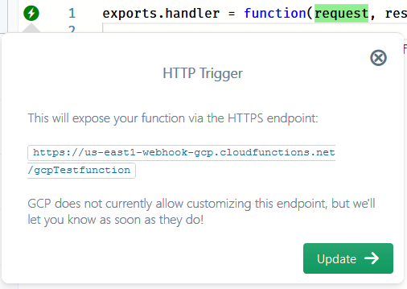

#  HTTP Cloud Functions and HTTP Triggers

Google Cloud Functions belong to one of two types:

* [HTTP](https://cloud.google.com/functions/docs/writing/#http_functions) (request-response pattern)
* [background](https://cloud.google.com/functions/docs/writing/#background_functions)/event-driven (event-callback pattern)

The HTTP trigger is dedicated for HTTP functions, which marks the function for exposure over a
GCP-provisioned HTTPS endpoint of the URL pattern:

```
https://{GCP region}-{GCP project}-gcp.cloudfunctions.net/{function name}
```

Currently GCP does not offer any options for customizing this endpoint (URL or other configurations like HTTP method).


## Auto-configuration

When you create a new HTTP cloud function, or reconfigure an existing function to be of HTTP type,
Sigma will automatically add an HTTP trigger to the function.
This is because a HTTP function **must** have exactly one HTTP trigger (no other trigger types are compatible).
For the same reason, you are not allowed to delete a HTTP trigger once it is added, unless you change the function type.

If a HTTP function is missing the HTTP trigger due to some reason,
you can add it manually by dragging the **HTTP Trigger** resource entry in the **GCP Resource Panel**
onto the `request` parameter of the function signature.


Once added, you will see the trigger pop-up containing the URL at which the cloud function will be exposed:




## Function signature

If you reconfigure an event-type function to HTTP type (or vice versa),
the method signature of the function should also be updated accordingly:

```
exports.handler = function(request, response) {
```

Here, `request` is an [Express.js `Request`](https://expressjs.com/en/api.html#req)
and `response` is an [Express.js `Response`](https://expressjs.com/en/api.html#res).

For event-type functions this would be

```
exports.handler = function(event, callback) {
```

Since it can corrupt the existing logic, Sigma does not automatically change this signature for you.
Hence currently it is your responsibility to manually adjust the method signature if you make such a switch.


## General pattern for HTTP cloud function implementation

Read (consume) from `request`; e.g. access its `method`, `headers`, `query`, `body`, etc.

When processing is complete, use `response` to send back the response, with one or more of:
HTTP status code, headers and payload.

E.g.:

```
// empty HTTP 200 OK response
response.send();
```

```
// a redirect (HTTP 302 Found)
response.redirect("http://www.example.com");
```

```
// a Bad Request error (HTTP 400) with JSON response payload
response.status(400).json({error: "message"});
```

You can also employ any combination of the numerous request/response features offered by Express.js.

Your function can execute further logic after the response, but only the first sent response will be visible to the caller.