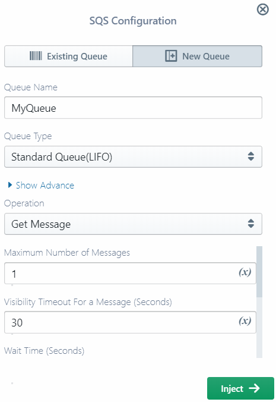
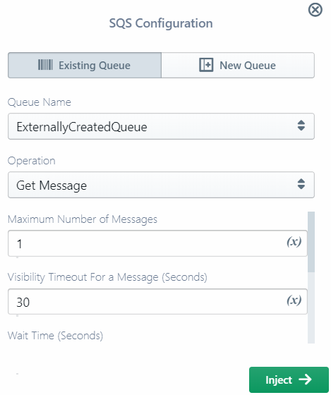
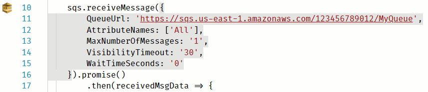
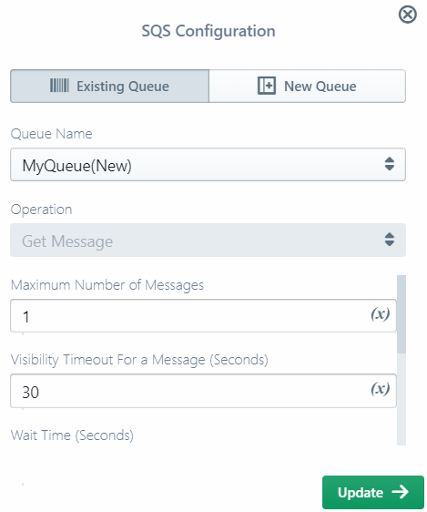
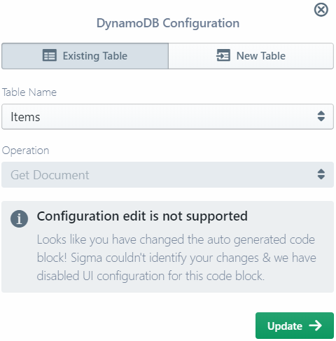

# Operations

Operations are actual API or service calls in your serverless function logic (code):
[getting an object](../components/aws/s3.md#get-object) from a S3 bucket,
[publishing a record](../components/aws/kinesis.md#put-record) to a Kinesis stream, and so on. 

## Design

In Sigma, an operation is always associated with a cloud platform-level entity called a [resource](resources.md).
Even for cases like [SNS Direct SMS](../components/aws/sns.md#sns-direct-sms-resource)
where there is no actual single entity being invoked, Sigma creates a mock resource for proper configuration management.

The same resource may be used in multiple operations
(and [triggers](triggers.md) as well, if the resource type also supports trigger functionality).
The associated resource may be either a [new](resources.md#new) one or an [existing](resources.md#existing) one.

### Operations and Permissions

At deployment time, Sigma scans your full code base and identifies every operation invoked against different resources
within each serverless function. It uses this information to generate the required runtime permissions for that function.

For example, consider two functions:
* `F1`: [gets objects](../components/aws/s3.md#get-object) from bucket `B1` and
[puts objects](../components/aws/s3.md#put-object) to buckets `B1` and `B2`
* `F2`: [copies an object](../components/aws/s3.md#copy-object) from `B2` to `B1`

At deployment,
* `F1` will have only *get-object* and *put-object* permissions on `B1`, and only a *put-object* permission on `B2`
* `F2` will have only a *put-object* permission on `B1`, and only a *get-object* permission on `B2`

This ensures the [least privilege principle](https://en.m.wikipedia.org/wiki/Principle_of_least_privilege)
and secures your cloud application and platform to the fullest possible extent.

**NOTE:** Some platforms like GCP do not expect fine-grained, resource- or operation-level permissions.
In such cases you can write your own code using whatever resource that you know would be accessible to your functions,
without worrying about the resource or operation configurations on Sigma side.

Usually you do not have to worry too much about these finer details,
as Sigma is designed to automatically handle resources and their interdependencies,
but they may be useful when troubleshooting any misconfigurations, deployment errors or runtime permission issues.

### Operations and Resource Usage

Sigma takes care of managing your resource definitions on the cloud platform side.
As part of this, it automatically detects and ignores resources that are no longer in active use.
If a resource is not being used in a trigger or operation across any of the functions (or other files that they refer),
Sigma will skip it from the next deployment; this may cause the resource to be removed from the cloud platform side.
Sigma carries out this usage calculation along with the abovementioned full code scan at deployment time.

**NOTE:** If there is a syntax error in your code file, Sigma will not be able to scan it for resource usage as operations;
if your resource was only being used in this file, Sigma would now consider the resource to be unused,
and ignore during from the next deployment.

## Supported Operation Resource Types

Sigma currently supports the following resource types for invoking operations:

### AWS

- [Cognito](../components/aws/cognito.md)
- [DynamoDB](../components/aws/dynamodb.md)
- [Kinesis Streams](../components/aws/kinesis.md#kinesis-stream-operations)
- [Machine Learning](../components/aws/machinelearning.md)
- [RDS](../components/aws/rds.md)
- [S3](../components/aws/s3.md#s3-for-operations)
- [SES](../components/aws/ses.md)
- [SNS](../components/aws/sns.md#sns-for-operations)
- [SQS](../components/aws/sqs.md)

### GCP

- [Cloud Datastore](../components/gcp/cloud-datastore.md)
- [Cloud Pub/Sub](../components/gcp/cloud-pub-sub.md#cloud-pubsub-as-an-operation)
- [Cloud SQL](../components/gcp/cloud-sql.md)
- [Cloud Storage](../components/gcp/cloud-storage.md#cloud-storage-as-an-operation)

**NOTE:** Out of each of these services, Sigma only supports the most commonly used operations.
If you want to use any operations that are not yet supported, you can manually write the necessary code
and configure any necessary runtime permissions via the *Permissions* button on the right side pane.

## Adding a New Operation

You can add an operation to your code by simply dragging the required resource type
from the left palette into the desired line in the editor.

Similar to triggers, **New** tab on operation pop-ups allows you to define a
[new resource](resources.md#new-resources-vs-existing-resources)
along with the operation that you are inserting. Top portion of the pop-up will contain resource configurations,
followed by a drop-down for selecting an operation.
Below the drop-down you can configure parameters specific to the current operation.

A resource defined in this way will be available for use in other triggers or operations via the **Existing** tab.
You can also click on the down arrow on the resource entry on the palette,
and directly drag-n-drop [an already defined resource entry](resources.md#reusing-a-resource) from there into the code.

## Editing an Operation

Once inserted, you can edit an operation in two ways:

### Modifying the code directly

This is quite straightforward and easy, but if you are not familiar with the service API it can lead to runtime issues.
Additionally, if the edited code differs from the standard SDK
(e.g. [`aws-sdk`](https://www.npmjs.com/package/aws-sdk) or [`googleapis`](https://www.npmjs.com/package/googleapis))
method call format, Sigma will not be able to analyze that block of code for resource usage and permission tracking.

### Reconfiguring via the operation edit pop-up

After you add an operation, Sigma will analyze the code and display a *service icon*
on the left line-number strip of the code window; for example, a SQS *Get Message* call will have the SQS icon against it.
Additionally, the parameter block of the detected operation will be highlighted in grey.

This indicates that Sigma may allow you to graphically edit the operation. If you click on the service icon,
Sigma will display an edit pop-up for that particular operation.

Notice the following:

* You cannot change the operation itself (e.g. SQS *Get Message* to *Get and Remove Message*);
you can only change the parameters of the operation.
* The edit pop-up only edits the specific operation, so any resource configurations are not editable there.
(Use the [global edit](resources.md#modifying-a-resource) if you want to modify the resource itself.)
* You may be able to change the target resource (e.g. SQS queue) via the **Existing** tab drop-down,
or define a new resource via the **New** tab.
* Some operations that do not have parameters
(e.g. [RDS begin transaction](../components/aws/rds.md#begin-transaction-operation))
may display a completely read-only pop-up.

In some cases, Sigma may not be able to parse the changed code to generate the editor pop-up.
In that case the pop-up will only display the configurations that Sigma could parse.

In such cases it is safer to make the modifications at code level,
since Sigma may fail to properly inject the updates done via the pop-up.

## Deleting an Operation

You can remove an operation by deleting the code block from the editor.
The service icon on the sidebar will also disappear, indicating that Sigma is no longer tracking the deleted operation.