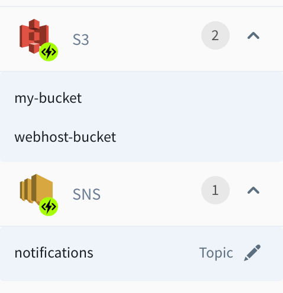
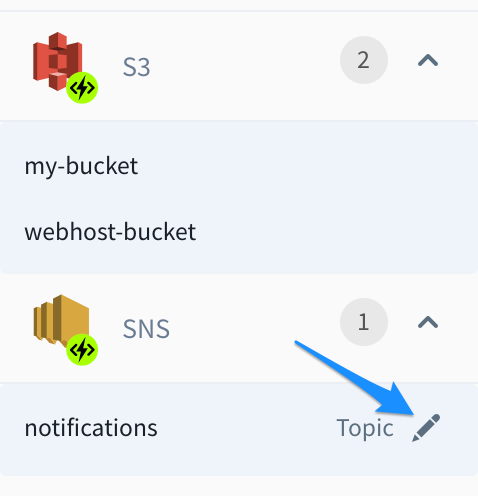

# Resources

In Sigma IDE, a Sigma Project is an aggregation of resources, where a **Resource** represents an actual entity on the connected AWS account, such as a S3 bucket, an API Gateway endpoint, etc. From the project's point of view, a resource can be either a **New Resource** or an **Existing Resource**.

## New resources vs. Existing Resources

In the context of a Sigma project, a resources is considered as **New** if it is/was created by the current project itself. On the other hand, ) or a resources is considered as **Existing** if it has been created by an external entity; e.g. the user himself, a different Sigma project, or an entirely unrelated third-party application.

This distinction follows from the fact that a Sigma project maintains its resources via an **AWS CloudFormation** stack, which is inherently limited to managing resources that were created by itself. Hence a Sigma project has full control over **New** resources (those that were created by, and hence belong to, the project's stack) but only partial control over **Existing** resources (limited to configuring them as trigger points, and allowing programmatic access to them via the user's application).

In almost all component configuration panels in Sigma, there are 2 separate tabs to define either a new resource of that component type or to use an existing one. When a new resource is defined (e.g. a new S3 bucket), from next time onwards it will also be listed under existing resources list (e.g. existing buckets list), but will be marked as **(New)**.

## Using Resources as Triggers and Operations

Usage of resources in a Sigma project also falls into two categories: **Triggers** and **Operations**. **Triggers**, as the name implies, correspond to the use of a resource for triggering a user's lambda function. **Operations** represent the usage of a resource inside the lambda function logic (such as an AWS API call).

A lambda can have any number of triggers and can access/operate on any number of resources (as operations). One resource may be associated with multiple triggers and also be involved in multiple operations.

> For example, if you write a function for processing files dropped into a S3 bucket, you will usually set up an S3 trigger for the bucket, and perform `getObject` (and probably `putObject`) operations on the bucket from within the function code. In this case, the same bucket resource serves as a trigger as well as a resource.

Depending on the type of the resource, it can be used either as a trigger, or for operations or for both. Following is a list of currently available resource types and their possible usages.

### AWS Resources

| Resource Type | Use as a Trigger    | Use for Operations
| ---           | :---:               | :---:
| Alexa Skill   | :white_check_mark:  | :x:
| API Gateway   | :white_check_mark:  | :x:
| CloudWatch    | :white_check_mark:  | :x:
| Cognito       | :white_check_mark:  | :white_check_mark:
| DynamoDB      | :white_check_mark:  | :white_check_mark:
| ElastiCache   | :x:                 | :white_check_mark:
| EventBridge   | :x:                 | :white_check_mark:
| Kinesis       | :white_check_mark:  | :white_check_mark:
| RDS           | :x:                 | :white_check_mark:
| Rekognition   | :x:                 | :white_check_mark:
| S3            | :white_check_mark:  | :white_check_mark:
| SES           | :x:                 | :white_check_mark:
| SNS           | :white_check_mark:  | :white_check_mark:
| SQS           | :white_check_mark:  | :white_check_mark:
| Translate     | :x:                 | :white_check_mark:

### GCP Resources

| Resource Type     | Use as a Trigger    | Use for Operations
| ---               | :---:               | :---:
| Cloud Datastore   | :x:                 | :white_check_mark:
| Cloud Pub/Sub     | :white_check_mark:  | :white_check_mark:
| Cloud SQL         | :x:                 | :white_check_mark:
| Cloud Storage     | :white_check_mark:  | :white_check_mark:
| Cloud Scheduler   | :white_check_mark:  | :x:
| HTTP Trigger      | :white_check_mark:  | :x:

### Third-party Components

| Resource Type  | Use as a Trigger | Use for Operations
| ---            | :---:            | :---:
| Twitter        | :x:              | :white_check_mark:

## Reusing a resource

When a resource is defined in Sigma as a trigger or for an operation, it will be listed
under its resource type on the left resource panel.

  

Such an already defined resource can be reused for another operation/trigger by directly dragging it to the editor instead of dragging the root resource type.

## Modifying a resource

Depending on the resource type, configurations of some resources can be modified
through the resource panel. Such editable resources have an edit button in-front of them, and the resource configuration panel can be opened by clicking on that button.

  

