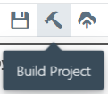

# Building your Project

For a serverless deployment, you often need to compose a bundle containing code and dependencies (libraries) of your functions.
Sigma IDE does this for you transparently, without having to install any build tools or dependency managers on your local system.

In order to perform a build, click the **Project &rarr; Build Project** menu item, or the hammer icon on the toolbar.

Note that the build may work differently, based on the current status of your IDE environment:

## Normal scenario: when the [test environment](../test/test.md) is live

In this case, the IDE will sync your latest code and dependency changes to the test environment,
which will then bundle everything and upload it to a suitable cloud storage location
(e.g. the dedicated [test environment bucket](../test/test.md#internals)).
In most cases this takes only a few seconds, and you will only see a brief progress on the bottom status bar.

For further details on dependency handling, refer to the respective cloud platform under
[Dependency Manager](../project-info/dependency-manager.md).

## When the test environment has failed to deploy, or encountered an error

In this case, the IDE will fall back to a "legacy" build. This usually involves a cloud-based build service
(e.g. [CodeBuild](https://aws.amazon.com/codebuild/) or AWS and [CloudBuild](https://cloud.google.com/cloud-build/) on GCP), which:

* clones the project from the version control repository,
* installs the necessary dependencies,
* bundles up the resulting file structure, and
* uploads it to a cloud storage location.

This usually takes more time (typically 15-30 seconds) to complete.
The status bar displays the progress, along with the currently ongoing build stage.

Since the legacy build obtains the project code from the VCS repository,
it is mandatory to commit (save) the project before the legacy build can be invoked.

**NOTE:**
The legacy build does not currently work for private repositories.