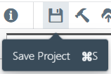
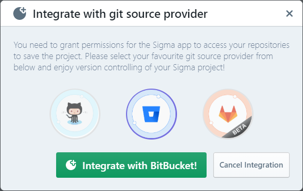
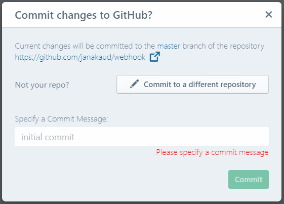
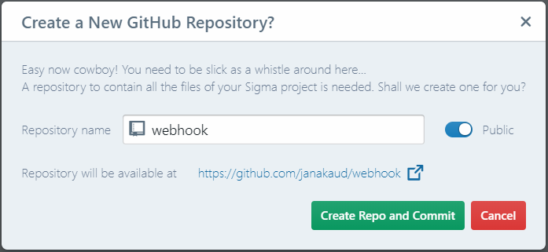
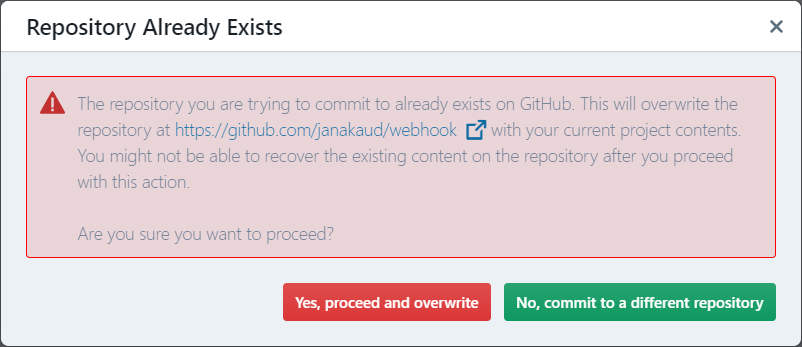
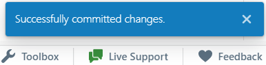
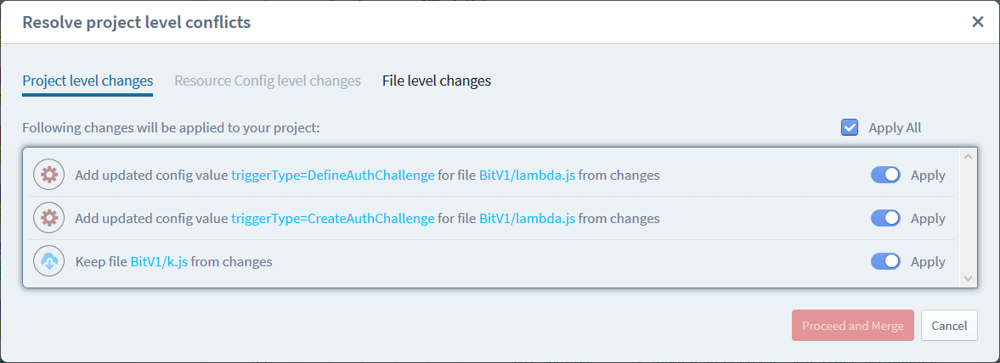

# Commit and Version Control

With Sigma you can commit and version-control your code, just like any other IDE.
However it does not require you to install any version control tools locally, and works completely within your browser.

Sigma supports `git` for version control, via

* [GitHub](https://github.com/)
* [Bitbucket](https://bitbucket.org/)

[AWS CodeCommit](https://aws.amazon.com/codecommit/) support is also on the roadmap.

## Persistence

When you work in Sigma, code, cloud resource and configuration changes you make are automatically synced
to the browser's [local storage](https://developer.mozilla.org/en/docs/Web/API/Window/localStorage).
So, effectively, your work is auto-saved locally - and gets automatically restored whenever you revisit the IDE;
unless the local storage gets cleared:

* manual log-out from the IDE
* manual clearing of the local storage
  (e.g. a [**Clear Data**](https://developer.mozilla.org/en-US/docs/Web/API/Storage/clear) action
  or `localStorage.clear()` invocation on the `sigma.slappforge.com` domain)
* a crash, browser update/reinstallation, or some other event that effectively clears local storage of the browser

Hence it is recommended to periodically commit your changes to an external version control system (VCS) for long-term persistence.
It also complies with development best practices, and serves as a changelog for your project.

To promote this good practice, Sigma will automatically prompt you to commit your changes
whenever you try to build or deploy your project after making changes.

**NOTE**:
Some actions allow you to bypass this commit step:

* deploying with only configuration changes
* [Quick Deploy](../deployment/quick-deploy.md) with only code-level changes

However, even in such cases, it is recommended to commit your changes at your earliest convenience.

## Commit

You can commit (save) the current status of your Sigma project any time, via:

* the **Save Project** button (the traditional floppy disk icon) on the toolbar,
* the **Project &rarr; Save Project** menu item, or
* the familiar **Ctrl + S** keyboard shortcut.

If you have not already integrated Sigma with a source provider, you will be asked to do so:

Click the appropriate source provider icon, and authorize Sigma to perform VCS actions on your behalf.

Next, Sigma prompts you to choose a VCS repository to commit to, and a commit message:

Sigma automatically generates a repo name based on your project name;
if you want to commit to a different repo, toggle the **Use a different repository** option
and enter the desired VCS username-repo name combination.

Enter a desired commit message and click **Commit & Push**.

Sigma then checks whether the selected repository exists and you have permissions to write to it.
If the repo is missing, it asks for confirmation to create it for you.

Alternatively, if the repository already exists and this is the first time the current project is being committed,
Sigma asks for your confirmation - since saving the new code to an existing repo can result in overwrites and loss of previous data.

After these checks, Sigma:

1. creates the repo via the respective VCS API, if it does not already exist,
1. clones the repo (if not already done) into the browser's [IndexedDB storage](https://en.m.wikipedia.org/wiki/Indexed_Database_API),
1. stages local changes,
1. commits them into the local repo copy, and
1. pushes the commit into the remote repository.

During this time, you would observe a progress indicator on the IDE's status bar, indicating the current operation;
"Preparing committing", "Committing changes", etc.

When done, Sigma displays a "Successfully committed changes" toast.

## Merging and Resolving Conflicts

If the remote contains changes that were not available at the time of cloning,
a [merge](https://www.atlassian.com/git/tutorials/using-branches/git-merge) occurs at pushing.
Sigma usually takes care of this automatically;
however, if there are conflicting changes for the same code snippet or resource definition,
a [conflict](https://www.atlassian.com/git/tutorials/using-branches/merge-conflicts) arises
and Sigma would need your assistance to resolve it before continuing.

In this case, Sigma stops and displays a summary of conflicted changes, with an option to handle each one separately:

Sigma categorizes conflicts as:

* *project* level (resources, triggers, files etc.)
* *resource* configuration level (attributes of individual cloud resources)
* *file* (code) level

and offers you the option to either:

* *accept the remote* version, discarding the corresponding local change,
* *accept the local* version, overwriting the remote change, or
* perform a *merge* to come up with a new, resolved version

<!--TODO explain conflict resolver UI-->

Once you have completed resolving the conflicts, click **Proceed and Merge**
so that Sigma can make a merge commit and proceed with the push.