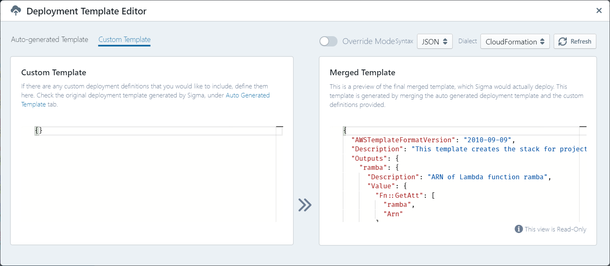

# Customizing your Deployment

Sigma auto-detects, generates and transparently manages configurations for several cloud resources, triggers, and associated permissions.
However, there may be cases where you want to further customize these to better suit your application requirements -
for example, via advanced configurations;
or, you may want to associate resources or triggers with your project, which Sigma does not currently support natively.

In such cases, Sigma's **Deployment Template Editor** option allows you to keep these customizations embedded in your Sigma project itself -
improving project portability and avoiding the need for manual or third-party tooling intervention after a fresh deployment.

You can access the template editor via **Project &rarr; Customize Resources** menu item, or the **Pencil icon** on the toolbar.


The dialog contains three panes;

* **Auto-generated Template** displays definitions that Sigma managed to detect and auto-generate for your project
* **Custom Template** displays the customizations that you have associated with the function
* Sigma merges statements from the above two, and displays the final effective template
  (which would actually [get deployed](deployment.md)), under **Merged Template**.




## Definition format

Definitions can be viewed and edited in a desired notation; currently JSON and YAML are supported.

You can edit the definitions under **Custom Template** as applicable for your primary (target) cloud platform.

* AWS projects use [CloudFormation](https://aws.amazon.com/cloudformation/) syntax
* GCP projects use [Cloud Deployment Manager](https://cloud.google.com/deployment-manager/) syntax

Under the custom tab, you can either specify the complete template, or just the content of the resources section
(`Resources` in AWS, or `resources` in GCP). Hence the following two will be effectively identical:

```yaml
Resources:
  foo:
    ...
```

```yaml
foo:
  ...
```


## How merging happens

When merging, Sigma will recursively merge contents of common keys. For example,

**Auto-generated:**

```yaml
Resources:
  foo:
    a: foo
    b: bar
```

**Custom:**

```yaml
foo:
  b: B
  c: C
```

will result in:

```yaml
Resources:
  foo:
    a: foo
    b: B
    c: C
```