# Deployments in Sigma

In Sigma, a *deployment* publishes the current status of your project into the underlying serverless platform
(AWS, GCP, etc.).

While the underlying mechanisms may vary across platforms,
Sigma tries to maintain a uniform UI/UX throughout the deployment phase.

## Starting a deployment

You can trigger a deployment by clicking the **Deploy Project** button on the toolbar,
or the **Project &rarr; Deploy Project** menu item.

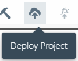

Depending on the current state of the project, Sigma may:

* ask you to commit the project, if there are code-level changes to be committed and incorporated into the build artifact
* proceed to the build phase if there are no uncommitted changes, but a build has not been performed after the last commit
* proceed directly to the deployment phase if the build artifact is up-to-date

**NOTE:** If your project only has uncommitted configuration changes,
Sigma will allow you to directly proceed with a deployment; without having to go through the commit/build phases.
This is only provided as a "shortcut" for quickly deploying configuration changes,
and it is always recommended to commit any configuration changes
(updates to function configs, environment variables or resource/entity parameters) as soon as possible.

## Deployment concepts

### The "stack"

Each project is associated with its own *deployment stack*, managed via an *infrastructure-as-code* service
([AWS CloudFormation](https://aws.amazon.com/cloudformation/),
[GCP Deployment Manager](https://cloud.google.com/deployment-manager/), etc.).
This allows the entire project to be maintained (deployed, updated, undeployed, etc.) as a single unit,
and in most cases provides cross-account portability as well.

The first deployment *creates* the stack, and subsequent ones *update* it.
The differencing mechanism used in these updates are transparently handled by the cloud provider;
Sigma does not retain any "important" status metadata on its side, except for displaying the last deployment summary to the user.

### Changeset and changes

Each deployment is carried out in a series of steps. Sigma displays these as *changes* in a *changelist*.
This changelist directly maps to the actual deployment execution plan of the cloud provider.

In the first deployment of a Sigma project, the changelist would be the same as the complete list of resources owned by the project -
functions, [new API resources](../../concepts/resources.md#new-resources-vs-existing-resources),
and triggers, permissions, and other binding configurations.
During subsequent deployments (updates) this list would only contain the resources that have been
added, modified or removed in the Sigma project.

Each change has its own *status* (in progress, success, failed, rollback etc.).
This status depends on the expected end-status of the resource.
For example, for an entity pending deletion, "success" is when the entity is *no longer present* in the stack;
while "failed" or "rollback" would mean that it is *still present* among the stack resources.

When possible, Sigma displays the status of individual changes of the deployment, in addition to the overall status.

## Deployment monitor

Once in the deployment phase, you will see a pop-up dialog similar to the following:

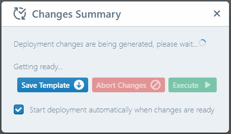

This dialog will display the schedule, progress and outputs of your deployment, from beginning to completion.

## Deployment phases

Sigma's deployer goes through multiple phases in order to attempt to successfully complete the deployment under different scenarios:

### Initialization

First, the IDE analyzes your project, filters out unused resources,
and generates a *deployment template* representing the current status of the project;

* functions,
* resources (tables, buckets, queues etc.),
* bindings (function triggers, resource interrelations etc.),
* permissions (execution, trigger, service authorizations etc.),

and so forth.

If something goes wrong - or a bad configuration is detected - during this phase, the deployment pop-up will disappear;
you will see an error toast indicating the appropriate error.

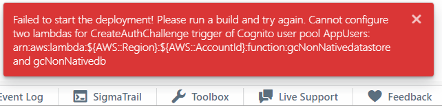

A common scenario is "missing build artifact" in which case you will see the somewhat obscure error message `Cannot read property...`:

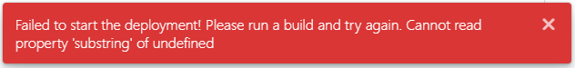

### Preparation

Once generation is complete, Sigma checks the current status of the *deployment stack*
for the project on the cloud provider's side.

* If the stack is missing, Sigma creates the stack.
* If the stack exists but is in an unrecoverable failure state
(e.g. a rollback failure during a previous creation/update attempt),
Sigma asks for your consent and then attempts to delete and re-create the stack.

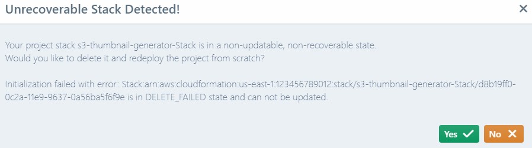

**NOTE:** This is a best-effort attempt; if Sigma cannot delete and/or recreate the stack,
you would need to rectify the situation manually via the cloud provider's dashboard or other management tools.

Once the deletion completes, Sigma will restart the deployment automatically,
right from the beginning ([**initialization** stage](#initialization)).

Similarly, if there are other errors (such as the required APIs not being enabled/available)
Sigma will display an appropriate error message so you can take the necessary actions.

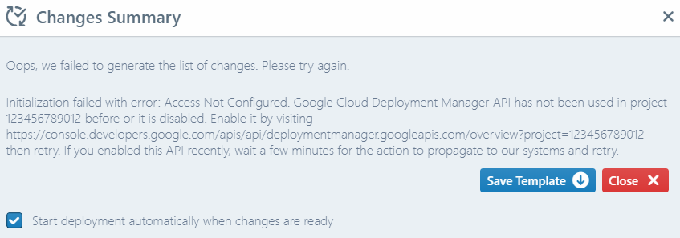

### Staging

When the stack is ready, Sigma "stages" the updates that need to be deployed,
and shows you a *deployment summary* of all pending changes. The "staging" is done on the underlying cloud platform;
e.g. [*changesets* in CloudFormation](https://docs.aws.amazon.com/AWSCloudFormation/latest/UserGuide/using-cfn-updating-stacks-changesets.html) or
[*previews* in Deployment Manager](https://cloud.google.com/deployment-manager/docs/configuration/preview-configuration-file).
This means that the platform is ready with an execution plan, but has not actually started to execute it.

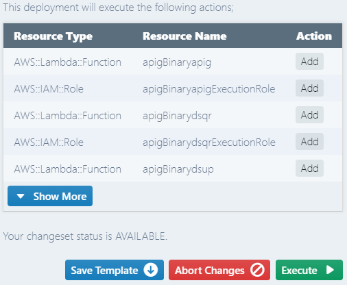

At this stage you can:

* revise the change list,
* click **Save Template** to download the deployment template that was submitted to the cloud service,
* click **Execute** to start deployment, or
* click **Abort Changes** to cancel and discard the staged changes.

### Execution

When you click **Execute**, Sigma signals the cloud provider to start deploying the staged changes.

**NOTE:** Sigma can automatically start deployment when changes are ready, without waiting for you to click **Execute**,
if you keep the **Start deployment automatically when changes are ready** box checked.
Sigma will remember your last preference, and you can change it anytime via the deployment dialog itself.

### Monitoring

If the deployment starts successfully, Sigma starts to periodically poll the provider
to display the current status of the deployment.

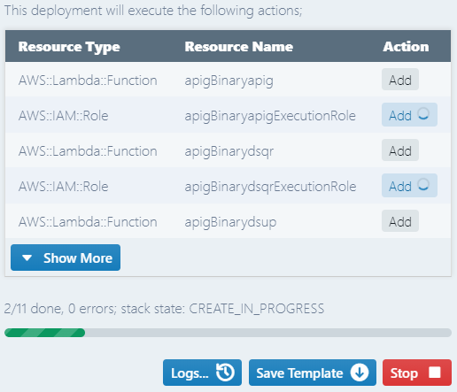

The level of detail displayed may vary, based on the APIs offered by the respective cloud provider.

When possible, Sigma displays the current deployment status of each resource (in progress, success, failed, rollback etc.)
individually, as an icon (spinner, check mark, alert mark) in front  of the change-list items.

Below the change list, Sigma displays the overall status and progress fraction of the deployment.

During this stage, you can:

* click **Logs...** to view a summary of events depicting the resource changes that have taken place during the deployment
* click **Stop** to cancel the deployment and roll-back the stack to its previous state
* close or dismiss the pop-up, so that the deployment can continue in the background;
you will be able to restore it and view the status by clicking the **Deploy Project** toolbar button again.

**NOTE:** You can continue to work on your project while the deployment is ongoing;
these changes will not affect the deployment, and you will be able to deploy them later as a completely new cycle.

### Failures and rollbacks

If there is a failure in completing one or more changes,
the platform will usually automatically roll-back the stack into its pre-deployment status.
(The same will happen if you click the **Stop** button.)

In this case, you can view the reason for each failure by hovering over the alert icon of the corresponding change-list entry.

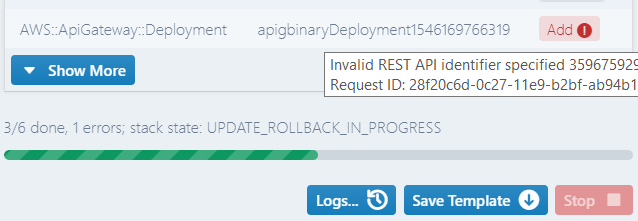

During a rollback, cloud platforms usually do not allow you to cancel or stop the deployment;
hence the **Stop** button will be disabled.

**NOTE:** In platforms like AWS, even if there is only one actual failure, multiple resources may enter the "failed" state;
in this case, the additional failures would contain errors like **Resource creation cancelled**.

### Completion

Once the deployment reaches a stable state (successful completion or rollback), the monitor will display the final status,
and any **output parameters** (such as HTTP endpoint URLs and database endpoints)
for resources generated or updated during the deployment.

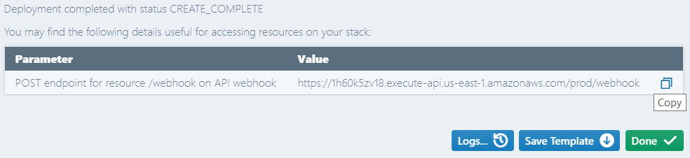

In case of a failure, Sigma will also display a list of failure reasons detected during the deployment.

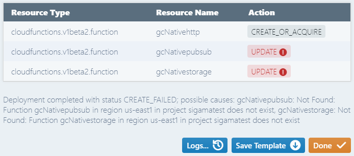

## Deployment history

Sigma retains details of the last complete deployment in-memory, for display purposes.
This can be viewed via the [**Deployment** section of the **Project Info** dialog](../project-info/project-info.md#deployment).

Note that this data is transient (temporary), and can be lost any time -
if you switch away from the project, sign out, or attempt to start and then cancel a new deployment.