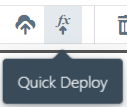

# Quick Build and Quick Deploy

**Quick Build** and **Quick Deploy** (collectively called **Quick Deploy**) can speed up your development cycle.
They quickly update the code of your deployed functions without having to go through a complete save-build-deploy cycle.

**TIP:**: You can find more details behind the rationale and implementation of Quick Build/Quick Deploy via
[this blog post](https://medium.com/think-serverless/sigma-quickbuild-towards-a-faster-serverless-ide-23c5d7eea841).

In order to use Quick Deploy, simply click the **Quick Deploy** button on the toolbar:

**NOTE:**
Quick Deploy works by directly modifying the functions deployed by your project.
Hence at least one complete build/deploy cycle should have been run before you start using Quick Deploy.

Since Quick Deploy can only handle code changes, it is not generally safe to use it when your project has non-code changes
(e.g. modifications of [resources](../../concepts/resources.md), [triggers](../../concepts/triggers.md),
file structure or dependencies).
In such cases, Sigma will warn you of the fact and refuse to continue.
However, you can still force a Quick Deploy in such a scenario by clicking the **Click here** link in the warning pop-up.

**NOTE:**
Quick Deploy is only a superficial deployment, and *does not* persist your code to GitHub.

All changes done by a Quick Deploy will be properly overwritten by the latest project changes
during the next complete save-build-deploy cycle.
Hence if Quick Build happens to break your project in some way, you can always recover from it by performing a full deployment.