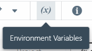
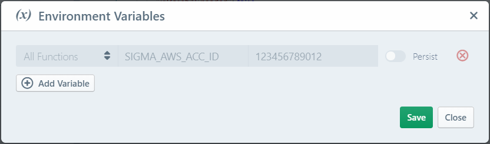
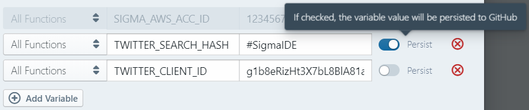
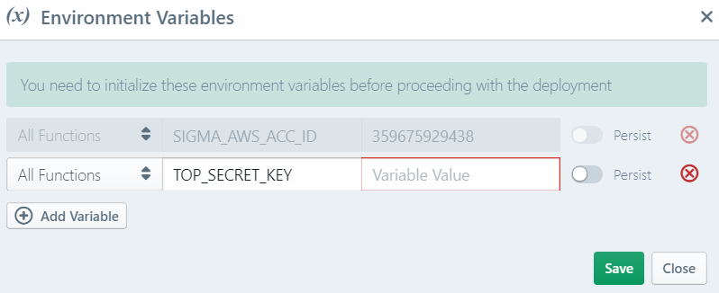

# Environment Variables

Since serverless functions ultimately resolve into system-level processes,
they can read environment variables visible to their runtime.
Combined with the ability to specify their values at configuration level, this can be handy in cases where:

* you wish to modify the behaviour of the function (e.g. enabling tracing) without making code-level changes, and
* you want to pass confidential information/parameters (e.g. API tokens, private keys)
to the function at deployment time or runtime, without having to add them to code or source control.

Additionally, different components may introduce their own variables into your project (usually at project scope),
which should generally be left untouched.

## Defining a variable

1. Click the *(x)* button on the toolbar to open the **Environment Variables** configuration pop-up:

   

2. Click the **(+) Add Variable** button (below the last variable entry) to add a new entry.

   

3. Configure your variables as desired:

   * Enter the name (key) and value for the variable, in the **Variable Key** and **Variable Value** fields respectively.
   * Select the [scope](#scoping) for the variable, which can be either **Global** or the name of a specific function.
   * If you want to [persist the variable value](#persistence) into source control, toggle the **Persist** switch against the variable.

   

4. When done, click **Save**.

### Value resolution

If any of the variable values are missing, Sigma will prompt you to provide them by automatically opening
the environment variables pop-up when starting a project deployment (usually, right after the build stage completes).

### Scoping

Sigma allows you to define environment variables on a global (visible to all functions) or per-function basis.
If the same variable (key) is defined at both global and per-function levels, the latter will take precedence.

### Persistence

In order to provide project portability while preventing the leaking of user-specific configurations,
Sigma saves only the keys (names) of environment variables into source control.
If you close and reopen a Sigma project, except for a few IDE-managed variables,
you will have to re-enter the values for any variables that you had defined previously.

Alternatively you can explicitly mark the variables that you do need to save into source control,
in order to make them available as part of the project itself, by toggling the **Persist** switch against each variable.

## Modifying or deleting a variable

You can modify a variable by making appropriate changes on the corresponding entry on the
[environment variables pop-up](#defining-a-variable), and clicking **Save**.

Similarly, you can delete a variable by clicking the cross button against the entry, and saving the configuration.

