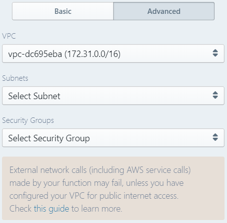

# Function Configurations

In Sigma, you can configure and tune individual serverless functions for optimal runtime performance using this option.

## Opening Function Configurations

While in the **Projects** tab of the [**Resources** pane](../../basic_functionalities.md#resources-pane) of the editor,
click the cog wheel icon against any function to open its configuration settings.

## Available Configuration Options

### Basic Tab

* **File name**: name of the function, without the suffix (file extension)
* **Runtime**: programming langugage used for the function;
available options differ based on the cloud platform (e.g. NodeJS *4.3*, *6.10* and *8.10* are supported on AWS)
* **Memory**: maximum amount of memory the function runtime can occupy;
available range depends on the cloud platform (e.g. 128 MB to around 3 GB (3008 MB) on AWS)
* **Timeout**: maximum duration of a function execution (after which the platform considers the execution as "timed out");
also depends on the platform (e.g. 1 second to 5 minutes (300 seconds) on AWS)

**NOTE:**
Functions with higher memory limits are
[usually assigned higher computation power (CPU time)](https://docs.aws.amazon.com/lambda/latest/dg/resource-model.html),
but they may also [incur higher costs](https://aws.amazon.com/lambda/pricing/).

Additional options may be available based on the cloud platform:

* **Execution/Trigger Type** (GCP): the type of the function trigger
([*HTTP*](https://cloud.google.com/functions/docs/writing/#http_functions) vs
[*background*](https://cloud.google.com/functions/docs/writing/#background_functions));
note that you need to manually change the function signature and any already written logic,
if you change this property for an existing function 

### Advanced Tab

This usually contains cloud platform-specific advanced configurations.

* **VPC** (AWS/GCP): the [**Virtual Private Cloud**](https://docs.aws.amazon.com/lambda/latest/dg/vpc.html)
(cloud VPN) where the function should be deployed.
This provides additional security since the function would be deployed inside a private network,
and would generally be inaccessible from, and not able to access, the public internet.
* **Subnets** (AWS): the [**subnets**](https://docs.aws.amazon.com/vpc/latest/userguide/VPC_Subnets.html)
(cloud VPN) where the function should be deployed.
This provides additional security since the function would be deployed inside a private network,
and would generally be inaccessible from, and not able to access, the public internet.
* **Security Groups** (AWS): the [**security groups**](https://docs.aws.amazon.com/vpc/latest/userguide/VPC_SecurityGroups.html)
(cloud VPN) where the function should be deployed.
This provides additional security since the function would be deployed inside a private network,
and would generally be inaccessible from, and not able to access, the public internet.

**NOTE:**
VPC containment may mean that external service (e.g. AWS/GCP API) calls made by your function may also fail.
Check out the respective cloud platform documentation
(e.g. [AWS](https://docs.aws.amazon.com/lambda/latest/dg/vpc.html), [GCP](https://cloud.google.com/vpc/docs/vpc)) to learn more.

Once configurations are complete, click **Save** to persist them.
The changes will be propagated to the deployed functions during the next deployment/update.

**NOTE:**
[Quick Deploy actions](../deployment/quick-deploy.md) will **not** propagate configuration changes,
as they only deal with code changes.