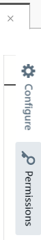

# Customizing Function Permissions

Sigma automatically generates the execution permissions for your serverless function based on the API operations used in the code.
However in some cases you may need to customize or add to these auto-generated permissions:

* if your function invokes cloud platform APIs or services that are not natively supported by Sigma;
  such as [AWS Textract](https://aws.amazon.com/textract/)
* if your invocations involve dynamic parameters decided at runtime
  (e.g. bucket name for a [S3 put operation](https://docs.aws.amazon.com/AWSJavaScriptSDK/latest/AWS/S3.html#putObject-property))
  in which case you would need to relax the permissions accordingly
* if you do not adhere to Sigma's syntax style of inline parameter blocks for API invocations;
  e.g. defining a `params` block and then invoking `s3.putObject(params)`,
  instead of `s3.putObject({Bucket: ... /* inline parameter block */})`

You can access the permissions customization dialog via the **Permissions** button
(containing the key icon) on the right side pane of the editor:

<p align="right">
  
</p>

The dialog contains three panes;

* **Auto Generated Permissions** displays the permissions that Sigma managed to detect and auto-generate for your function
* **Custom Permissions** displays the custom permission statements that you have associated with the function
* Sigma merges statements from the above two, and displays the final effective permissions set
  (which would actually be applied to your function at deployment/test time)


You can edit the permission definitions under **Custom Permissions** in order to associate additional permissions with your function.

On AWS, a permission generation UI is also available for your convenience, via the **Statement Generator** button on the top right:


1. Under **Effects**, select whether you want to allow or deny access (in most cases this will be `Allow`).
1. Under **AWS Service**, select the AWS API for which you wish to add the new permission.
1. Under **Actions**, select the API operations you wish to invoke from your Lambda.
1. Under **ARN**, specify the
   [Amazon Resource Name](https://docs.aws.amazon.com/general/latest/gr/aws-arns-and-namespaces.html) (ARN)
   of the resource that Lambda wishes to access (`Resource` of the IAM permission).
   The generator will provide a list of fields, which you can fill in order to auto-generate the ARN.
   Alternatively if you already have the ARN, simply turn off the **Guided** switch and enter the ARN into the input field. 
1. Click **Generate**.

For example, if your Lambda function invokes
[`AWS.Textract.DetectDocumentText`](https://docs.aws.amazon.com/textract/latest/dg/API_DetectDocumentText.html)
upon objects stored in a S3 bucket,
which requires the `textract:DetectDocumentText` permission on Textract service
and an additional `s3:GetObject` permission for retrieving the source S3 object from the relevant bucket (say `acme.data.ocr`),
the final custom permissions block would look like this:

```json
{
    "Version": "2012-10-17",
    "Statement": [
        {
            "Effect": "Allow",
            "Resource": "*",
            "Action": [
                "textract:DetectDocumentText"
            ]
        },
        {
            "Effect": "Allow",
            "Resource": "arn:aws:s3:::acme.data.ocr/*",
            "Action": [
                "s3:GetObject"
            ]
        }
    ]
}
```

**NOTE:**
If you wish to customize the complete IAM role of your function
(e.g. assign a [managed policy](https://docs.aws.amazon.com/IAM/latest/UserGuide/access_policies_job-functions.html)),
you can use the [deployment template editor](../deployment/deployment-template-editor.md) instead;
to override the autogenerated IAM role definition.