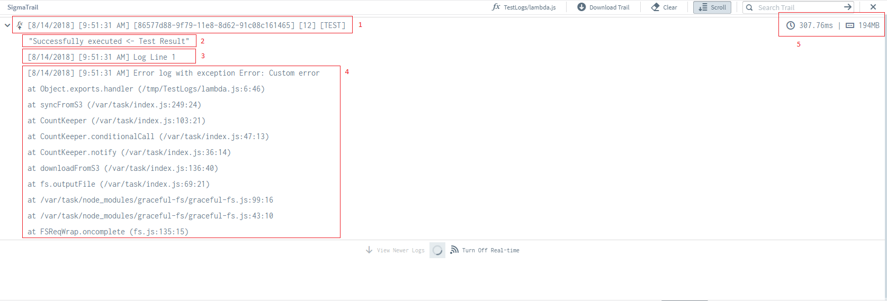
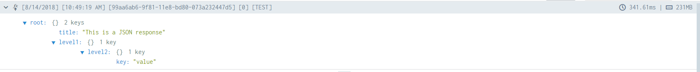
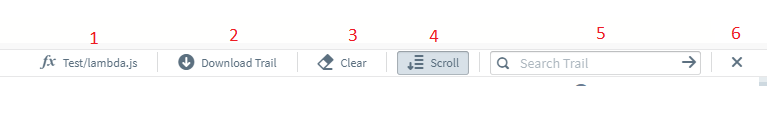
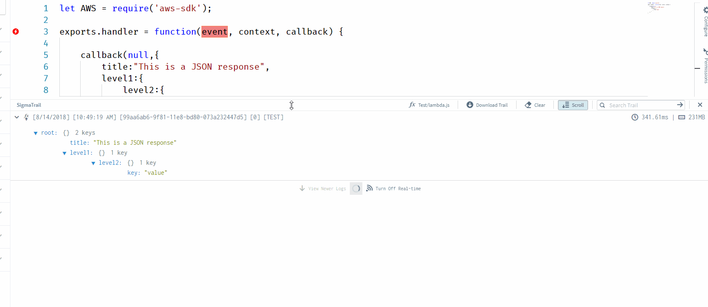
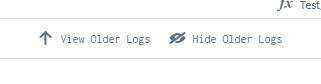

# Application Logs

In sigma, we have categorized logs into two types.

#### 1. Test Logs [TEST]

Test logs are the type, that will be generated in realtime when you execute a test case within the IDE. These logs will include the result/response of the test execution and the generated logs in line.

#### 2. Prod Logs [PROD]

Prod logs are the type, that will be generated when you invoke the lambda function through one of your event sources. (ie: Api Gateway, S3 event etc.)
These logs does not include the result/response of the execution.

## Log Request

We refer log request as the group of log lines which are generated during a one cycle of execution of lambda function.

# 

#### 1. Log Request header

Log request header gives you a quick insight about the Log Request. The format of the header is as follows.

[Date] [Time] [Request Id] [No of log lines] [TEST / PROD]

You can click on Log request header to expand or collapse the log lines.

#### 2. Test execution result

This section is only applicable for TEST logs. If the result can be parsed to a JSON, Sigma will show you the response in an expandable JSON tree.

# 

#### 3. Log line

Log line is a single line of a console log generated by lambda code

#### 4. Stack Trace

Stack trace is a report of the active stack frames at the time of an error is thrown. This will be useful when debugging an application.

#### 5. Resource Utilization

This section indicates the time taken to execute the function logic and the memory utilized to process the respective request.

## Sigma Trail Controllers

# 

Sigma trail header has following controls to fine tune your logs view.

#### 1. Lambda Selector
 
 Sigma Trail shows only trails related to one particular function within one screen. If you want to switch sigma trail to show trails of a different function, click on this button to get a list of available lambda functions.
 
 In addition to this selector, switching between editor tabs will automtically switch Sigma Trail to show logs of the focused function.
 
#### 2. Download Trail
 
 Sigma allows you to download logs in following two formats.
 
 * Text
 * JSON
 
#### 3. Clear Logs
 
 If you are not interested about the visible logs, you can hide visible logs by this button.
 
#### 4. Auto Scroll 
 
 Sigma automatically scrolls the trail for you. Whenever a new Log request is appended, trail will get automatically scrolled and expand the new log request. You may switch on/off this feature by toggling this button.
 
#### 5. Search logs
 
You can filter Sigma trails by using [cloudwatch filter pattern and syntax](https://docs.aws.amazon.com/AmazonCloudWatch/latest/logs/FilterAndPatternSyntax.html).

This will give you an effect similar to tailing with grep.

#### 6. Close

Close the sigma trail panel.

## Resizing logs view

If you want to make more room for your code, you may resize sigma trail by holding and dragging the header as below.

# 

## Navigating over Old Log requests

Sigma by default shows you only the latest 15 log requests.

To view older logs, you may use following controllers.

# 

#### View Older Logs

This will load 15 more older logs to sigma trail. 

#### Hide Older Logs

This button will take you back to the 15 latest logs only mode.

## Controlling Sigma Log fetching behaviour

By default Sigma continuously polls for new logs from cloudwatch. If you wish to control this behaviour, you may use following set of buttons.

# 

#### Tune On/Off Real-time logs
Turning of Real-time logs will stop Sigma from automatically polling for new logs.

#### View Older Logs
In non Real-time mode, use this button to request for newer log requests.

