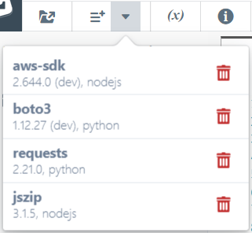

# Adding Dependencies to your Project

Oftentimes you need to add external package dependencies to your serverless code via npm, pip, etc.
Sigma allows you to do this right inside your browser - without having to install any dependency managers,
and without fetching or configuring any tools or dependency metadata on your local machine.

To access Sigma's **Dependency Manager**, click **Project &rarr; Add New Dependencies**,
or the **Dependency Manager** button (with three horizontal lines) on the toolbar.

**NOTE:**
The dependency manager that gets opened, corresponds to the language of the currently focused code file in the editor:
`npm` manager for NodeJS, `pip` manager for Python, and so forth.

## NodeJS

### `npm` Dependency Manager

This allows you to search and add packages available in `npmjs.com` repositories - similar to `npm install`.

Once you type in a phrase, matching packages will be displayed, along with available versions for each.
You can pick the desired version from the drop-down, and click **Add** to add it to your project.

The **Add as a dev-mode dependency** checkbox at the bottom, allows you to add a dependency in development-only mode
(similar to [`devDependencies` in `package.json`](https://stackoverflow.com/questions/18875674/whats-the-difference-between-dependencies-devdependencies-and-peerdependencies)).
Such dependencies will not be available in the final build artifact, but will be available in the development and build phases.

This can be useful for cases like `aws-sdk` on AWS;
it is already available in the deployment environment so you don't have to add it explicitly,
but having it as a dev-dependency provides convenient autocompletion when coding in the IDE.

### Build and Packaging

During build, Sigma adds your selected packages into `dependencies` section of its `package.json`,
installs them in the remote build environment via `npm install --production`,
and bundles them into a `node_modules` folder inside your final deployment archive.

This step may be skipped in some environments (e.g. GCP, where dependency installation is taken care of by the platform itself).

## Python

### `pip` Dependency Manager

This allows you to search and add packages available in `pypi.org` repositories - similar to `pip install` or `pip3 install`.

Currently this dialog does not offer a package search option;
instead, you can directly enter the name and version of the package, and click **Add** to add it to your project.

An **Add as a dev-mode dependency** option is available to allow adding packages in development-only mode
(similar to NodeJS `devDependencies`).

### Build and Packaging

Sigma adds selected packages into a `requirements.txt`,
installs them in the remote build environment via `pip(3) install`,
and bundles them into the root of your final deployment archive.

This step may be skipped in some environments (e.g. GCP).

## Viewing and Removing Dependencies

You can view the dependencies currently added to your project, by clicking the drop-down against the **Add Dependency** button:

Each dependency indicates the name, version, applicable language,
and whether it is added as a dev-mode dependency (via a `(dev)` indicator).

You can remove any dependency by clicking the dustbin icon next to the corresponding entry in the list.
Sigma will ask for confirmation, and then remove the dependency from the project.
The change will be reflected in the next [test](../test/test.md) or [full deployment](../deployment/deployment.md) cycle.

