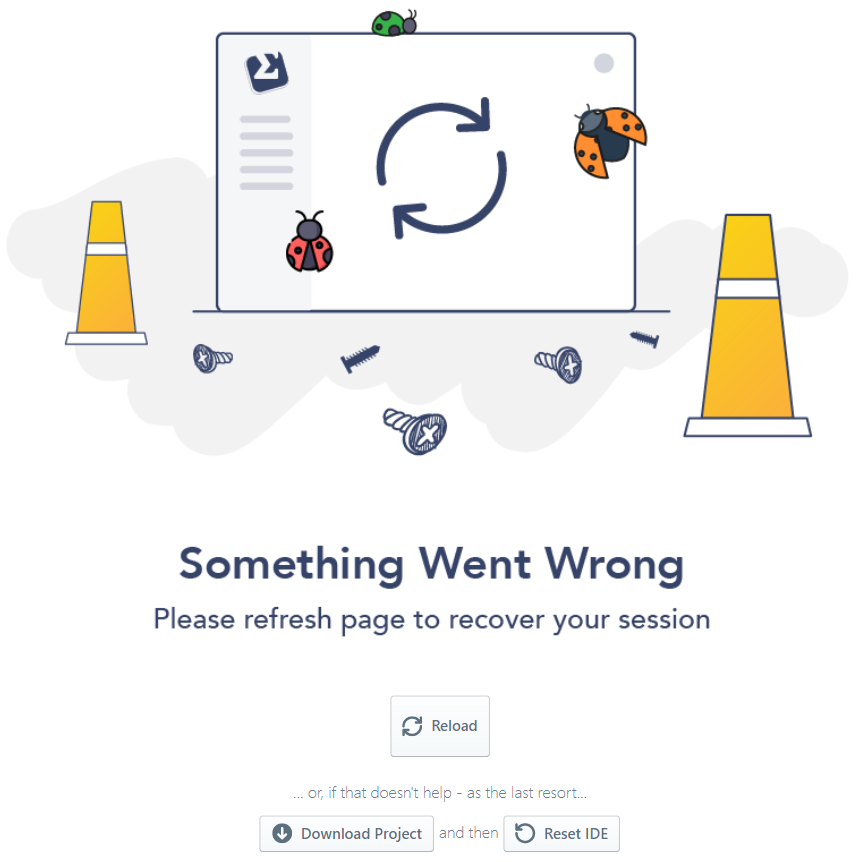

# Importing and Exporting your Project

Sigma allows you to import and export your code, to promote interoperability with other frameworks, IDEs and tools.

## Importing a project

On the [project creation page](https://sigma.slappforge.com/#/project),
in addition to [creating a new, empty project](../../first_project.md#create-new-project) and
[opening an existing Sigma project from a version control repository](../../getting_started.md#loading-a-project),
you can also:

* *import an existing repository* that uses another framework, or
* *import a code bundle* as the content of the newly created Sigma project

### Importing from an external repository

Under **... or, import a ___ project!** section, at the bottom of the project creation page:

1. On the drop-down, select the framework used by the project you are about to import.
2. Enter the URL of the repository, into the input field.
3. Click the **Import** (lightning bolt) button.

The URL can be one of:

* repository root (e.g. `https://github.com/user/repo`)
* path to the main framework config file: repository *browse* URL format
(e.g. `https://github.com/user/repo/blob/master/blob/subpath/serverless.yml`)
or *raw* format (e.g. `https://raw.githubusercontent.com/user/repo/master/subpath/serverless.yml`)
* path of the parent "directory" of the desired framework config file:
repository *browse* URL format (e.g. `https://github.com/user/repo/blob/master/blob/subpath/`)
or *raw* format (e.g. `https://raw.githubusercontent.com/user/repo/master/subpath/`)

The latter two can be useful when you wish to import one project/module containing multiple projects;
e.g. [the Serverless Framework Examples repository](https://github.com/serverless/examples/).

Sigma currently supports importing projects from the following frameworks:

* [Serverless Framework](https://serverless.com/framework/)

Additionally, Sigma can also import the code files from _any_ repository.
Unlike in the case of a specific framework import, any cloud resources defined in the project *will not* get imported here.

**NOTE**:
For framework imports, some features of the framework may not be supported by Sigma.
If the unsupported items are not critical, Sigma will continue the import with a set of warnings;
however if there is a critical issue (e.g. multiple serverless functions being defined in the same code file),
Sigma will abort the framework-specific conversion with an error toast, and resume the import as a generic project as described above.

**NOTE**:
The imported project will be managed as a native Sigma project;
metadata (e.g. cloud resource and function definitions) will be managed in the Sigma-specific `appState.json`.
The original framework configs (e.g. `serverless.yml`) will no longer be kept updated.

### Importing from a zip file

Under the right-hand-side pane **Create a New Project**,

1. Click the **Browse** button of the **Got a code bundle?** option on the bottom left.
2. Select the zip file with the content that you wish to import.

If the zip file contains an `appState.json` metadata file
(usually because it was generated by Sigma's own [**Export Project** action](#exporting-a-project)),
Sigma will auto-fill the project name, version and other details.
You can change them if desired, before completing the import.
Sigma will also automatically add the resources and function configs from `appState.json`, into the new project.

### After an import

The resulting project will be a new Sigma project, which you can work on and commit, build, deploy and test as usual.

**NOTE**:
During a generic import (resulting from nsupported framework syntax, or a non-Sigma zip file),
any serverless function files in the original source will get imported as plain code files.
Once the import is complete, you can convert them to function files by right-clicking them on the
[Project pane](../../basic_functionalities.md#resources-pane) and selecting **Convert to Function**.

## Exporting a project

Click the **File &rarr; Export as Zip** menu item; your project
(`appState.json` and all project files) will be downloaded to your browser as a zip file.

You can either use this zip file to begin/update an external project using a different framework,
or [import it again into Sigma](#importing-a-project) to start a new project.

**NOTE**:
If you want to *change the name or region* of your Sigma project,
this export-and-import option is the quickest route so far;
until we introduce more project configuration change options in the near future.

### Emergency export

If an internal error causes the IDE to crash, Sigma will display an error page as follows:

In some cases, if the error is critical, clicking **Reload** may not resolve the issue.
In such cases, the safest option is to *download the project* by clicking **Download Project**, before taking any further actions.

If the [SLAppForge Support team](mailto:support@slappforge.com) is unable to resolve your issue in time,
you can reset the IDE using **Reset IDE**.
**All data in the IDE, including your project, will be lost.**
Afterwards, you can [re-import the downloaded zip file](#importing-from-a-zip-file)
through the project creation page, to resume working on the project.

If the IDE continues to crash after re-importing the downloaded zip file:

1. make a copy of the zip file,
2. remove the `appState.json` file inside it, and
3. try to import the new zip file.

This will recover your code, but lose the [cloud resources](../../concepts/resources.md) and
[function configurations](../function-configurations/function-configurations.md);
similar to a *generic project import*.

In such an event, we would highly appreciate it if you can share the original zip file with the
[SLAppForge support team](mailto:support@slappforge.com) - by

* creating a public or private support ticket (**Help &rarr; Report an Issue**),
* contacting via live chat, or
* directly sending an email to [support@slappforge.com](mailto:support@slappforge.com).