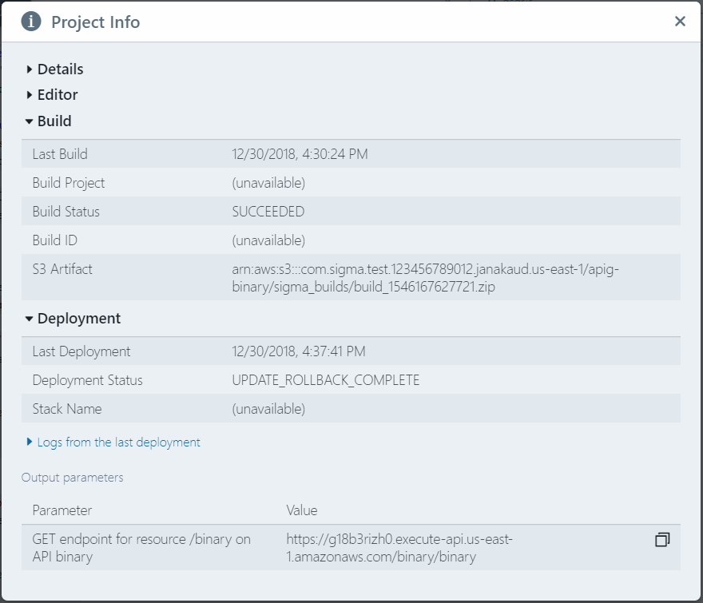

# Sigma Project Info Window

The **Project Info** window ("(i)" icon on the toolbar) displays a summary of the current state of your Sigma project.

It has four sections indicating different aspects of the project:

## Overview

Shows metadata of your project:

* project **name**
* project **version number** (editable)
* project **description** (editable)
* **base cloud platform** where the project will be deployed
* cloud platform **region** for the project
* URL of the project's **source repository**

## Editor

Shows the current state of your IDE editor:

* **Unsaved Changes**: the types of changes taken place since the last time it was saved (committed) to its repository,
or `none` if there are none.
Changes could be one or more of:
  - `dependency`: added or removed dependencies
  - `code`: code-level changes
  - `resource`: added, modified or removed [resources](../../concepts/resources.md) or [triggers](../../concepts/triggers.md)
  - `environment`: changes in [environment variables](../environment-variables/environment-variables.md)
  - `structure`: added, renamed, [reconfigured](../function-configurations/function-configurations.md)
  or removed directories, serverless functions or other files
* **Unsaved Files**: a list of files that have changed since the last commit, or `none` if there are no such code changes

## Build

Shows details of the last [build](../build/build.md) performed on this project:

* **timestamp**
* name of the cloud platform-level **build project**
* **status** (success or failure)
* cloud platform-level **ID** of the build
* URL of the **build artifact**, usually on a storage bucket

## Deployment

Shows details of the last [deployment](../deployment/deployment.md) performed on this project:

* **timestamp**
* **status** (success or failure of creation, update or rollback)
* name of the cloud platform-level **stack** used for the deployment

Additionally, this section would display (as separate subsections, collapsed by default):

* **output parameters** from the last deployment (HTTP endpoints, DB URLs etc.),
in case the monitoring process ran to completion
* **logs (events)** from the last deployment, gathered during the monitoring process

## Data availability

If the build/deployment information is unavailable (e.g. for a newly loaded or reloaded project),
the corresponding section would indicate **Build/Deployment details are not available**.
The sections will automatically get populated during the next build/deployment.