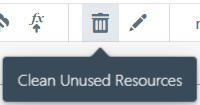
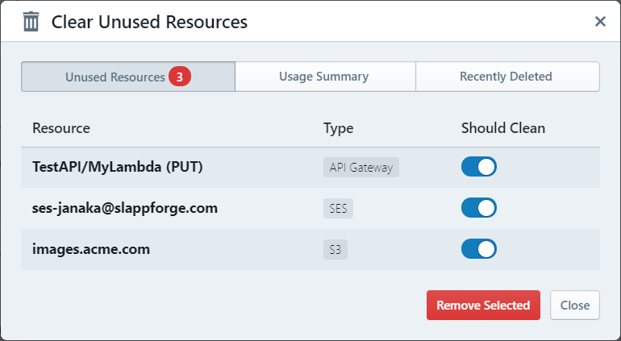
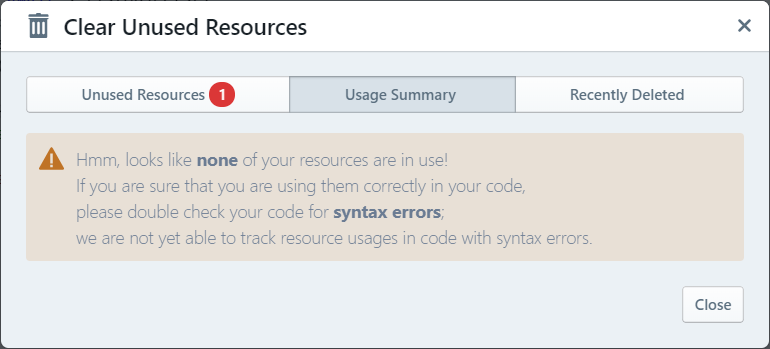
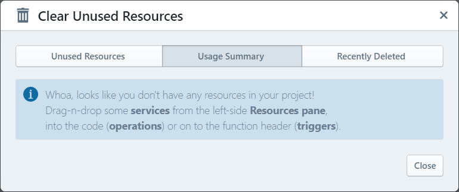
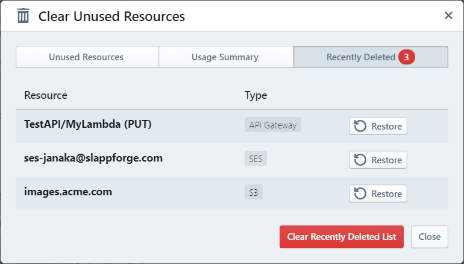

# Cleaning up Unused Resources

When developing a serverless application in Sigma,
you may come across instances where you need to switch from one cloud entity or type to another -
e.g. switch your RDS database for a DynamoDB table -
or add a new resource entity with a different configuration.
In such cases, Sigma will continue to track the old entity (resource) configurations (in case you happen to need it again later on).

If you want to get rid of such obsolete resources that are still being tracked in your project,
the **Resource Cleanup** feature would be useful.

**NOTE:**
If the old entity is no longer being referred, in your code or function triggers,
Sigma will automatically remove the resource from your *deployment configurations* -
as a result of which, it will get removed from your actual cloud environment from the next deployment onwards;
but Sigma will still keep track of the last configuration (spec) details of the resource.

You can access the Resource Cleanup UI via the **Project** menu, or via the dustbin icon on the toolbar:

The feature first analyzes your code for any usages
([trigger](../../concepts/triggers.md) or [operation](../../concepts/operations.md))
of the available resources, and then displays a summary of resources that have no such usage references.

**NOTE:**
If any of your code files contain a syntax error,
or if they deviate from the standard Sigma notation for API calls
(e.g. using a pre-populated parameter block instead of inline parameter definitions within the call statement),
the corresponding resource usages will not be tracked.
As a result, such resources may come up as unused ones in the above summary.

In such scenarios, if Sigma notices that your project *does contain* resources but *none of them are in use*,
it will display a warning asking you to check for syntax errors:

If Sigma could not detect *any resources* in your project, it will display a message similar to the following:

**NOTE:**
Resources defined in the [custom deployment template](../deployment/deployment-template-editor.md)
are not tracked (or displayed as clean-up candidates) during this process.

Once the unused resources list is loaded, you can toggle the switches against the resources that you wish to discard,
and click the **Remove Selected** button to remove them from your Sigma project configuration.

## Recovering Cleaned-up Resources

When you clean up resources in the above manner, the removed entries get moved into a temporary "recently cleaned up" list.
If you happen to need to recover any of them, you can switch to the **Recently Deleted** tab of the above dialog
and click the **Restore** button against the respective entries.

Alternatively, if you are confident that you would not need to restore any of these resources,
click **Clear Recently Deleted List** to clear them from your project **permanently**.

**NOTE:**
This removal action is irreversible;
if you clear the **Recently Deleted** List, those resources cannot be recovered
unless you revert your project codebase to a previous version.

**NOTE:**
The **Recently Deleted** list gets cleared automatically during the next deployment;
after you deploy your project after a resource cleanup, there is no way to recover the cleaned-up resources
unless you revert your project codebase to a previous version
(or the `appState.json` file itself - which can be tricky).