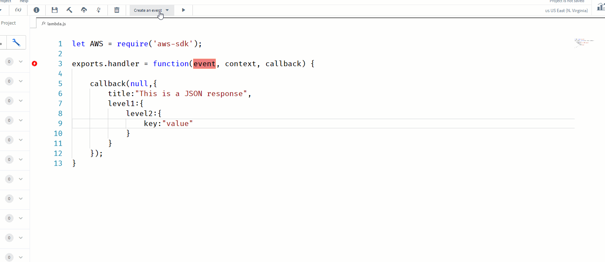
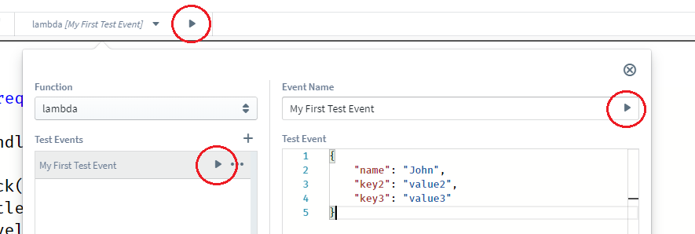
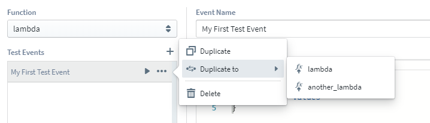

# Testing Your Functions

Sigma has provided you the ability to test your functions as you develop. Testing a function is easy and has only two steps.

### 1. Creating a Test Case

A test case is a JSON document that will be injected as the event of the lambda handler during the test execution. You can start creating an event by clicking 'Create an event' of toolbar.

# 

### 2. Invoking the Test Case

Once you create a test event, you can invoke your function by clicking on any of three play buttons shown below. For your convenience, Sigma allows you to re-invoke the last invoked test case from the tool bar with a single click.

# 

Sigma will invoke your function and show you the execution results immediately in the Sigma Trail.

## Managing your test cases

Each test case you create belongs only to a particular function that you choose at the time of defining the test case. 

# 

### 1. Duplicate

With duplicate option, you can create a copy of the test case within the same function. 

### 2. Duplicate to

With 'Duplicate to' option, a test case can be duplicated to another function.

Once duplicated, two test cases are independent of each other. You can edit or delete one without affecting the other.

### 3. Delete

Delete or detach a test case from a function.

## Additional Notes

Inorder to invoke a test case, it is not necessary to deploy your project. However, if your function utilizes new resources(non existing resources in your AWS account), better to deploy your project once to create new resources to prevent 'Requested resource not found' errors. 
