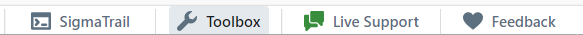
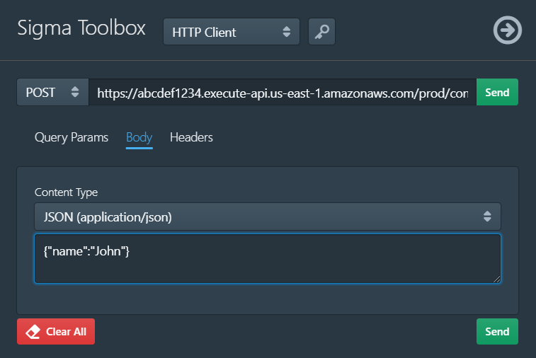
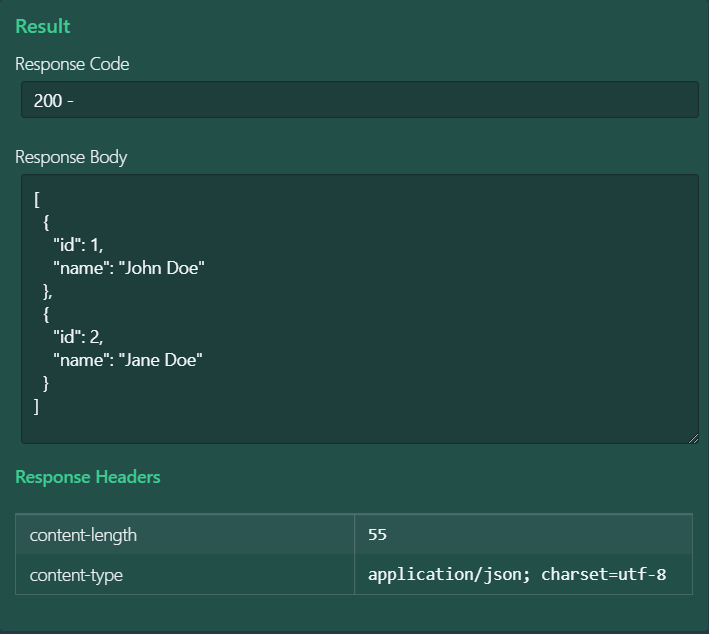
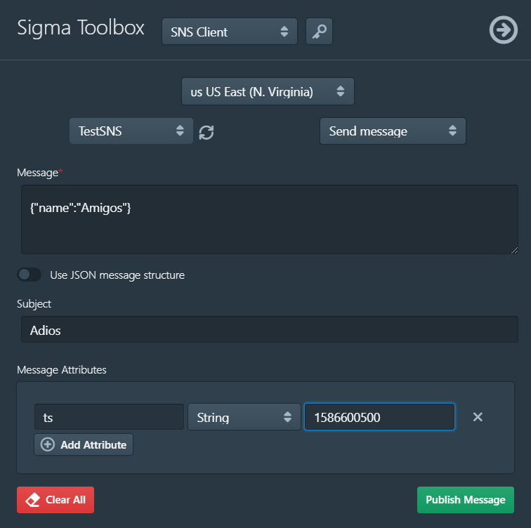
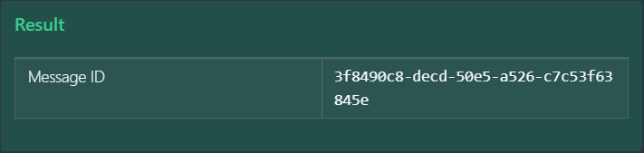
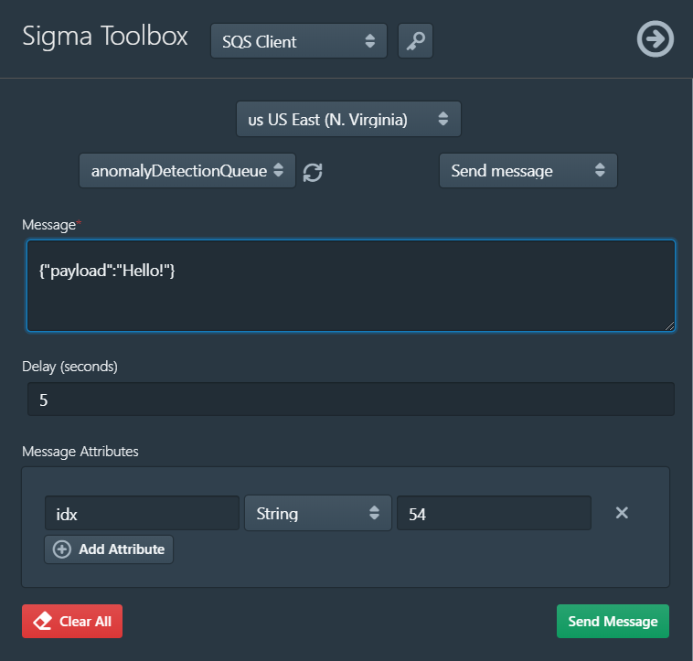
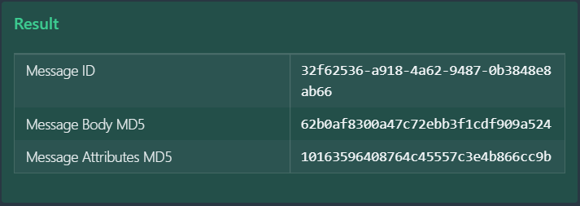

# Sigma Toolbox

After deploying a serverless application, you may want to invoke the deployed function via its trigger:
such as HTTP endpoint (e.g. [API Gateway URL](../../components/aws/apig.md))
or queue (e.g. [SQS](../../components/aws/sqs.md)).
Also, you may need to populate your queues, topics etc. with data, for test executions -
or retrieve data from such, to verify execution results or side-effects.

The **Toolbox** component of Sigma IDE allows you to interact with your cloud resources in this manner.
You can open (toggle) it via the **Toolbox** button on the bottom toolbar:

Sigma's toolbox currently supports:

* [HTTP endpoints](#http-client)
* [SNS topics](#sns-client)
* [SQS queues](#sqs-client)

## HTTP Client

This allows you to send HTTP requests to endpoints, similar to [Postman](https://www.getpostman.com/apps) or
[`curl`](https://curl.haxx.se/).
You can use it to test REST/HTTP endpoints deployed by your project, such as
[AWS API Gateway triggers](../../components/aws/apig.md) or
[GCP HTTP triggers](../../components/gcp/http-trigger.md).

**NOTE:**
As the request is generated by the browser, the endpoint **must** have
[CORS](https://developer.mozilla.org/en-US/docs/Web/HTTP/CORS) enabled -
either globally, or inclusive of the `sigma.slappforge.com` domain.

1. Select the desired HTTP **method** (`GET`, `POST`, etc.).
1. Enter the endpoint **URL**/link into the URL field.
1. Under **Headers**, add any HTTP headers that you would like to send along with the request - using the **Add New** button.
1. If the endpoint accepts a payload, enter it into the text field under **Body**, and select the correct **Content Type**.
1. Click **Send**.

Once the CORS check passes and the actual request gets executed, the response will be displayed -
headers under **Response Headers** and any returned payload under **Response Body**.

## SNS Client

This allows you to

* publish messages,
* retrieve messages, or
* remove messages

to/from a [SNS topic](../../components/aws/sns.md).

1. Select the **region** where your topic is located.
1. Select the desired **SNS topic** from the topics list on the left.
1. Select the desired **operation** (e.g. **Send message**) from the list on the right.
1. Fill in the required details for the operation; e.g. the message payload, subject and attributes (optional).
1. Invoke the operation via the button on the bottom right; e.g. **Publish Message**.

The result (e.g. published message ID) will be displayed in the lower section - *green* on success, *red* otherwise.

## SQS Client

This allows you to

* put (publish) messages,
* retrieve (get) messages, or
* remove messages

to/from a [SQS queue](../../components/aws/sqs.md).

1. Select the **region** where your queue is located.
1. Select the desired **queue** from the queues list on the left.
1. Select the desired **operation** (e.g. **Send message**) from the list on the right.
1. Fill in the required details for the operation; e.g. the message payload, attributes and the visibility delay (optional).
1. Invoke the operation via the button on the bottom right; e.g. **Send Message**.

The result (e.g. status, sent message ID and MD5 hash) will be displayed in the lower section - *green* on success, *red* otherwise.

