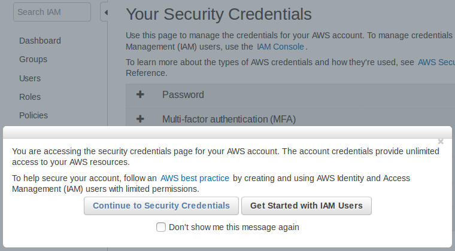
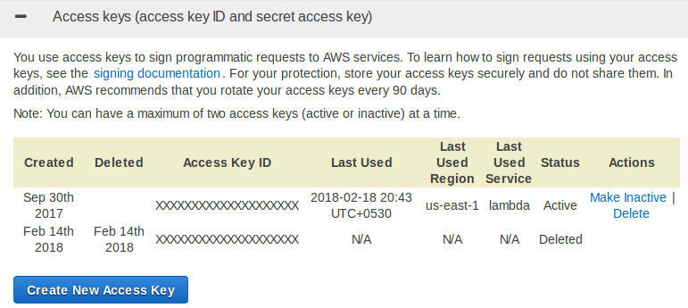
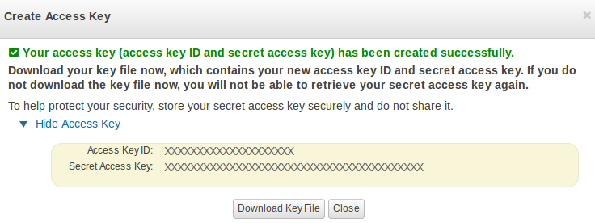
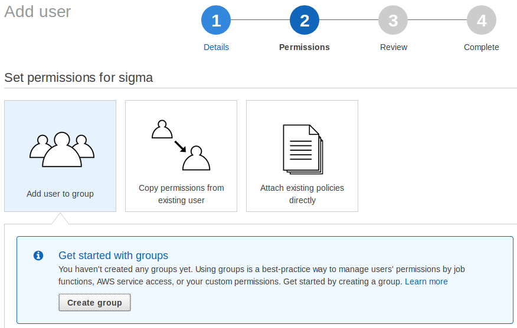
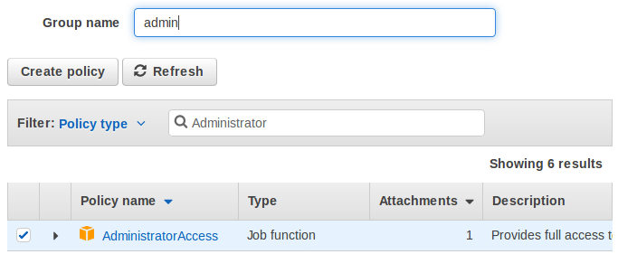
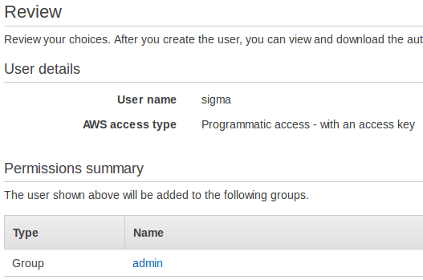
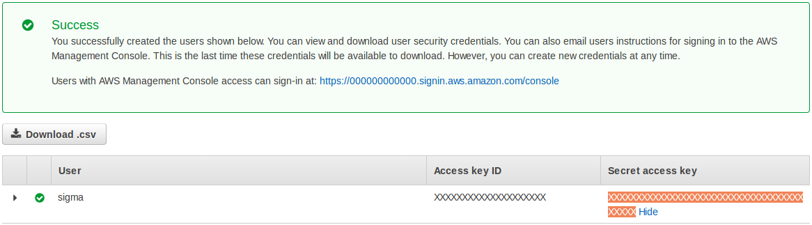
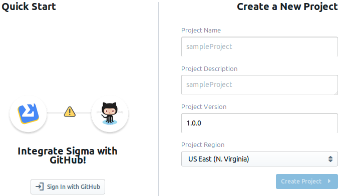
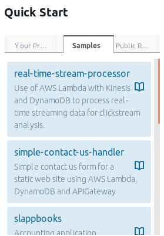

# Getting Started with Sigma IDE

## Prerequisites

* an [**AWS account**](https://aws.amazon.com/account/); you could either
create [your own free account](https://aws.amazon.com/free/) or
[ping us via Slack](https://launchpass.com/slappforge) for one of our demo accounts
* a [**GitHub account**](https://github.com/); free to sign up if you don't have one already
* a fairly new web browser; Sigma has been tested on **Google Chrome 59+**, **Mozilla Firefox 58+**,
**Microsoft Edge 41+** and **Apple Safari 10.1.2+**

## AWS Credentials

Before firing up Sigma, you need to create/obtain AWS
[access credentials](https://docs.aws.amazon.com/general/latest/gr/aws-sec-cred-types.html)
for allowing Sigma to access your AWS account.
Sigma will perform a wide range of tasks on your behalf, including building and deploying your app into your AWS account,
so for the moment it needs unrestricted,
[full administrator access](https://docs.aws.amazon.com/IAM/latest/UserGuide/access_policies_job-functions.html#jf_administrator)
to your AWS account (however, we do have future plans for preparing a minimal, more restrictive set of permissions).

### Granting access using IAM root account credentials (easy, but not recommended)

Here you will allow Sigma to act as your [AWS IAM root user](https://docs.aws.amazon.com/IAM/latest/UserGuide/id_root-user.html)
for gaining the required access.
Although Sigma will never share your credentials with other parties
(and persist them only if you ask it to do so, with full encryption),
using root user credentials is generally discouraged; it is also against the
[AWS IAM best practices](https://docs.aws.amazon.com/general/latest/gr/root-vs-iam.html).

* Open the [Security Credentials page of the IAM dashboard](https://console.aws.amazon.com/iam/home#/security_credential).
If AWS asks for your confirmation, click **Continue to Security Credentials** to proceed.

 

* Click **Access keys (access key ID and secret access key)** among the list of accordions on the right pane.

 

* Click the **Create New Access Key** button. A pop-up will appear, stating that your access key has been created successfully.
* Click **Show Access Key**, which will display a pane with two parameters:
an **Access Key ID** that looks like `AKIAUPPERCASEGIBBERISH` and a longer, **Secret Access Key**.
(**WARNING**: You'll see the latter value only once!)

 

* Copy both of the above values to a secure location (or click **Download Key File** to save them to your filesystem).

The detailed version is [here](https://docs.aws.amazon.com/IAM/latest/UserGuide/id_root-user.html#id_root-user_manage_add-key).

### Granting access using a new IAM user (recommended):

Here you will create a new administrator group inside your AWS account (if one does not already exist),
create and assign a new user to that group (so that the user would have administrator privileges on your account),
and feed that user's access credentials to Sigma.
This way, you can instantly revoke Sigma's access anytime by disabling/deleting the access keys of the new user.

* Go to the [IAM dashboard](https://console.aws.amazon.com/iam/home).
* Select **Users** on the left pane.
* Click the **Add user** button at the top of the right pane.

 

* Type a name (e.g. `sigma`) for the **User name** field.
* Under **Access type**, tick **Programmatic access**, and click **Next: Permissions** at the bottom right.

 

> You can skip the next 3 steps if you already have an administrator group in your AWS account,
directly assigning that group to the new user in the 4th step.

* Click **Create group** under the **Add user to group** option. A new pop-up will open.
* Type a name (e.g. `admin`) for the **Group name** field.
* Tick off `AdministratorAccess` in the list of policies.
(It should usually appear at the top of the list; if not, type `Administrator` in the Filter text box to see it.)

 

* Click **Create group**.
The pop-up will close, and the new group will appear in the groups list of the permissions page, already checked (ticked).
* Click **Next: Review**.
* Double-check that your user has the correct name, and that he belongs to the new group you just created.
If all looks fine, click **Create user**.

 

* Once the user is created, you will be shown a Success page with a table
containing the **Access Key ID** and **Secret Access Key** (masked with `*` s) of the user.
Click **Show** against the secret access key, to view its value. (WARNING: You'll see this value only once!)

 

* Copy both **Access key ID** and **Secret access key** to a safe location (or click **Download CSV** above).

Here's the [official, detailed version](https://docs.aws.amazon.com/IAM/latest/UserGuide/getting-started_create-admin-group.html).

Once you follow either of the above methods (and have an access key-secret key pair in hand),
you can feed the obtained credentials to Sigma in order to make it functional against your AWS account.

# Signing up for Sigma

Create new Sigma account (if you haven't already):

* Go to the [Sigma sign-in page](https://sigma.slappforge.com/#/signin).
* Click the **Create an account** link against the **New to Sigma?** message.
* Fill in your first and last names, email, and phone number.
* Take note of your username: Sigma will automatically generate one, using your first and last names.
You are free to change this to your own preference, as long as another user has not used it already.
* Choose a password. Passwords in Sigma need to be at least 8 letters long, and have at least one from each of:
uppercase, lowercase, numeric and symbolic (@, $, # etc.) character categories.
(For example, `Password#123` minimal (but **very** insecure) example.)
You can press and hold the **show password** button (eye icon) to confirm what you have typed.
* When all looks good, click **Sign Up**.
If Sigma succeeds in creating your account, you will be taken to a confirmation page (**Insert Confirmation Code**).
An email will be sent to the address you indicated (from `noreply@slappforge.com`), with a verification code.
* Check your mail for the verification email (including promotions, spam, trash etc. in case it does not show up in the inbox).
Once you find it, copy the 6-digit confirmation code in the email, paste it into the confirmation page, and click **Confirm**.
* If all goes well, you will see a **Confirmation successful!** message, with a link back to the
[sign-in page](https://sigma.slappforge.com/#/signin).
* Go to the sign-in page, and log in using your username (that you took note previously, during sign-up) and password.

# Granting AWS access to Sigma

* After sign-in, you'll be in the **AWS Credentials** page of Sigma.
* Copy the **access key ID** and **secret access key** that you retrieved from the AWS console previously,
and paste them in the **Access Key ID** and **Secret Key** fields, respectively.
* Decide the preferred credential storage mode:
 * Sigma can store the credentials on your behalf, so that you will not have to re-enter them at every log-in.
 The keys will be encrypted with your own password (both your password and keys will be managed by
[AWS Cognito](https://aws.amazon.com/cognito/), AWS's own user management service,
so the Sigma administrators will also not be able to access your password or keys),
hence Sigma authors, or any other third party, will not be able to confiscate your credentials.
 * If you are not comfortable with the above, you can simply avoid the store option by unticking **Save Credentials**.
* When done, Click **Load Editor**.

# Connecting GitHub

* Now you will be in the [projects page](https://sigma.slappforge.com/#/project),
with a quickstart pane (displaying the text **Integrate Sigma with GitHub!**) on the left.

 

* Click the **Sign in with GitHub** button. A GitHub authorization window will pop up
(if it does not, tune your browser to enable pop-ups for `sigma.slappforge.com` and try again).
* On the pop-up, sign in to GitHub if you are not already signed in.
* The pop-up will ask you to authorize the **Sigma** GitHub app (made by `slappforge`, the author of Sigma)
to connect with your GitHub account. Click the **Authorize slappforge** button to continue.

# Loading a project

* Once GitHub authorization is complete, the pop-up will close,
and the quickstart pane will start displaying the already available Sigma projects:
 * **Your Projects** tab will display any Sigma-compatible projects that are already in your GitHub account.
 * **Samples** tab will display the numerous samples published by [SLAppForge](https://github.com/slappforge/),
 that you can try out right away.

    
 * If you have the GitHub URL of any other Sigma project that you know of,
 you can simply paste it in the search bar of the **Public Repositories** tab and hit the search button, to load it.
* Once you have found the desired project, click the list entry to load it into the Sigma editor.
* Alternatively you can create a new project
by filling in the project creation form on the right side pane and clicking **Create Project**.
