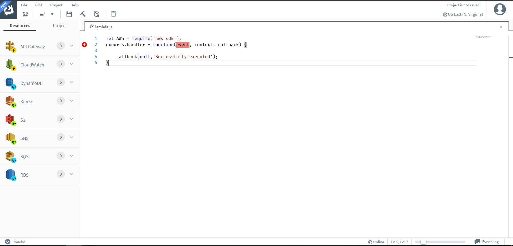

# What is SLAppForge Sigma?

The [SLAppForge Sigma IDE](https://slappforge.com/sigma/) enables you to develop serverless applications
simply by dragging and dropping components into your development space, right inside your web browser.
The editor provides the best of both worlds by allowing you to edit the code using Sigma's rich text editor and also
the ease of drag and drop elements.
Sigma also takes care of all platform-level configurations, resource management, builds and deployments,
which means you can fully concentrate on your application logic and forget about everything else.

To start development, you just need:

* credentials for a cloud platform that offers serverless computing;
[**Amazon Web Services**](https://aws.amazon.com/) and
[**Google Cloud Platform**](https://cloud.google.com/) are already supported!
* a cloud version control (VCS) account;
[**GitHub**](https://github.com/) and [**BitBucket**](https://bitbucket.org/) are already supported,
with [AWS CodeCommit](https://aws.amazon.com/codecommit/) coming soon!

As the first step, you would [create an account](getting_started.md) in Sigma.
You can also use your Facebook or Google account to log in via one click.

Upon login, you can
[provide your cloud account credentials](components/gcp/getting-started.md#grant-gcp-access-to-sigma) to Sigma.
This will allow Sigma to list and display details of your cloud resources at development time,
and to run builds and deployments on your behalf.

You can also authorize Sigma to access [your VCS account](components/gcp/getting-started.md#connect-github),
so that Sigma can open existing projects from VCS repositories -
your own ones, sample projects provided by Sigma, or any public repositories out there.
You can also commit your work to a repository of your choosing, from within the browser IDE itself.

You will see the following view upon login.

  

Sigma IDE makes serverless application development easier by centralizing and unifying
resource and trigger (event source) configurations and permissions with the application logic.
Rather than navigating through multiple cloud platform dashboards and services to configure each trigger,
resource and associated permissions, you can configure everything with a simple drag and drop.

## Where to go from here

- [basic functionalities of Sigma](basic_functionalities.md)
- [getting started](getting_started.md)
- [your first project!](first_project.md)
- [deploying a sample project](deploy_sample.md)
- [Sigma concepts](concepts/index.md)
- [available components](components/index.md)
- [features](features/index.md)
- [frequently asked questions](faq.md)
