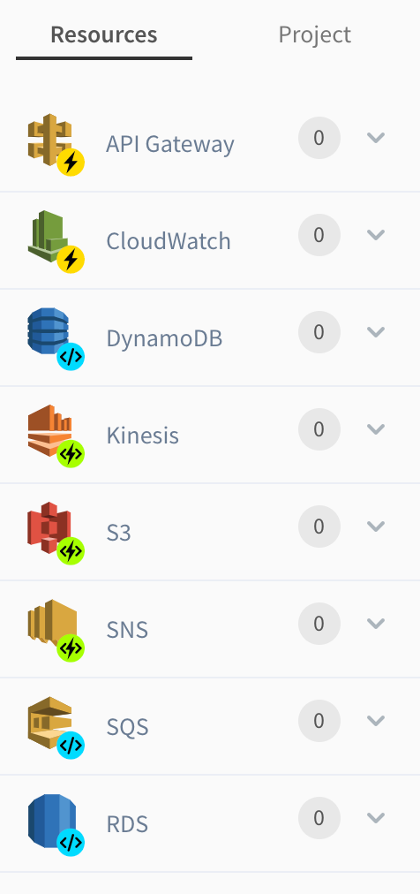
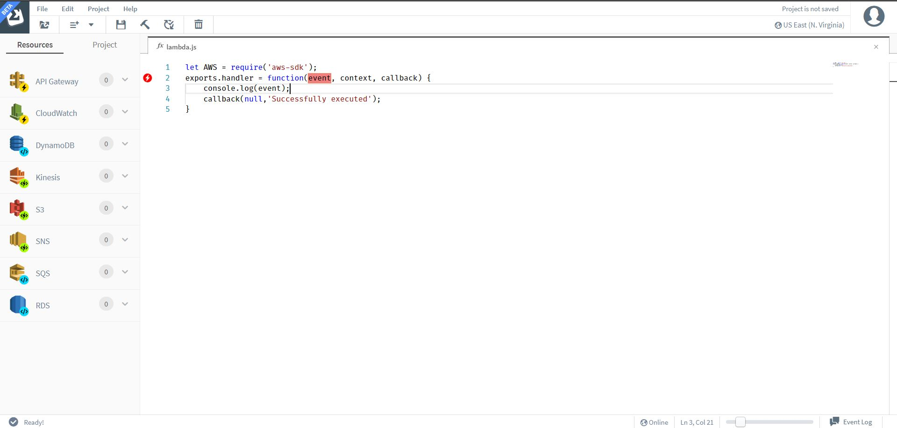

# Getting Started with Sigma IDE

Sigma IDE enables you to develop Serverless applications simply by dragging and
dropping components on to the pane. The editor provides the best of both worlds
by allowing a user to edit the code using Sigma's rich text editor and also
the ease of drag and drop elements.

To start development, a user needs valid AWS credentials and a Github account.
As the first step a user will need to create an account with Sigma. Upon login,
the user will be requested to provide his/her AWS credentials. You will then
need to provide your Github credentials to login.

The user will be shown the following view upon login.

  

Sigma IDE makes lambda function development easier by centralizing resource/ trigger
configurations and the application logic. Rather than navigating through AWS services
to configure each trigger/ resource, a simple drag and drop can configure all of the
components required.

The resources pane shown in the below image, depicts the available resource
types/ trigger types in the IDE.

  

To add an element on to the pane, just drag and drop a component on to the
editor pane.

For example, if you would like to trigger a lambda based on an API gateway
call, just drag and drop an API Gateway component on to the event tag of the
lambda function. If you would like to add a resource to your lambda function
just drag and drop a resource such as RDS.

To develop the application logic, simply type in the code that you would like to
have.

For example, we can add a `console.log(event)` method within the lambda function.
This would log the event trigger, on cloudwatch logs.

The function would appear as follows.

  

Please refer to our samples, if you would like to deploy a Serverless application
easily.
